# 11. Large AI Model Courses

## 11.1 AI Model Deployment: Ollama

Large Language Models (LLMs) are advanced text generation systems powered by artificial intelligence. Their key feature is the ability to learn and understand human language through vast training datasets, enabling them to generate natural and fluent text.

Ollama is an open-source tool designed to simplify the deployment and operation of large language models. It allows users to run high-quality language models within a local network environment without relying on cloud services. The tool features a simple, user-friendly command-line interface, making it easy for users to deploy and manage various open-source LLMs.

| **Model Specifications** | **Compatible Boards** |
|:------------------------:|:---------------------:|
|   Raspberry Pi 5 (8GB)   |           √           |
|   Raspberry Pi 5 (4GB)   |           √           |

### 11.1.1 Ollama Installation 

Follow this tutorial to install Ollama, which will run in CPU-only mode by default. To run with GPU support, you need to install from source or directly flash the image we provide.

Before proceeding with the deployment, ensure the board is connected to the internet.

1. Install curl by entering the following command:

   ```py
   sudo apt install curl
   ```


2. Install Ollama by running:

   ```py
   curl -fsSL https://ollama.com/install.sh \| sh
   ```


> [!NOTE]
>
> **Note:** Installation time may vary depending on your network environment. The entire process may take a while, so please be patient! If installation fails, try again or reboot and attempt once more.

### 11.1.2 Using Ollama

After installation, type ollama to see the following prompt:


|  **Command**  |             **Function**             |
|:-------------:|:------------------------------------:|
| ollama serve  |             Start Ollama             |
| ollama create |   Create a model from a model file   |
|  ollama show  |      Display model information       |
|  ollama run   |             Run a model              |
|  Ollama pull  |    Pull a model from the registry    |
|  ollama push  |     Push a model to the registry     |
|  ollama list  |             List models              |
|   ollama ps   |         List running models          |
|   ollama cp   |             Copy a model             |
|   Ollama rm   |            Remove a model            |
|  Ollama help  | Get help information for any command |

### 11.1.3 Uninstalling Ollama

To uninstall the Ollama tool, follow the steps below:

*  **Remove the Service** 

  ```py
  sudo rm /etc/systemd/system/ollama.service
  ```

* **Remove the Files** 

  ```py
  sudo rm $(which ollama)
  ```

* **Remove Models and Service User and Group** 

  ```py
  sudo rm -r /usr/share/ollama
  sudo userdel ollama
  sudo groupdel ollama
  ```

> [!NOTE]
>
> **Note:** If you encounter an error when running sudo userdel ollama because the user is currently in use, follow these steps:


1. The process with ID 12614 is in use in this example, please check the actual process ID on your system. You need to find and stop the process:

   ```py
   sudo kill 12614
   ```

2. Next, check the group members:

   ```py
   getent group ollama
   ```

3. Then remove ollama from the group:

   ```py
   sudo gpasswd -d username ollama
   ```

Replace username with the actual username, for example, hiwonder.

4. After removing the user from the group, you can run the command again to successfully delete the user.

   ```py
   sudo userdel ollama
   ```

### 11.1.4 References 

Official Website:

GitHub：[<u>https://github.com/ollama/ollama</u>](quot;https://github.com/ollama/ollama&quot)

## 11.2 Installing the Large Model Chat Platform

### 11.2.1 Installing Models with Ollama

Before using a model, you need to install it. Start by visiting the Ollama website from the browser on your Raspberry Pi:

Ollama website: <https://ollama.com/>

1)  In the top-right corner, click on **Models** to browse available models.

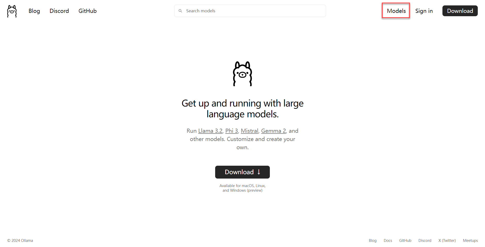

2)  You can also use the search bar to find a specific model. For example, let's take the Qwen model.

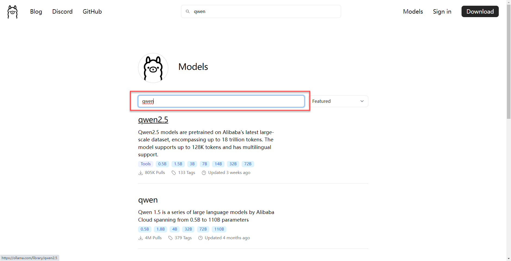

3)  On the model's page, you'll find details about all available versions.

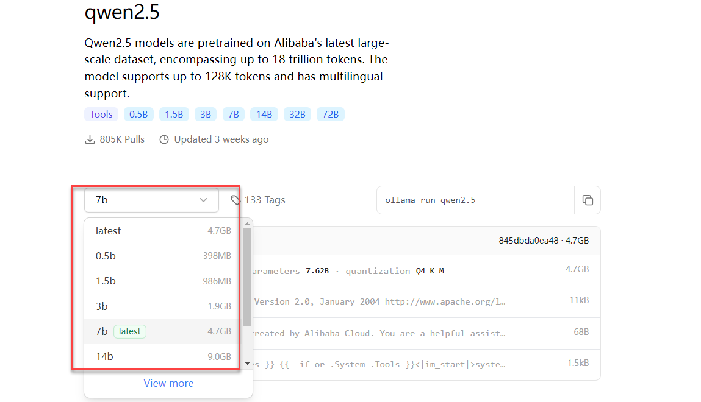

4. Once you've chosen the right model, you can use the following command to pull it. For example, to pull qwen2.5:0.5b:

   ```py
   ollama pull qwen2.5：0.5b
   ```

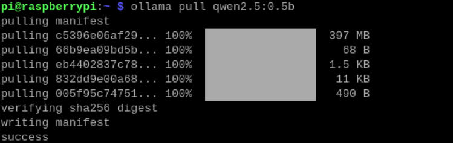

**To download other models, you may repeat the same steps.**

### 11.2.2 Open WebUI 

Open WebUI is an open-source project designed to provide a simple and user-friendly interface for managing and monitoring open-source software and services.

Supported Boards:

|  **Board Model**   | **Supported** |
| :----------------: | :-----------: |
| Raspberry Pi 5 4GB |       √       |
| Raspberry Pi 5 8G  |       √       |

When using Open WebUI, you may encounter issues like unresponsive dialogues or timeouts. In such cases, try restarting Open WebUI or use Ollama to run the models instead.

This tutorial demonstrates how to install Open WebUI using Docker.

* **Docker Installation** 

If you're using the image we provide, Docker is already installed.

1. Update the local package list:

   ```py
   sudo apt update
   ```

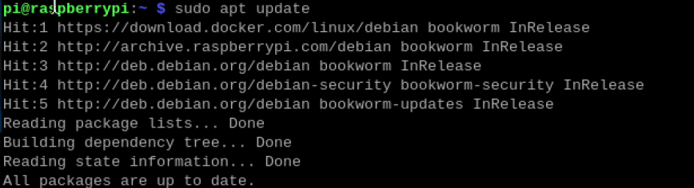

2. Upgrade the installed packages:

   ```py
   sudo apt upgrade
   ```

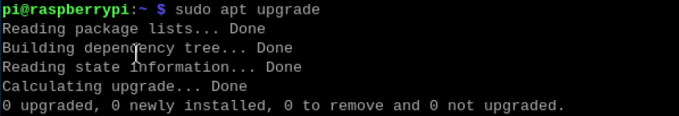

* **Installing Open WebUI**

For systems with Docker already installed, you can directly enter the following command in the terminal:

```py
sudo docker pull ghcr.io/open-webui/open-webui:main
```

> [!NOTE]
>
> **Note:** The installation process may take some time, so please be patient!

* **Running Open WebUI**

1. To start Open WebUI, run the following command using Docker:

   ```py
   sudo docker run --network=host -v open-webui:/app/backend/data -e OLLAMA_BASE_URL=http://127.0.0.1:11434 --name open-webui --restart always ghcr.io/open-webui/open-webui:main
   ```

2)  Once successfully started, open your system's browser  and visit the following URL:

**http://localhost:8080/**

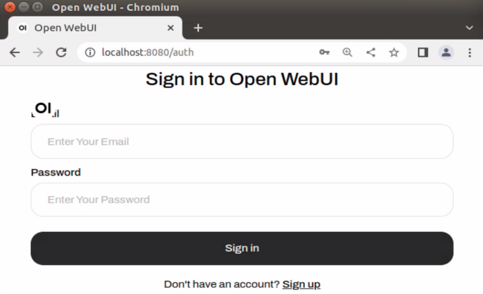

3)  For first-time use, you need to register an account. This account will be the administrator account, and you can fill in the required information as needed. Taking hiwonder as an example:

Username: hiwonder

Email: hiwonder@qq.com

Password: hiwonder

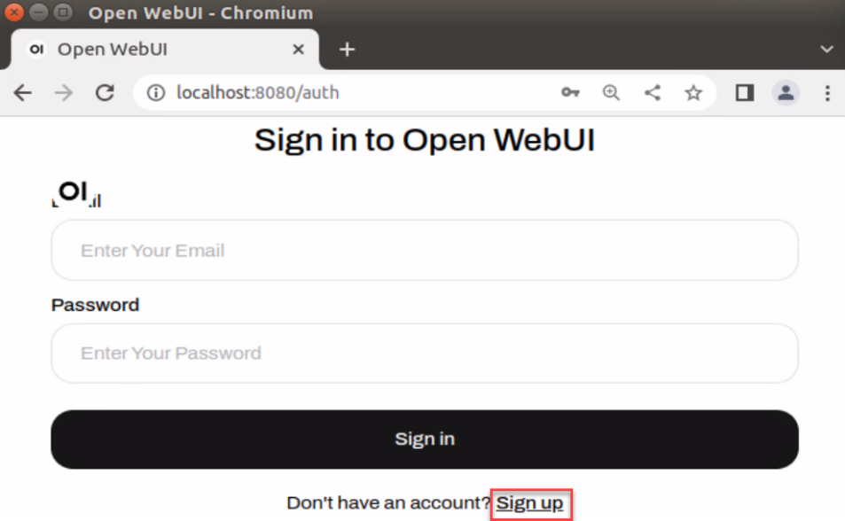

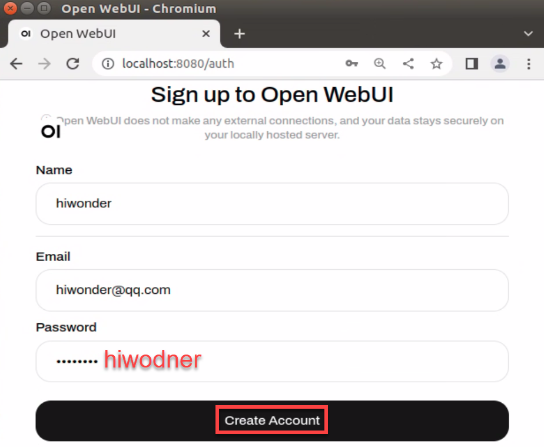

4)  Once logged in successfully, the interface will appear as shown below.

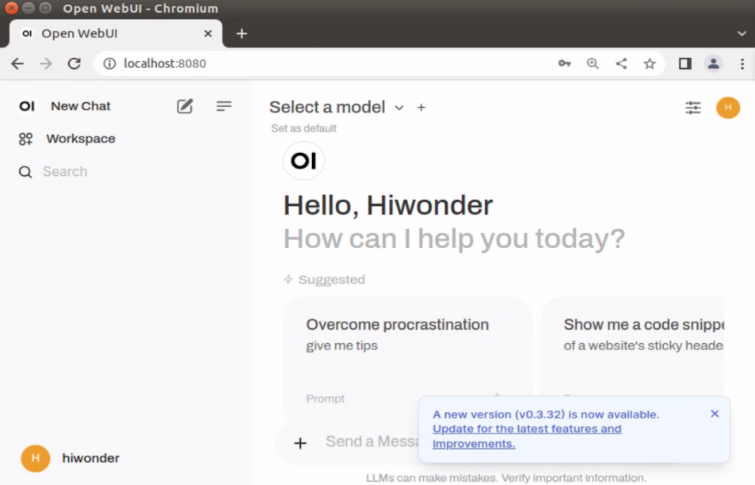

**1. Demo**

Using Open WebUI for dialogue may be slower than running directly with the Ollama tool, and you might even encounter service connection timeouts. This is related to the size of the board's memory and cannot be avoided!

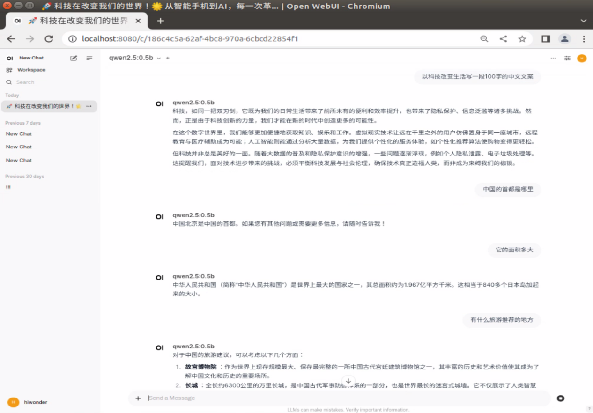

**2. Switching Models**

If you have downloaded multiple models, you can click on **Select a model** to choose a specific model for conversation. Models pulled using Ollama will automatically be added to the model options in Open WebUI.

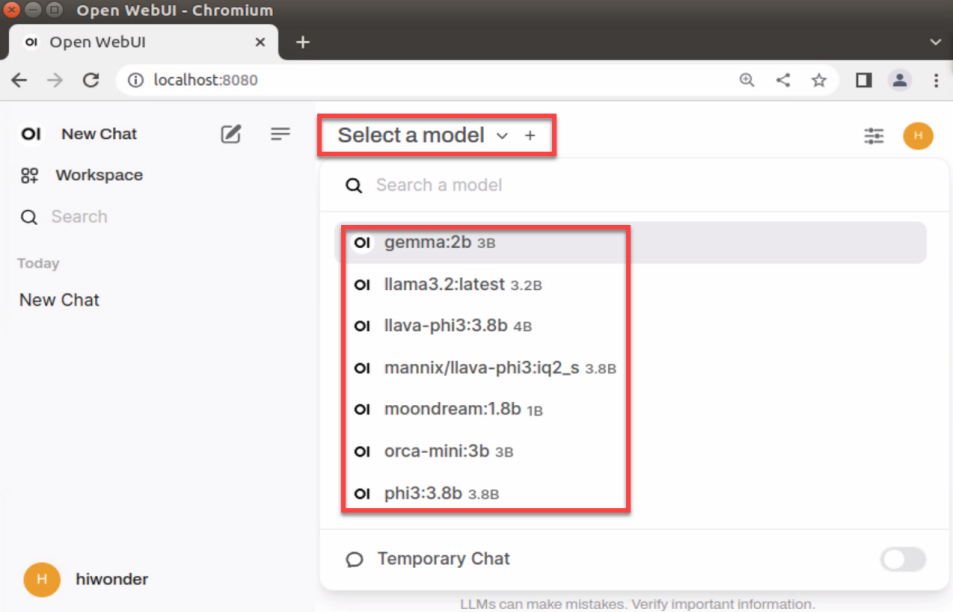

### 11.2.3 Closing Open WebUI

- **To check running Docker containers:**

  ```py
  docker ps
  ```

- To stop a running Docker container:

  ```py
  docker stop [CONTAINER ID] # For example: docker stop 5f42ee9cf784
  ```

Be cautious when following the next steps, as they involve removing containers.

- To view all stopped containers:

  ```py
  docker ps -a
  ```

- To remove a stopped container:

  ```py
  docker rm [CONTAINER ID] # For example: docker rm 5f42ee9cf784
  ```

- To remove all stopped containers:

  ```py
  docker container prune
  ```

### 11.2.4 FAQ

* **Service Connection Timeout** 

Error Message: Open WebUI: Server Connection Error

Solution: Close Open WebUI and restart it. After that, try asking your question again, or alternatively, use the Ollama tool to run the model and ask your question.

## 11.3 Meta AI: Llama 3 Model

### 11.3.1 Llama3 Introduction

Meta's Llama 3 is a series of advanced open-source large language models (LLMs) developed by Meta AI. Llama 3 has demonstrated state-of-the-art performance across various industry benchmarks and introduces new features, including enhanced inference capabilities.

On the architecture side, Llama 3 uses the standard decoder-only Transformer architecture and employs a tokenizer with a 128K token vocabulary. Llama 3 was pre-trained on Meta's custom-built 24K GPU clusters, using over 15 terabytes of publicly available data, 5% of which is non-English content, covering more than 30 languages. The training dataset is seven times larger than that of the previous Llama 2, with four times as much code.

* **Model Specifications**

Llama 3 comes in multiple versions, allowing you to choose based on the board's configuration.

<table  class="docutils-nobg" style="margin:0 auto" border="1">
  <colgroup>
    <col style="width: 33.33%;">
    <col style="width: 33.33%;">
    <col style="width: 33.34%;">
  </colgroup>
  <tbody>
    <!-- 表头：合并Compatible Boards列的空格，明确列名 -->
    <tr style="border: 1px solid #000;text-align:center">
      <td style="border: 1px solid #000; font-weight: bold; padding: 8px;">Model Specifications</td>
      <td style="border: 1px solid #000; font-weight: bold; padding: 8px;text-align:center" colspan="2">Compatible Boards</td>
    </tr>
    <!-- 子表头：列出具体兼容主板型号 -->
    <tr style="border: 1px solid #000;text-align:center">
      <td style="border: 1px solid #000; padding: 8px;">Llama3.2</td>
      <td style="border: 1px solid #000; padding: 8px;">Raspberry Pi 5 (4GB)</td>
      <td style="border: 1px solid #000; padding: 8px;">Raspberry Pi 5 (8GB)</td>
    </tr>
    <!-- 数据行：对应型号的兼容情况 -->
    <tr style="border: 1px solid #000;text-align:center">
      <td style="border: 1px solid #000; padding: 8px;">1B</td>
      <td style="border: 1px solid #000; padding: 8px;">√</td>
      <td style="border: 1px solid #000; padding: 8px;">√</td>
    </tr>
    <tr style="border: 1px solid #000;text-align:center">
      <td style="border: 1px solid #000; padding: 8px;">3B</td>
      <td style="border: 1px solid #000; padding: 8px;">√</td>
      <td style="border: 1px solid #000; padding: 8px;">√</td>
    </tr>
  </tbody>
</table>


* **Performance**


### 11.3.2 Running Llama 3

1. To run Llama 3.2:1B, enter the following command. If the model has not been pulled yet, it will be downloaded first.

   ```py
   ollama run llama3.2:1b
   ```


2. After entering a question, press Enter to send it. Response time depends on the hardware configuration, so please be patient!

   ```py
   Example questions: Write a 100-word copy on how technology changes life.
   ```

   ```py
   A rectangular nursery has an area of 120m². The length is 2m more than the width. What are the length and width of the nursery?
   ```

   ```py
   What is the capital of the United States?
   What is its area?
   What are some recommended tourist destinations?
   ```

3. To end the conversation, simply enter the following command:

   ```py
   /bye
   ```


### 11.3.3 References 

* **Ollama** 

Official Website: <https://ollama.com/>

GitHub：[https://github.com/ollama/ollama](quot;https://github.com/ollama/ollam)

* **Llama3** 

GitHub：[https://github.com/meta-llama/llama3](quot;https://github.com/meta-llama/llama3&quot)

Corresponding Models for Ollama: [<u>https://ollama.com/library/llama3.2:3b</u>](quot;https://ollama.com/library/llama3.2:3b&quot)

## 11.4 Alibaba Cloud: Qwen 2 Model

### 11.4.1 Introduction to Qwen 2 Model

The Qwen 2 model is an open-source large language model developed by Alibaba Cloud's Tongyi Qianwen team. It includes multiple pre-trained and instruction-tuned models of varying sizes, such as Qwen 2-0.5B, Qwen 2-1.5B, Qwen 2-7B, Qwen 2-57B-A14B, and Qwen 2-72B. This series of models has shown excellent performance across several benchmark tests, particularly excelling in areas such as language comprehension, text generation, multilingual capabilities, programming, mathematics, and reasoning. It competes effectively with proprietary models in these fields.

* **Model Specifications**

Qwen 2 comes in multiple versions, allowing you to choose based on the board's configuration.

<table style="width: 100%; border-collapse: collapse; text-align: center;">
  <colgroup>
    <col style="width: 33.33%;">
    <col style="width: 33.33%;">
    <col style="width: 33.34%;">
  </colgroup>
  <tbody>
      <tr style="border: 1px solid #000;text-align:center">
      <td style="border: 1px solid #000; font-weight: bold; padding: 8px;">Model Specifications</td>
      <td style="border: 1px solid #000; font-weight: bold; padding: 8px;text-align:center" colspan="2">Compatible Boards</td>
    </tr>
    <tr style="border: 1px solid #000;">
      <td style="border: 1px solid #000; padding: 8px;">Qwen2</td>
      <td style="border: 1px solid #000; padding: 8px;">Raspberry Pi 5 (4GB)</td>
      <td style="border: 1px solid #000; padding: 8px;">Raspberry Pi 5 (8GB)</td>
    </tr>
    <tr style="border: 1px solid #000;">
      <td style="border: 1px solid #000; padding: 8px;">1.5B</td>
      <td style="border: 1px solid #000; padding: 8px;">√</td>
      <td style="border: 1px solid #000; padding: 8px;">√</td>
    </tr>
    <tr style="border: 1px solid #000;">
      <td style="border: 1px solid #000; padding: 8px;">7B</td>
      <td style="border: 1px solid #000; padding: 8px;">√</td>
      <td style="border: 1px solid #000; padding: 8px;">×</td>
    </tr>
    <tr style="border: 1px solid #000;">
      <td style="border: 1px solid #000; padding: 8px;">72B</td>
      <td style="border: 1px solid #000; padding: 8px;">×</td>
      <td style="border: 1px solid #000; padding: 8px;">×</td>
    </tr>
  </tbody>
</table>


* **Performance**

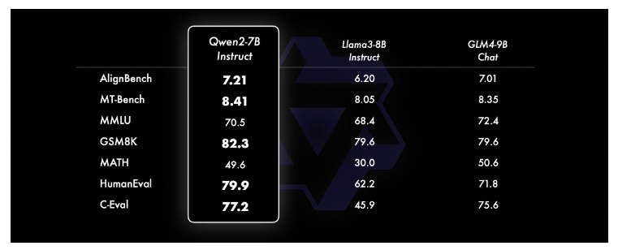

### 11.4.2 Running Qwen 2

1. To run Qwen 2:1.5B, enter the following command. If the model has not been pulled yet, it will be downloaded first.

   ```py
   ollama run qwen2:1.5b
   ```

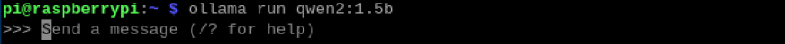

2. After entering a question, press Enter to send it. Response time depends on the hardware configuration, so please be patient!

   ```py
   Example questions: Write a 100-word copy on how technology changes life.
   ```

   ```py
   A rectangular nursery has an area of 120m². The length is 2m more than the width. What are the length and width of the nursery?
   ```

   ```py
   What is the capital of the United States?
   What is its area?
   What are some recommended tourist destinations?
   ```

3. To end the conversation, enter the following command:

   ```py
   /bye
   ```

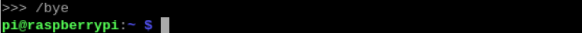

### 11.4.3 References 

*  **Ollama** 

Official Website: https://ollama.com/

GitHub：[https://github.com/ollama/ollama](quot;https://github.com/ollama/ollam)

* **Qwen2** 

GitHub：[https://github.com/QwenLM/Qwen2](quot;https://github.com/QwenLM/Qwen)

Corresponding Models for Ollama: [<u>https://ollama.com/library/qwen2</u>](quot;https://ollama.com/library/qwen2&quot)

## 11.5 Microsoft: Phi-3 Model

### 11.5.1 Introduction to Phi-3 Model

The Phi-3 model is a series of compact language models (SLMs) developed by Microsoft Research, designed to offer language understanding and reasoning capabilities comparable to larger models, while maintaining a smaller parameter size. The Phi-3 series includes three versions with different sizes: phi-3-mini, phi-3-small, and phi-3-medium. Each version is tailored for specific use cases and requirements.

* **Model Specifications**

Phi-3 comes in multiple versions, allowing you to choose based on the board's configuration.

<table  class="docutils-nobg" style="margin:0 auto" border="1">
  <colgroup>
    <col style="width: 33.33%;">
    <col style="width: 33.33%;">
    <col style="width: 33.34%;">
  </colgroup>
  <tbody>
    <!-- 表头：合并Compatible Boards列的空格，明确列名 -->
    <tr style="border: 1px solid #000;text-align:center">
      <td style="border: 1px solid #000; font-weight: bold; padding: 8px;">Model Specifications</td>
      <td style="border: 1px solid #000; font-weight: bold; padding: 8px;text-align:center" colspan="2">Compatible Boards</td>
    </tr>
    <!-- 子表头：列出具体兼容主板型号 -->
    <tr style="border: 1px solid #000;text-align:center">
      <td style="border: 1px solid #000; padding: 8px;">Phi-3.5</td>
      <td style="border: 1px solid #000; padding: 8px;">Raspberry Pi 5 (4GB)</td>
      <td style="border: 1px solid #000; padding: 8px;">Raspberry Pi 5 (8GB)</td>
    </tr>
    <!-- 数据行：对应型号的兼容情况 -->
    <tr style="border: 1px solid #000;text-align:center">
      <td style="border: 1px solid #000; padding: 8px;">3.8B</td>
      <td style="border: 1px solid #000; padding: 8px;">√</td>
      <td style="border: 1px solid #000; padding: 8px;">√</td>
    </tr>
    <tr style="border: 1px solid #000;text-align:center">
      <td style="border: 1px solid #000; padding: 8px;">14B</td>
      <td style="border: 1px solid #000; padding: 8px;">×</td>
      <td style="border: 1px solid #000; padding: 8px;">×</td>
    </tr>
  </tbody>
</table>

* **Performance**


### 11.5.2 Running Phi-3

1. To run Phi-3:3.8B, enter the following command: If the model has not been pulled yet, it will be downloaded first. If installation fails, try again or reboot and attempt once more.

   ```py
   ollama run phi3:3.8b
   ```


2. After entering a question, press **Enter** to send it. Response time depends on the hardware configuration, so please be patient!

   ```py
   Example questions: Write a 100-word copy on how technology changes life.
   ```

   ```py
   A rectangular nursery has an area of 120m². The length is 2m more than the width. What are the length and width of the nursery?
   ```

   ```py
   What is the capital of the United States?
   What is its area?
   What are some recommended tourist destinations?
   ```

3. To end the conversation, enter the following command:

   ```py
   /bye
   ```


### 11.5.3 References 

* **Ollama** 

Official Website: https://ollama.com/

GitHub：https://github.com/ollama/ollama

Corresponding Models for Ollama: https://ollama.com/library/phi3

## 11.6 Google: Gemma Model

### 11.6.1 Introduction to Gemma Model

Gemma is an open-source AI large model developed collaboratively by Google DeepMind and other teams, with the goal of advancing responsible AI development.

The Gemma model incorporates the same research and technologies as the Gemini model, including Rotational Position Encoding (RoPE), the SentencePiece tokenizer, Logit Clipping, and the GeGLU activation function. Gemma 2 features a deeper network architecture and alternates between local sliding windows and global attention mechanisms to improve model performance and efficiency.

* **Model Specifications**

Gemma comes in multiple versions, allowing you to choose based on the board's configuration.

<table  class="docutils-nobg" style="margin:0 auto" border="1">
  <colgroup>
    <col style="width: 33.33%;">
    <col style="width: 33.33%;">
    <col style="width: 33.34%;">
  </colgroup>
  <tbody>
    <!-- 表头：合并Compatible Boards列的空格，明确列名 -->
    <tr style="border: 1px solid #000;text-align:center">
      <td style="border: 1px solid #000; font-weight: bold; padding: 8px;">Model Specifications</td>
      <td style="border: 1px solid #000; font-weight: bold; padding: 8px;text-align:center" colspan="2">Compatible Boards</td>
    </tr>
    <!-- 子表头：列出具体兼容主板型号 -->
    <tr style="border: 1px solid #000;text-align:center">
      <td style="border: 1px solid #000; padding: 8px;">Gemma</td>
      <td style="border: 1px solid #000; padding: 8px;">Raspberry Pi 5 (4GB)</td>
      <td style="border: 1px solid #000; padding: 8px;">Raspberry Pi 5 (8GB)</td>
    </tr>
    <!-- 数据行：对应型号的兼容情况 -->
    <tr style="border: 1px solid #000;text-align:center">
      <td style="border: 1px solid #000; padding: 8px;">7B</td>
      <td style="border: 1px solid #000; padding: 8px;">√</td>
      <td style="border: 1px solid #000; padding: 8px;">√</td>
    </tr>
    <tr style="border: 1px solid #000;text-align:center">
      <td style="border: 1px solid #000; padding: 8px;">7B</td>
      <td style="border: 1px solid #000; padding: 8px;">×</td>
      <td style="border: 1px solid #000; padding: 8px;">√</td>
    </tr>
  </tbody>
</table>

### 11.6.2 Running Gemma

1. To run Gemma:2B, enter the following command: If the model has not been pulled yet, it will be downloaded first. If installation fails, try again or reboot and attempt once more.

   ```py
   ollama run gemma:2b
   ```

2. After entering a question, press Enter to send it. Response time depends on the hardware configuration, so please be patient!

   ```py
   Example questions: Write a 100-word copy on how technology changes life.
   ```

   ```py
   What is the capital of the United States?
   ```

   ```py
   What is its area?
   What are some recommended tourist destinations?
   A rectangular nursery has an area of 120m². The length is 2m more than the width. What are the length and width of the nursery?
   ```

3. To end the conversation, simply enter the following command:

   ```py
   /bye
   ```


### 11.6.3 References 

* **Ollama** 

Official Website: https://ollama.com/

GitHub：https://github.com/ollama/ollama

* **Gemma** 

GitHub：https://github.com/google-deepmind/gemma

Corresponding Models for Ollama: https://ollama.com/library/gemma

## 11.7 DeepSeek Coder Model

### 11.7.1 Introduction to DeepSeek Coder Model

The DeepSeek Coder model is based on DeepSeek V2.5, which significantly outperforms the previous versions in both general capabilities and coding proficiency. DeepSeek Coder V2 and DeepSeek V2 Chat have been merged and upgraded to DeepSeek V2.5. The new model has been optimized across various tasks, including writing tasks and instruction-following, aligning more closely with human preferences.

* **Model Specifications**

DeepSeek Coder comes in multiple versions, allowing you to choose based on the board's configuration.

<table style="width: 100%; border-collapse: collapse; text-align: center;">
  <colgroup>
    <col style="width: 33.33%;">
    <col style="width: 33.33%;">
    <col style="width: 33.34%;">
  </colgroup>
  <tbody>
      <tr style="border: 1px solid #000;text-align:center">
      <td style="border: 1px solid #000; font-weight: bold; padding: 8px;">Model Specifications</td>
      <td style="border: 1px solid #000; font-weight: bold; padding: 8px;text-align:center" colspan="2">Compatible Boards</td>
    </tr>
    <tr style="border: 1px solid #000;">
      <td style="border: 1px solid #000; padding: 8px;">DeepSeek Coder</td>
      <td style="border: 1px solid #000; padding: 8px;">Raspberry Pi 5 (4GB)</td>
      <td style="border: 1px solid #000; padding: 8px;">Raspberry Pi 5 (8GB)</td>
    </tr>
    <tr style="border: 1px solid #000;">
      <td style="border: 1px solid #000; padding: 8px;">1.3B</td>
      <td style="border: 1px solid #000; padding: 8px;">√</td>
      <td style="border: 1px solid #000; padding: 8px;">√</td>
    </tr>
    <tr style="border: 1px solid #000;">
      <td style="border: 1px solid #000; padding: 8px;">6.7B</td>
      <td style="border: 1px solid #000; padding: 8px;">×</td>
      <td style="border: 1px solid #000; padding: 8px;">√</td>
    </tr>
    <tr style="border: 1px solid #000;">
      <td style="border: 1px solid #000; padding: 8px;">33B</td>
      <td style="border: 1px solid #000; padding: 8px;">×</td>
      <td style="border: 1px solid #000; padding: 8px;">×</td>
    </tr>
  </tbody>
</table>

* **1.2 Performance**

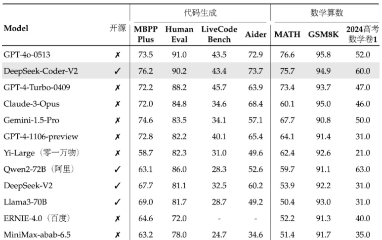

### 11.7.2 Running DeepSeek Coder

1. To run DeepSeek Coder:1.3B, enter the following command. If the model has not been pulled yet, it will be downloaded first.

   ```py
   ollama run deepseek-coder:1.3b
   ```

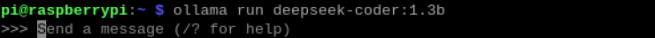

2. After entering a question, press **Enter** to send it. Response time depends on the hardware configuration, so please be patient!

   ```py
   Example questions: Write a 100-word copy on how technology changes life.
   ```

   ```py
   Find the smallest even number in the list \[12, 45, 7, 23, 56, 89, 34\] using Python.
   ```

3. To end the conversation, enter the following command:

   ```py
   /bye
   ```

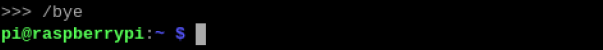

### 11.7.3 References 

* **Ollama** 

Official Website: https://ollama.com/

GitHub：https://github.com/ollama/ollama

* **DeepSeek Coder**

Corresponding Models for Ollama: https://ollama.com/library/deepseek-coder

GitHub：https://github.com/deepseek-ai/DeepSeek-Coder

## 11.8 Orca Mini Model

### 11.8.1 Introduction to Orca Mini Model

The Orca Mini model is an open-source LLM (Large Language Model) that can run locally. The key feature of this model is its ability to operate locally, allowing you to leverage advanced language model technology without relying on cloud services. Developed by the ORCA project, Orca Mini aims to provide an efficient and easy-to-use solution for running large language models locally.

* **Model Specifications**

Orca Mini comes in multiple versions, allowing you to choose based on the board's configuration.

<table style="width: 100%; border-collapse: collapse; text-align: center;">
  <colgroup>
    <col style="width: 33.33%;">
    <col style="width: 33.33%;">
    <col style="width: 33.34%;">
  </colgroup>
  <tbody>
      <tr style="border: 1px solid #000;text-align:center">
      <td style="border: 1px solid #000; font-weight: bold; padding: 8px;">Model Specifications</td>
      <td style="border: 1px solid #000; font-weight: bold; padding: 8px;text-align:center" colspan="2">Compatible Boards</td>
    </tr>
    <tr style="border: 1px solid #000;">
      <td style="border: 1px solid #000; padding: 8px;">Orca Mini</td>
      <td style="border: 1px solid #000; padding: 8px;">Raspberry Pi 5 (4GB)</td>
      <td style="border: 1px solid #000; padding: 8px;">Raspberry Pi 5 (8GB)</td>
    </tr>
    <tr style="border: 1px solid #000;">
      <td style="border: 1px solid #000; padding: 8px;">3B</td>
      <td style="border: 1px solid #000; padding: 8px;">√</td>
      <td style="border: 1px solid #000; padding: 8px;">√</td>
    </tr>
    <tr style="border: 1px solid #000;">
      <td style="border: 1px solid #000; padding: 8px;">7B</td>
      <td style="border: 1px solid #000; padding: 8px;">×</td>
      <td style="border: 1px solid #000; padding: 8px;">√</td>
    </tr>
    <tr style="border: 1px solid #000;">
      <td style="border: 1px solid #000; padding: 8px;">13B</td>
      <td style="border: 1px solid #000; padding: 8px;">×</td>
      <td style="border: 1px solid #000; padding: 8px;">×</td>
    </tr>
    <tr style="border: 1px solid #000;">
      <td style="border: 1px solid #000; padding: 8px;">70B</td>
      <td style="border: 1px solid #000; padding: 8px;">×</td>
      <td style="border: 1px solid #000; padding: 8px;">×</td>
    </tr>
  </tbody>
</table>

### 11.8.2 Running Orca Mini

1. To run orca-mini:3b, enter the following command. If the model has not been pulled yet, it will be downloaded first.

   ```py
   ollama run orca-mini:3b
   ```


2. After entering a question, press **Enter** to send it. Response time depends on the hardware configuration, so please be patient!

   ```py
   Example questions: Write a 100-word copy on how technology changes life.
   ```

   ```py
   What is the capital of the United States?
   What is its area?
   What are some recommended tourist destinations?
   ```

   ```py
   A rectangular nursery has an area of 120m². The length is 2m more than the width. What are the length and width of the nursery?
   ```

3. To end the conversation, enter the following command:

   ```py
   /bye
   ```


### 11.8.3 References 

* **Ollama** 

Official Website: https://ollama.com/

GitHub：https://github.com/ollama/ollama

* **Orca Mini** 

Corresponding Models for Ollama:https://ollama.com/library/orca-mini

## 11.9 StarCoder2 Model

### 11.9.1 StarCoder2 Model

The StarCoder2 model is a series of open-source large language models designed for code-related tasks. It offers models in three different sizes, including 3 billion, 7 billion, and 15 billion parameters. These models are trained on The Stack v2 dataset, which includes over 600 programming languages, and have demonstrated excellent performance across various evaluations.

* **Model Specifications**

‌StarCoder 2 comes in multiple versions, allowing you to choose based on the board's configuration.

<table style="width: 100%; border-collapse: collapse; text-align: center;">
  <colgroup>
    <col style="width: 33.33%;">
    <col style="width: 33.33%;">
    <col style="width: 33.34%;">
  </colgroup>
  <tbody>
      <tr style="border: 1px solid #000;text-align:center">
      <td style="border: 1px solid #000; font-weight: bold; padding: 8px;">Model Specifications</td>
      <td style="border: 1px solid #000; font-weight: bold; padding: 8px;text-align:center" colspan="2">Compatible Boards</td>
    </tr>
    <tr style="border: 1px solid #000;">
      <td style="border: 1px solid #000; padding: 8px;">StarCoder2</td>
      <td style="border: 1px solid #000; padding: 8px;">Raspberry Pi 5 (4GB)</td>
      <td style="border: 1px solid #000; padding: 8px;">Raspberry Pi 5 (8GB)</td>
    </tr>
    <tr style="border: 1px solid #000;">
      <td style="border: 1px solid #000; padding: 8px;">3B</td>
      <td style="border: 1px solid #000; padding: 8px;">√</td>
      <td style="border: 1px solid #000; padding: 8px;">√</td>
    </tr>
    <tr style="border: 1px solid #000;">
      <td style="border: 1px solid #000; padding: 8px;">7B</td>
      <td style="border: 1px solid #000; padding: 8px;">×</td>
      <td style="border: 1px solid #000; padding: 8px;">√</td>
    </tr>
    <tr style="border: 1px solid #000;">
      <td style="border: 1px solid #000; padding: 8px;">15B</td>
      <td style="border: 1px solid #000; padding: 8px;">×</td>
      <td style="border: 1px solid #000; padding: 8px;">×</td>
    </tr>
  </tbody>
</table>

* **Performance**


### 11.9.2 Running‌StarCoder2

‌StarCoder 2 is primarily designed for code generation, editing, and reasoning tasks.

1. Run the ‌StarCoder 2:3b model using the following command. If the model has not been pulled yet, it will be downloaded first.

   ```py
   ollama run starcoder2:3b
   ```


2. After entering a question, press **Enter** to send it. Response time depends on the hardware configuration, so please be patient!

   ```py
   Find the smallest even number in the list [12, 45, 7, 23, 56, 89, 34] using Python.
   ```

3. To end the conversation, enter the following command:

   ```py
   /bye
   ```


### 11.9.3 References 

* **Ollama** 

Official Website: https://ollama.com/

GitHub：https://github.com/ollama/ollama

* **StarCoder2** 

GitHub：https://ollama.com/library/starcoder2

Corresponding Models for Ollama: https://ollama.com/library/starcoder2

## 11.10 LLaVA-Phi3 Model

### 11.10.1 Introduction to LLaVA-Phi3 Model

LLaVA-Phi3 is a fine-tuned version of the LLaVA model based on Phi 3 Mini 4k. LLaVA (Large-scale Language and Vision Assistant) is a multimodal model designed to achieve general-purpose vision and language understanding by combining a visual encoder with a large-scale language model.

* **Model Specifications**

<table style="text-align: center; border-collapse: collapse;">
  <tbody>
    <tr>
      <td style="border: 1px solid black; font-weight: bold;">Model Specifications</td>
      <td style="border: 1px solid black; font-weight: bold;" colspan="7">Compatible Boards</td>
    </tr>
    <tr>
      <td style="border: 1px solid black; font-weight: bold;" rowspan="2">LLaVA-Phi3</td>
        <td style="border: 1px solid black; font-weight: bold;" rowspan="2">Jetson Nano</td>
      <td style="border: 1px solid black; font-weight: bold;" colspan="2">Jetson Orin Nano</td>
      <td style="border: 1px solid black; font-weight: bold;" colspan="2">Jetson Orin NX</td>
      <td style="border: 1px solid black; font-weight: bold;" colspan="2">Raspberry Pi 5</td>
    </tr>
    <tr>
      <td style="border: 1px solid black;">4G</td>
      <td style="border: 1px solid black;">8G</td>
      <td style="border: 1px solid black;">8G</td>
      <td style="border: 1px solid black;">16G</td>
      <td style="border: 1px solid black;">4G</td>
      <td style="border: 1px solid black;">8G</td>
    </tr>
    <tr>
      <td style="border: 1px solid black;">3.8B</td>
      <td style="border: 1px solid black;">√</td>
      <td style="border: 1px solid black;">√</td>
      <td style="border: 1px solid black;">√</td>
      <td style="border: 1px solid black;">√</td>
      <td style="border: 1px solid black;">√</td>
      <td style="border: 1px solid black;">√</td>
      <td style="border: 1px solid black;">√</td>
    </tr>
  </tbody>
</table>


### 11.10.2 Running LLaVA-Phi3

1) To run LLaVA-Phi3 :3.8b, enter the following command. If the model has not been pulled yet, it will be downloaded first.


2) After entering a question, press Enter to send it. Response time depends on the hardware configuration, so please be patient!

You can drag an image directly into the terminal. The image below is an example, you may import your own.


3) To end the conversation, simply enter the following command:

```py
/bye
```


### 11.10.3 References

* **Ollama**

Official Website: https://ollama.com/

GitHub：https://github.com/ollama/ollama

* **LLaVA-Phi3**

GitHub：https://github.com/InternLM/xtuner/tree/main

Corresponding Models for Ollama: https://ollama.com/library/llava-phi3

## 11.11 Moondream Model

### 11.11.1 Moondream Model Overview

‌Moondream is a compact yet powerful vision-language model designed to deliver strong performance across a wide range of environments. It is initialized with SigLIP and Phi-1.5 weights and contains 1.86 billion parameters, enabling efficient operation and impressive adaptability.

* **Model Specifications**

<table style="width: 100%; border-collapse: collapse; text-align: center;">
  <colgroup>
    <col style="width: 33.33%;">
    <col style="width: 33.33%;">
    <col style="width: 33.34%;">
  </colgroup>
  <tbody>
      <tr style="border: 1px solid #000;text-align:center">
      <td style="border: 1px solid #000; font-weight: bold; padding: 8px;">Model Specifications</td>
      <td style="border: 1px solid #000; font-weight: bold; padding: 8px;text-align:center" colspan="2">Compatible Boards</td>
    </tr>
    <tr style="border: 1px solid #000;">
      <td style="border: 1px solid #000; padding: 8px;">moondream</td>
      <td style="border: 1px solid #000; padding: 8px;">Raspberry Pi 5 (4GB)</td>
      <td style="border: 1px solid #000; padding: 8px;">Raspberry Pi 5 (8GB)</td>
    </tr>
    <tr style="border: 1px solid #000;">
      <td style="border: 1px solid #000; padding: 8px;">1.8B</td>
      <td style="border: 1px solid #000; padding: 8px;">√</td>
      <td style="border: 1px solid #000; padding: 8px;">√</td>
    </tr>
  </tbody>
</table>

* **Performance**

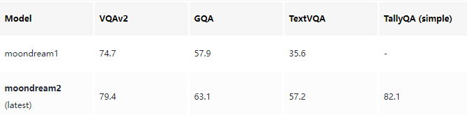

### 11.11.2 Running moondream

The Moondream model is primarily designed for image-based question answering and image description tasks.

1. Run the moondream:1.8b model using the following command. If the model has not been pulled yet, it will be downloaded first.

   ```py
   ollama run moondream:1.8b
   ```

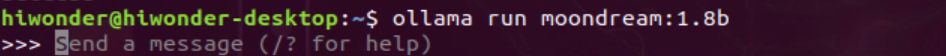

2. Press **Enter** after entering the image path and file name to send it. Response time depends on the hardware configuration, so please be patient!

   You can drag an image directly into the terminal.

   ```py
   /home/hiwonder/Desktop/3.png
   ```

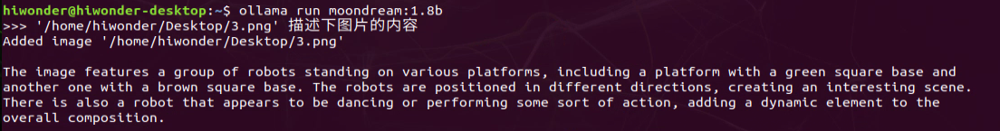

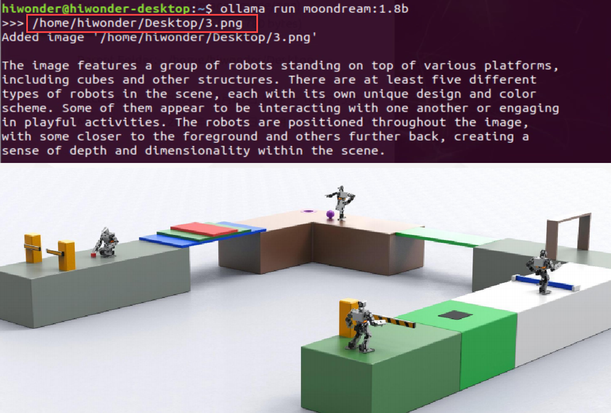

3. To end the conversation, enter the following command:

   ```py
   /bye
   ```

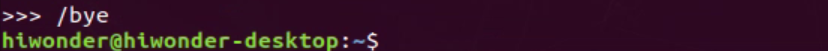

### 11.11.3 References 

* **Ollama** 

Official Website: https://ollama.com/

GitHub: https://github.com/ollama/ollama

*  **moondream**

Corresponding Models for Ollama: https://ollama.com/library/moondream
