# 2. Conifiguration Guide

## 2.1 Introduction to Jetson Orin Nano

Jetson Orin Nano is a new member of the Jetson series. The core board is as picture.

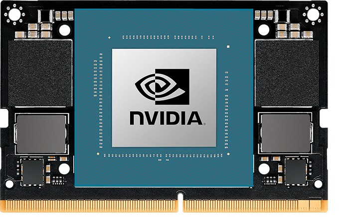

###  2.1.1 Overview

Jetson Orin Nano development kit features the Jetson Orin Nano module, available in 8GB and 4GB memory versions.

1. The CPU of Orin SoC is based on the Cortex-A78AE architecture.

2. Both Jetson Orin Nano 8GB/4GB is equipped with 6 cores, with a maximum frequency of 1.5GHz.

3. The GPU is based on the Ampere architecture, specifically the GA10B, featuring 1,024 CUDA cores and 32 Tensor Cores, with a maximum frequency of 625MHz.

4. Jetson Orin Nano only has a hardware decoder but no hardware compiler, with encoding capabilities limited to 1080p30, supported by 1-2 CPU cores. In terms of computing resources, the Jetson Orin Nano 4GB is similar to the Jetson Orin Nano 8GB, being half of the AGX orin 64GB version but with a lower frequency and thus lower power consumption. Despite its very low power consumption, the Jetson Orin Nano still delivers strong performance, with single-precision floating-point performance of 1.28 TFLOPs. The Jetson Orin Nano 4GB and Jetson Orin Nano 8GB models is very similar, but in addition to differences in frequency and power.

###  2.1.2 Performance Comparison Between Jetson Nano and Jetson Orin Nano

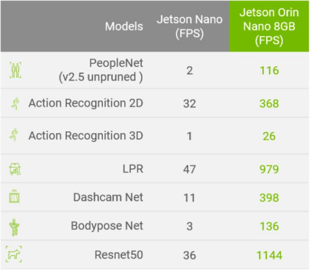

From the above image, the Jetson Orin Nano represents an order-of-magnitude improvement in performance. According to official data, the Jetson Orin Nano reaches 40 TOPS of AI performance, which is 80 times greater than Jetson Nano.

###  2.1.3 Comparison Between Jetson Orin Nano 4GB and 8GB

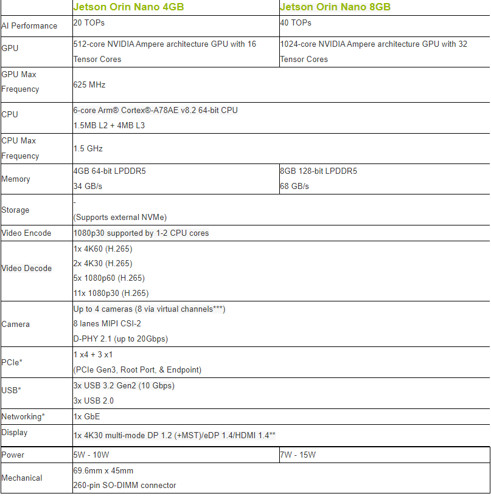

## 2.2 Flashing Firmware Using SDK Manger Tool

The SDK Manager is an official software provided by NAVIDA for flashing SDK. It can be downloaded from the NVIDIA official website based on the JetPack version. Please note that all operations in this document are performed in an Ubuntu environment. You can select either an Ubuntu PC or a virtual machine with an Ubuntu environment. **Ensure that there is at lease 100GB of available disk space. It is important to note that the SDK manger currently supports download and usage only on Ubuntu 18 or 20 systems.**

It is imperative to use the SDK Manger if you want to install a completely new original image on Jetson Orin Nano.

Users can use the SDK Manger in a virtual machine to flash image on Jetson Orin Nano. This lesson focuses on how to install SDK tool in a virtual machine and use if for flashing image.

###  2.2.1 Hardware Preparations

1. A Jetson Orin Nano board

2. A 5V 4A power adapter

3. A jumper cap and a Dupond line

4. A Type-C data cable

5. A display, a mouse and a keyboard

###  2.2.2 Software Preparations

* **Virtual Machine Configuration**

Install the virtual machine software "**[VMware Workstation Pro](https://drive.google.com/drive/folders/1UcCOwynkVlhPwAvY0srWcv6i3fJNugTb?usp=sharing)**" and create a virtual machine. For the detailed operation method, please refer to ther relevant content.

* **Register for NVIDIA DEVELOPER Account**

Since using SDK manager requires to log in with an NVIDAI DEVELOPER account, please register for an account in advance. The specific steps are as follows:

> [!Note]
>
> **If you already have an NVIDIA DEVELOPER account, you can start with "[2.2.2 Software Preparations ->Install SDK Manager](#anchor_2_2_2_3)".**

1. Access NVIDAI DEVELOPE website at "[**<u>https://developer.nvidia.com/</u>**](https://developer.nvidia.com/)" and click "**Join**" in the upper-right corner.

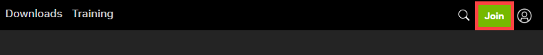

2. In the "Email" bar, enter the email address for signing up, and then click "**Next**".

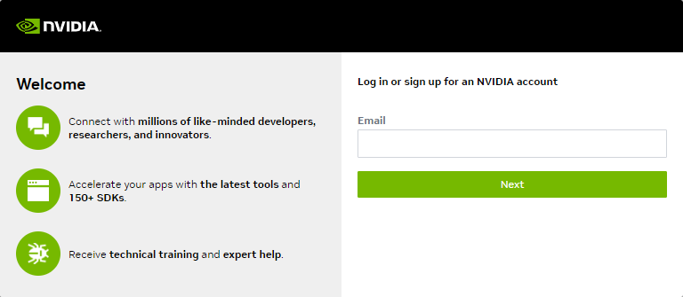

3. Enter the password.

4. After completing the registration, return to the login page. For the first login, you need to complete the privacy settings by selecting the second option and click "**Submit**".

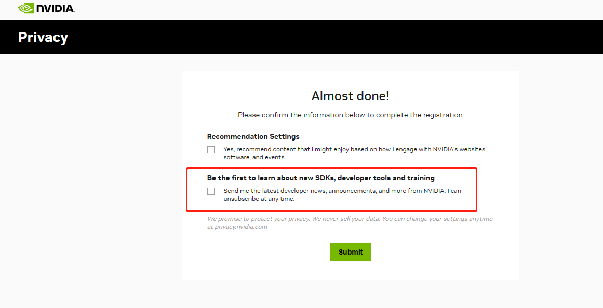

5. Additionally, you need to check "**Join the NVIDIA Developer Program to access downloads (like cuDNN), how-to-video, and more.**"

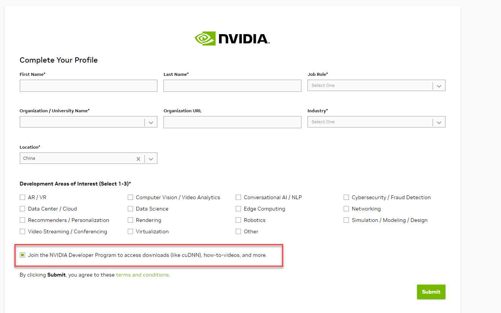

<p id="anchor_2_2_2_3"></p>

* **Install SDK Manager**

This section takes Jetpack5.1.1 (the latest version officially adapted for Jetson Orin Nano by NVIDIA) as an example. The SDK Manger download link is: <https://developer.nvidia.com/embedded/jetpack-sdk-511>. Choose " **NVIDIA SDK Manager Method**" and click "**Download**".

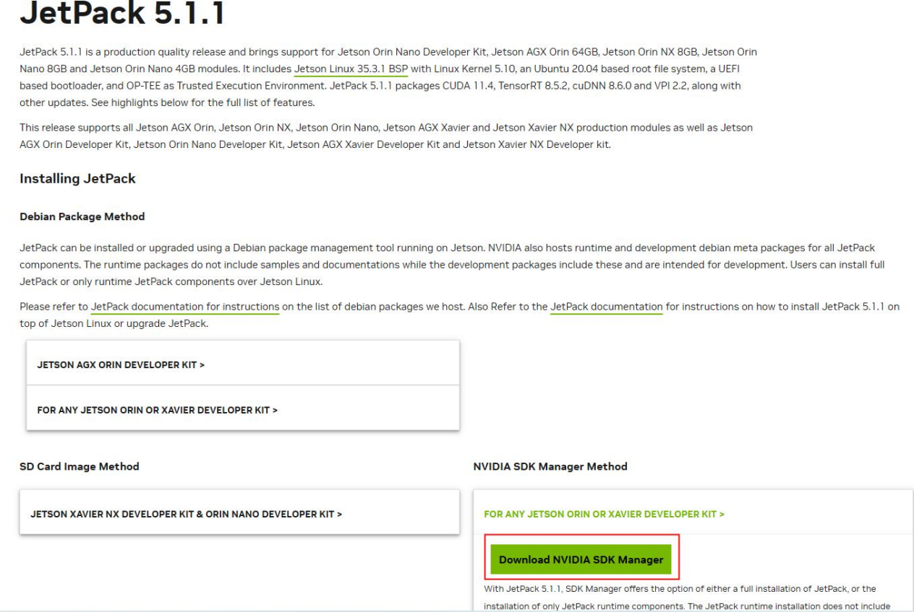

You can choose to download the file in deb format.

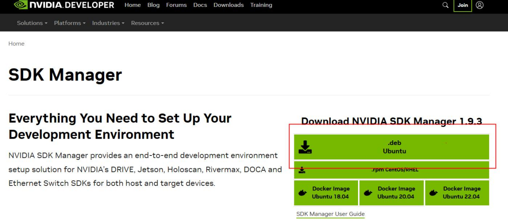

>[!Note]
>
>**When installing the virtual machine, we recommend to follow the installtion method described in Lesson 10 (Simple installation). If you use the custom installation, you will need to manually install "VMware Tools".**

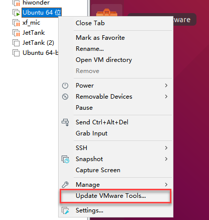

The specific operation steps for installing the SDK Manager on a the virtual machine are as follow:

1. Click  to open the virtual machine, and then click "**Power on this virtual machine**" to start the virtual machine.

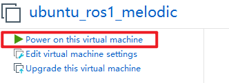

2. Drag the SDK Manager installation file directly from the PC to the the virtual machine’s desktop.

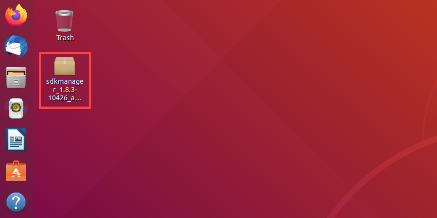

3. Click 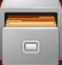to open the file manger, and move the SDK Manger installation file to the home directory.

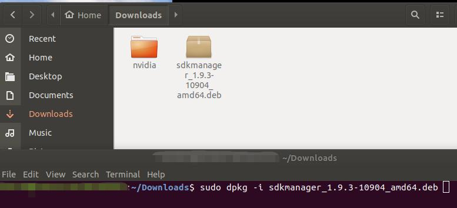

4. Click  in the menu bar, and click  or use the shortcut key "**Ctrl+Alt+T**" to open the terminal.

>[!Note]
>
>**The entered command should be case sensitive and "Tab" key can be used to complement the key words.**

5. Enter the command "**sudo apt install ./sdkmanager_1.8.3-10426_amd64.deb**" and press Enter to install the SDK Manger tool.

```bash
sudo apt install ./sdkmanager_1.8.3-10426_amd64.deb
```

The "**sdkmanager_1.8.3-10426_amd64.deb**" in command represents the default name of the installlation file. If you have renamed the file, you need to modify the command needs accordingly based on the actual file name.

6. Enter the system account and password, and press Enter. The password here is "**ubuntu**".

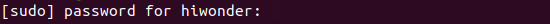

>[!Note]
>
>**When entering the password, the terminal interface will hide the characters being typed.**

7. If the following prompt occurs, please input "**Y**" and press Enter.


8. After completing the installation, click  to find the SDK Manager icon in the program interface.

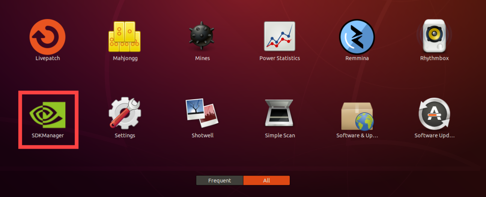

###  2.2.3 Install System

1. Use a jumper cap or Dupond wire to short the "FC REC" and "GND" pins on the development board, allowing the Jetson Orin Nano board to enter the Force Recovery mode. (If the development board only requires SDK installation and the system has already been installed before shipment, there is not need to short the "FC REC" and "GND" pins.)

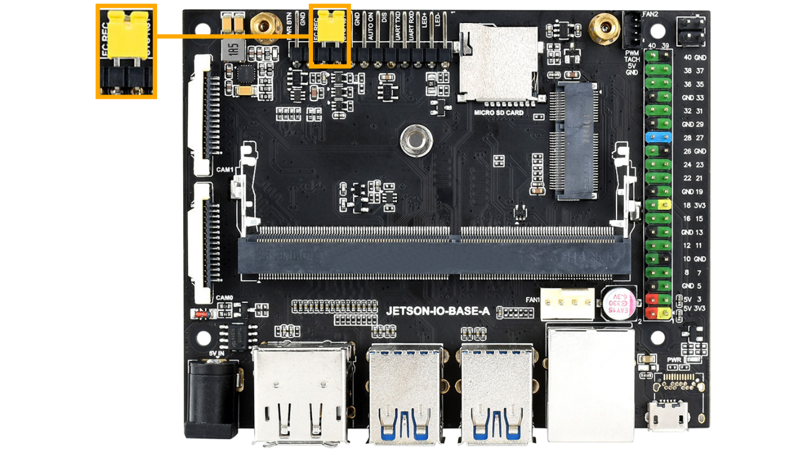

2. Connect the 5V 4A power adapter to the DC power port of Jetson Orin Nano, then power it on.

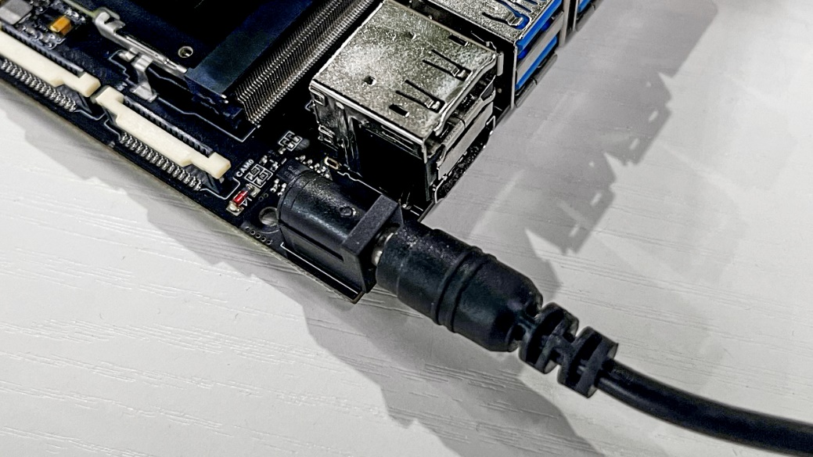

>[!Note]
>
>**Be sure to short the pins first, then power on the development board.**

3. Click  to open the virtual machine software, then click "**Power on this virtual machine**" to start the virtual machine.


4. Once the virtual machine has fully booted, connect one end of the USB data cable to the Micro USB port on the Jetson Orin Nano and the other end to a USB port on your computer.

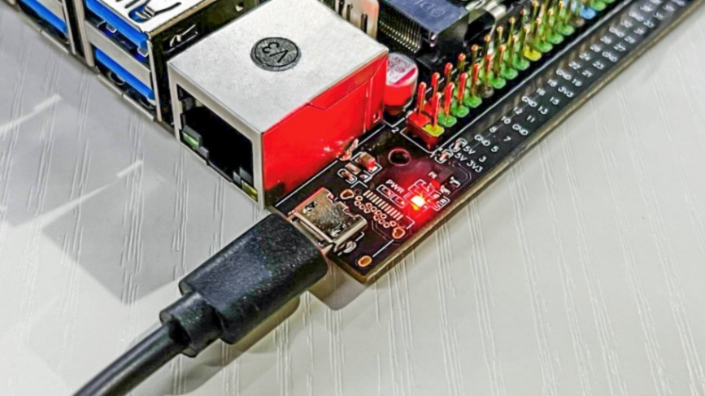

5. If the following window appears, choose "**Connect to a virtual machine**" and select the virtual machine you’re using. Click "**OK**" to connect the development board to the virtual machine.

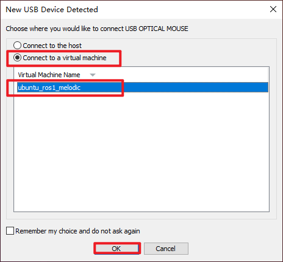

6. If no device detection windows appears, you can also connect the development board to the virtual machine by click on "**VM -\> Removable Devices -\> NVIDIA APX -\> Connect (Disconnect from Host)**".

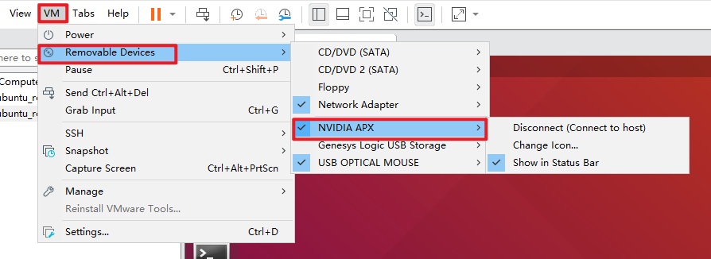

7. Click  on the menu bar and click 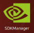 to run the SDK Manager tool. If the following warning pop-up appears, click "**Yes**".

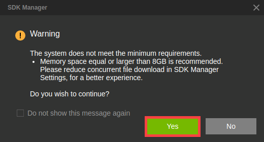

8. Click "**LOGIN**".

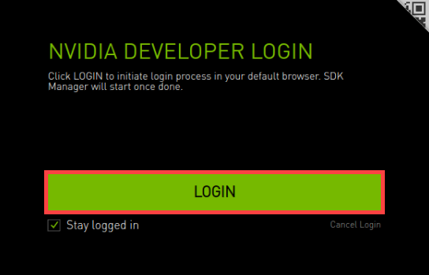

9. Login in with your account on the NVIDAI DEVELOPER website.

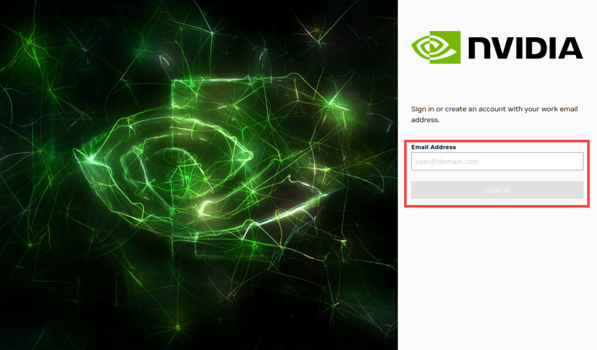

10. It is required to complete security verification when logging in. Go to your email and click the verification link sent by NVIDIA.

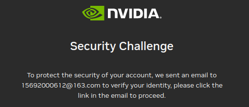

11. If the following prompt window occurs, check "**No, disable usage collection.**" and click "**OK**".

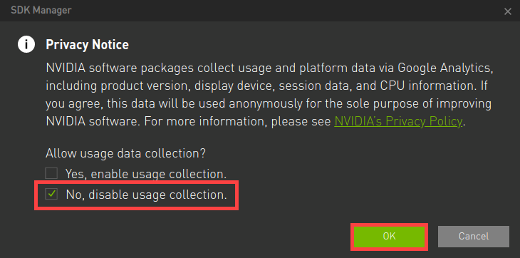

12. If a window for selecting the development board model pops up, choose "**Jetson Orin Nano**" and click the "**OK**" button. If the Target Hardware shows a "Not Connected" status, make sure the Nano is in REC flashing mode and connected to the virtual machine, then click "**Refresh**" to update. Normally, the connected Jetson Orin Nano device will be automatically recognized. After confirming the correct device, click "**CONTINUE**".

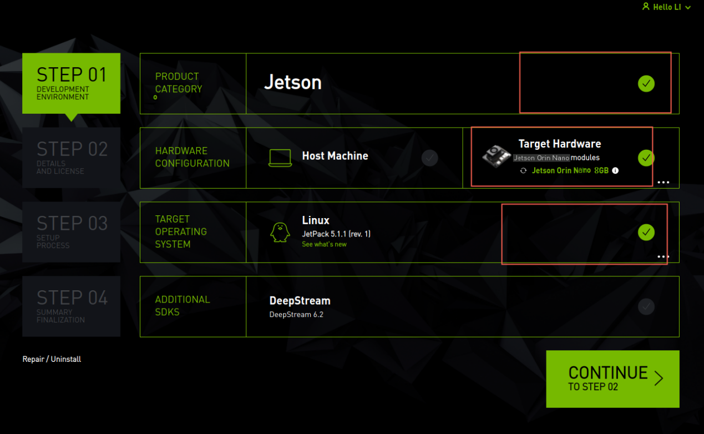

13. In the "**STEP 02**" interface, keep the default file download path, check the agreement box, and click "**CONTINUE**" to proceed to the next step

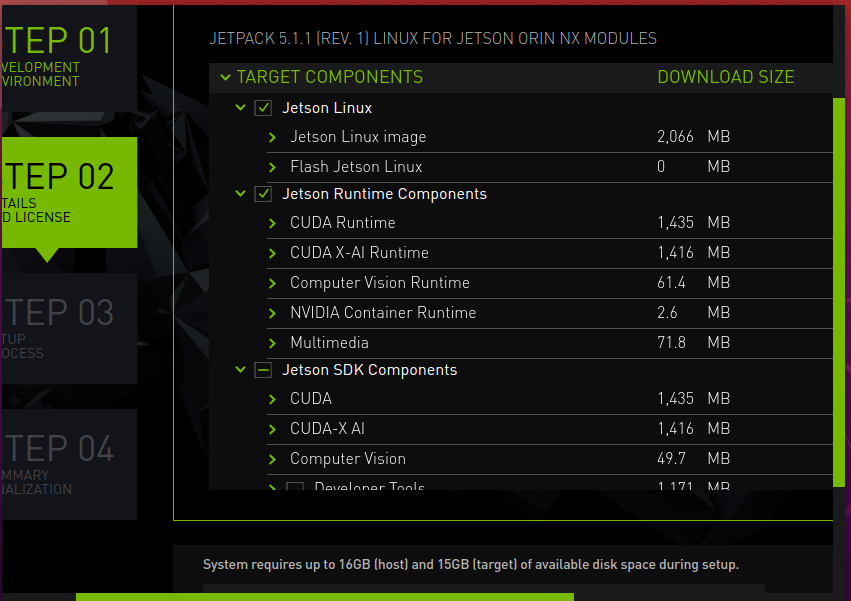

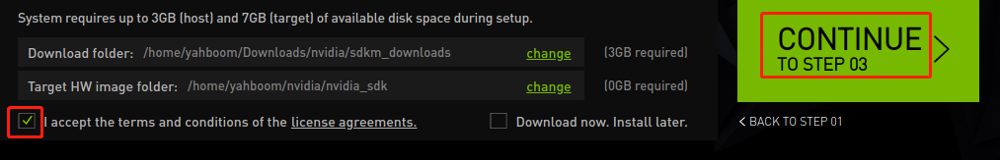

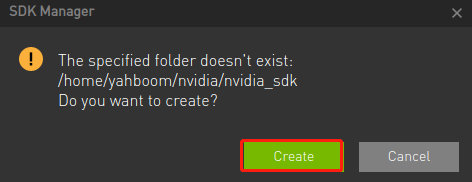

14. Enter the password for the virtual machine. The SDK Manager will first download the necessary files for flashing. Once the files are downloaded, you can proceed with flashing the system and SDK.

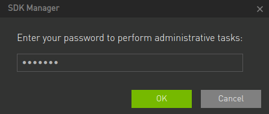

15. After the TAR system OS flashing is complete, the Jetson Orin Nano will automatically restart and enter the system. At this point, you need to set up basic system functions according to the system prompts. Essential tasks include setting a username and password, and connecting to the same local network as the virtual machine. Switch to the Jetson Orin Nano system for these settings. It is crucial to remember the username and password you set, as forgetting them could prevent you from logging into the system.

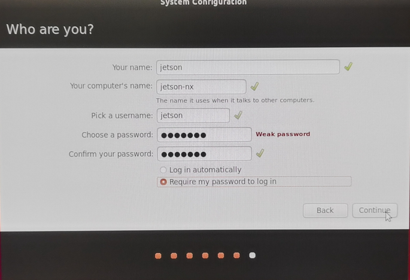

16. After completing the system setup, the Jetson Orin Nano will restart again. At this point, it may disconnect from the virtual machine. You can reconnect the USB data cable to the virtual machine by re-plugging it. Then, enter the username and password you just set for the Jetson Orin Nano. Click "I**nstall**" to proceed with installing the SDK software. The image below shows an 8GB model.

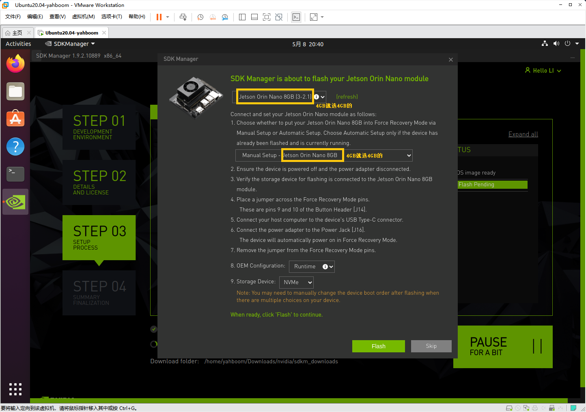

>[!Note]
>
>**Since flashing the SDK requires data transfer over the local network, please connect an Ethernet cable to ensure a stable connection.**

17. Once the installation is complete and it indicates that all installations were successful, click "FINISH." If any software failed to install during the process, click "Retry" or consider installing a different version.

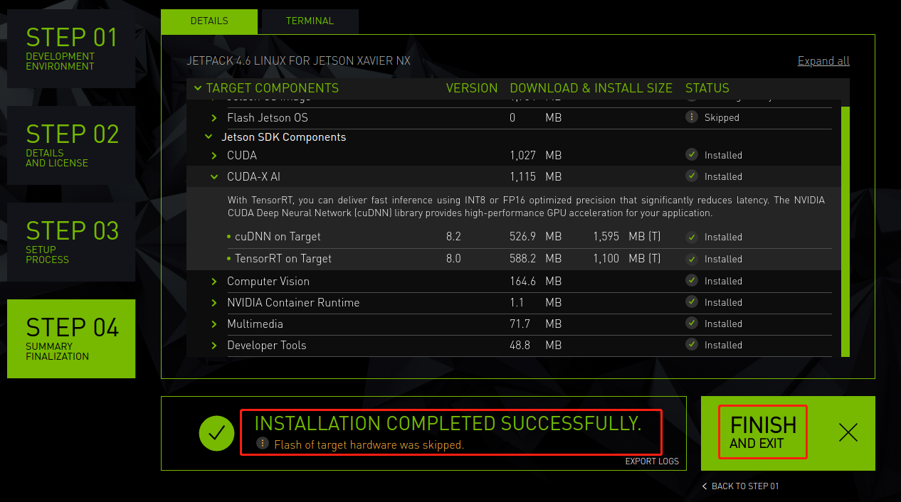

>[!Note]
>
>**After flashing the system and SDK, please remove the jumper cap between FC REC and GND.**

## 2.3 Flashing System Using an SSD

### 2.3.1 Getting Started

* **Hardware Preparations**:

Prepare yourself an SSD, a Jetson Orin Nano development board, a computer (with Windows 10 as the operating system).

* **Software Preparations**:

It is necessary to install the SSD initialization tool (DiskGenius.exe) and the image flashing tool (Win32DiskImager). This section will use these two tools as an example for instructions.

>[!Note]
>
>**Prior to the image flashing, you can delete all unnecessary partitions on the SSD using SSD initialization tool (the installation package can be found in the Appendix). After that, proceed with the flashing.**
>**After the flashing is complete, multiple prompts for independent disks may appear. Please do not click "Format", just simply cancel the prompts.**

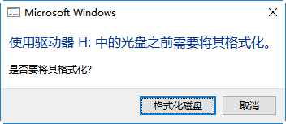

###  2.3.2 Delete Partitions on the SSD 

>[!Note]
>
>**If the SSD is blank, you can directly skip this part.**

1. Remove the SSD from the development board, the insert the SSD into the enclosure and connect the enclosure to the computer.

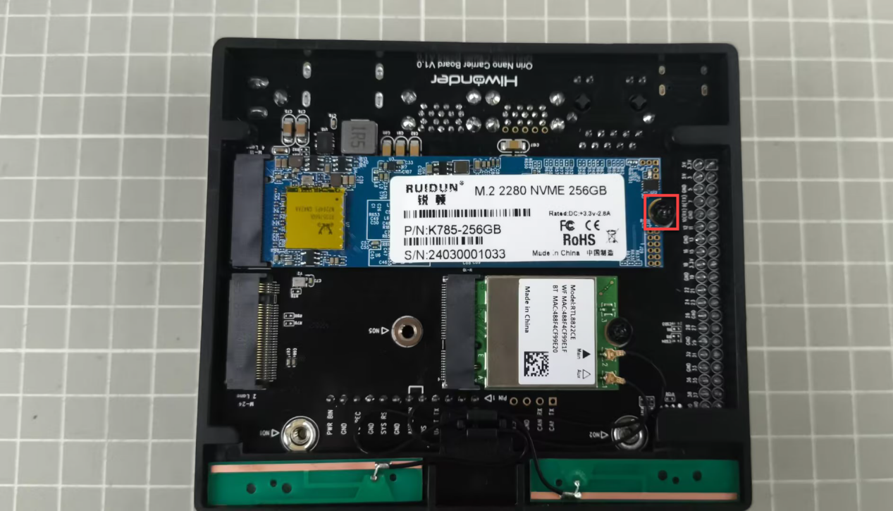

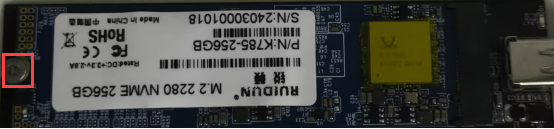

2. In the appendix folder, ;ocate the DiskGenius.exe tool for formatting the NVMe system, or use the disk management toll on your computer to format the drive. **Make sure to select the correct NVMe drive and avoid selecting the wrong drive letter to prevent formatting your computer’s drive.**

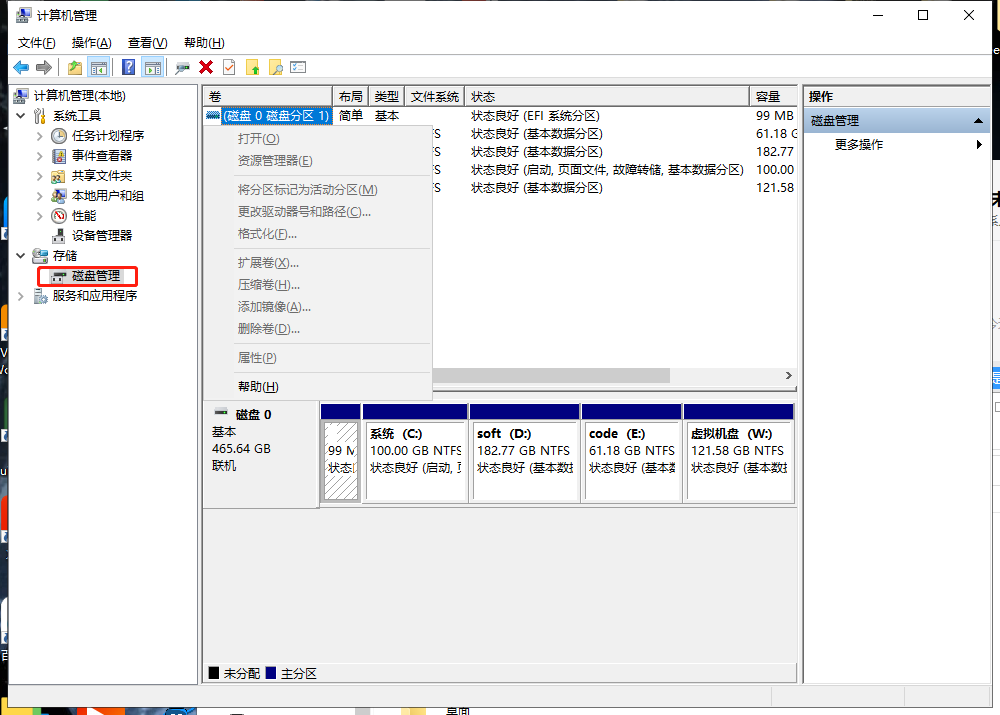

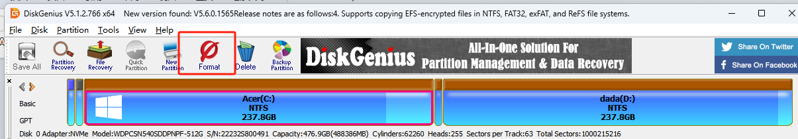

3. If you use the DiskGenius.exe tool to delete the unnecessary partitions on the NVMe drive:

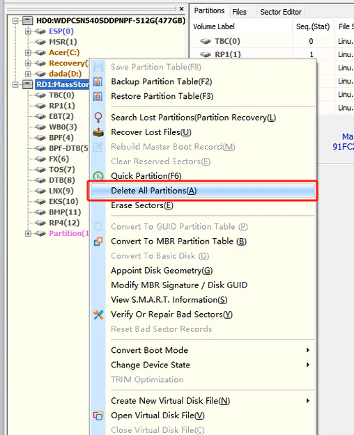

4. After successfully deleting, the result will show as follows：

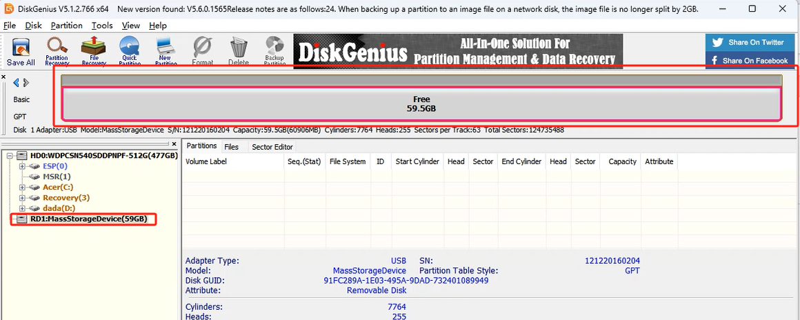

5. Establish a new partition, allowing the computer to recognize normally. If a message pops up, click "OK" to proceed.


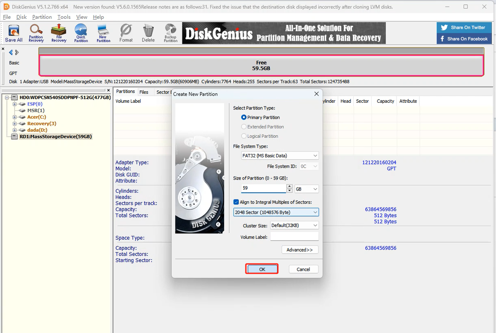

6. Then click "**Save**".


7. Once successful, you will see the information as pictured:


###  2.3.3 Flash Image

1. Open the image flashing tool (Win32DiskImager), then click  to select the image file (users need to extract the image file yourself; the image shown is for your reference only, please refer to the actual image file). Select the drive letter of the SSD in the "**Device**" bar, and click "**Write**" to start flashing the image.


>[!Note]
>
>**Do not store the image file under a path containing any Chinese character.**

2. If the following prompts appears, click "Yes’.


3. If the "**Write Successful**" is prompted, the flashing was successful. If an error is reported, please disable any firewall software, reinsert the SSD, and repeat the steps in this section.

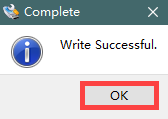

>[!Note]
>
>**After the flashing is complete, if any prompt asking whether to format the partition appears, simply ignore it.**

4. Wait for the image flashing to complete, the reinsert the SSD back into the development board. After powering it on for a while, it should successfully boot up.

###  2.3.4 Expand System Image

After a successful flashing, insert the SSD into the Jetson Orin Nano, then power it on. Follow the steps below to expand the system image.

1. If the gparted software is not installed, enter the following command to download it:

```bash
sudo apt install gparted
```

2. Run the command to open the software and input the password "ubuntu":

```bash
sudo gparted
```

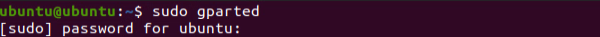

3. Confirm the corresponding NVMe SSD is ‘/dev/nvme0n1’ (please see the actual one), with the APP partition corresponding to ‘/dev/nvme0n1p1’. 

   > [!NOTE]
   >
   > **Note: it is crucial to select the correct disk number in this step.**

You may see that a part of APP partition is gray. You need to expand the gray area to white, which is normal. Colors represent: yellow indicates used space, white indicates unused space, and gray indicates unavailable space. This is because the restored system was compressed, so the internal space needs to be rechecked and expanded to the full partition capacity.

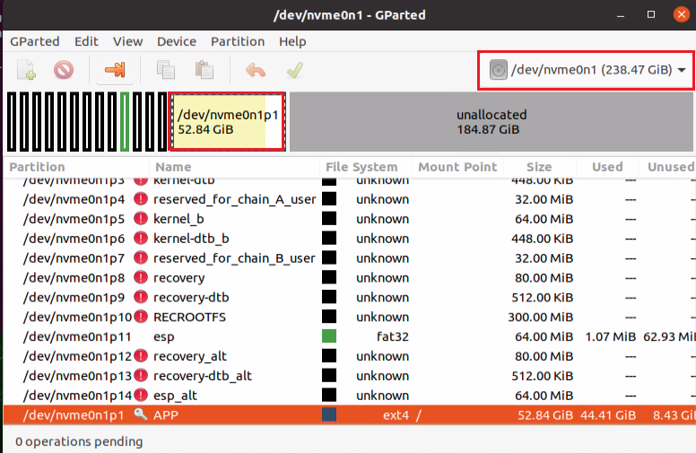

4. Right click on the yellow space and click "**Unmount**" to unmount the partition.

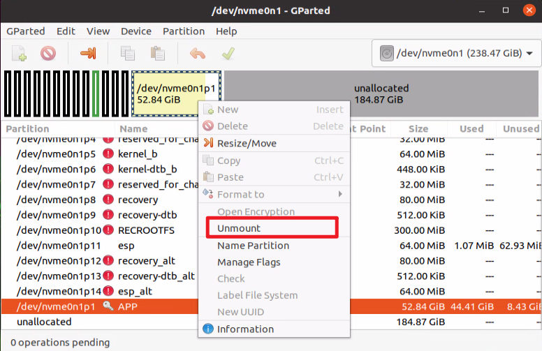

5. Click on the yellow space again and select "**Resize/move**" to expand the partition.

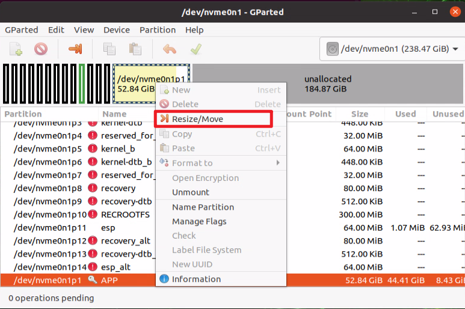

6. Drag the right edge of the yellow-white area highlighted in the red box blow to far right.

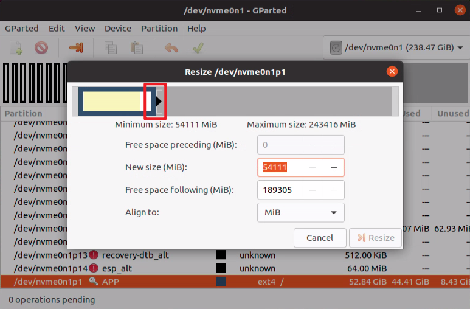

7. Then click "**Resize**" to expand the partition.

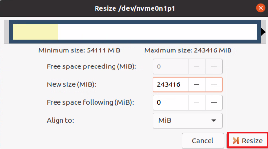

8. Click "**√**" to complete the expansion.

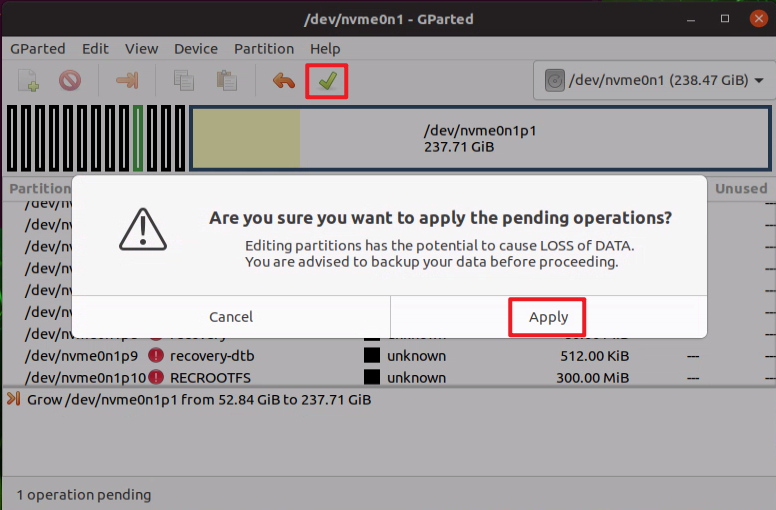

9. After completion, you should see the gray area turn white.

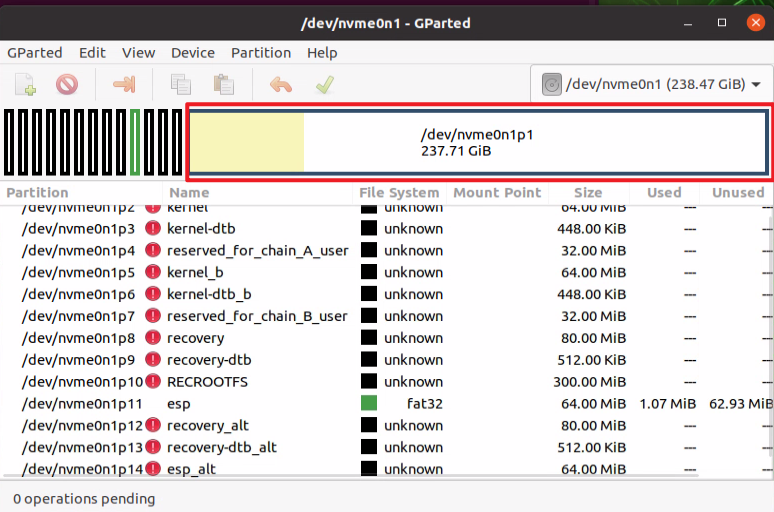

10. After that, you can enter the command "**df -h**" to check and confirm that the memory expansion was successful.

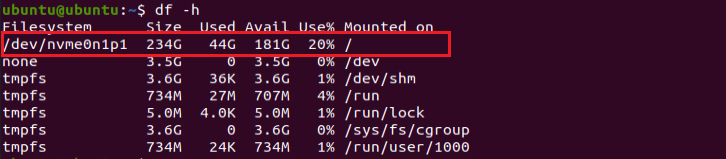

###  2.3.5 System Image Directory Instruction

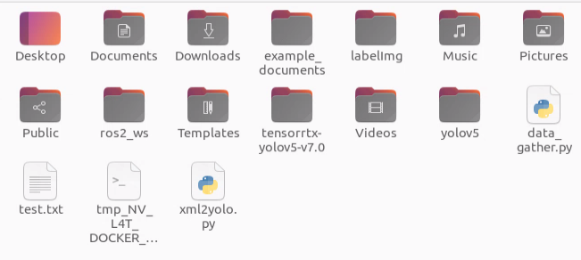

Compared to the official image, the provided image includes some additional files. All the libraries or resources required for the courses have already been installed. You can refer to the table below:

|                           **Icon**                           |       **Name**        |                   **Function Instruction**                   |
| :----------------------------------------------------------: | :-------------------: | :----------------------------------------------------------: |
| 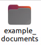 |   example_documents   |         Store the required resources and source code         |
| 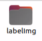 |       Labelimg        |                  Image annotation software                   |
| 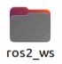 |        ros2_ws        |                        ROS2 workspace                        |
| 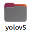 |        Yolov5         |                        Yolov5 folder                         |
| 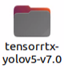 | tensorrtx-yolov5-v7.0 |                       Tensorrtx folder                       |
| 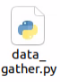 |    data_gather.py     |           Used to take photos and collect datasets           |
| 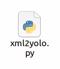 |      xml2yolo.py      | Used to convert the xml files to txt files for YOLO model training |

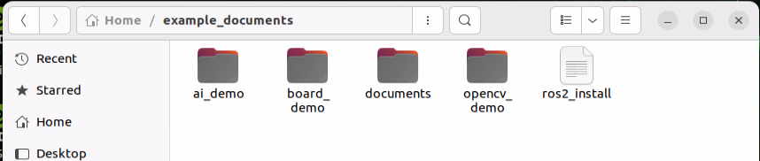

|                           **Icon**                           |  **Name**   |                   **Function Instruction**                   |
| :----------------------------------------------------------: | :---------: | :----------------------------------------------------------: |
| 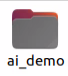 |   ai_demo   |        Stores examples corresponding to the AI course        |
| 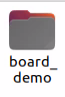 | board_demo  | Stores examples for the development board and expansion board |
| 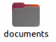 |  documents  |          Stores some crucial installation packages           |
| 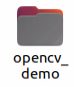 | opencv_demo |              Store OpenCV application examples               |

## 2.4 Flashing System Using an SD Card

>[!Note]
>
>**The** **SD** **card** **will be formatted** **before** **flashing** **the** **system image.** **If there is any data on the SD card, please back it up in advance.**

###  2.4.1 Preparations

* **Hardware**

Prepare an card reader, an SD card with at lease of 32GB of storage), and a computer (running Windows 10).

* **Software**

You need to install an SD card initialization tool (SD Card Formatter) and an image flashing tool (Win32DiskImager). This section will use these two tools as examples for the explanation.

> [!Note]
>
> * **After inserting the SD card into the card reader and connecting it to the computer’s USB port, the computer may detect multiple partitions and display a 'format reminder.' This happens because the SD card already contains an image, which is a Linux system version that includes multiple partitions by default. These partitions are recognized as multiple separate disks, which is normal and nothing to worry about.**
> * **Before flashing the image, you can use the SD card initialization tool (the installation package can be found in the** **"[Appendix/SD Card Initialization Tool](https://drive.google.com/drive/folders/1XiGkOoG7GBK3wgXMUic4kFUlTuOdLKYH?usp=sharing)") to format the SD card, and then proceed with the flashing process.**
> * **Similarly, after the flashing is complete, multiple independent disk prompts may appear. Do not click format; simply cancel the prompt.**


###  2.4.2 Format SD Card

>[!Note]
>
>**If the SD card is blank, there is no need to perform the formatting operation.**

1. Insert the SD card into the card reader, and then connect the card reader to the computer.

2. Open the SD card initialization tool (SD Card Formatter), select the SD card drive in the '**Select card**' section, and click '**Format**' to format the SD card.

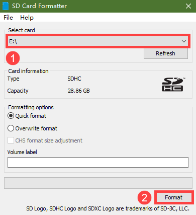

3. If the prompt shown in the image below appears, click the 'Yes' button. Wait for the formatting to complete

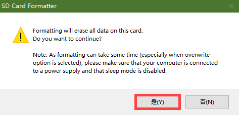

###  2.4.3 Flash Image

1. Open the image flashing tool (Win32DiskImager), click the icon to select the image file (users need to download and extract it themselves; the image shown is for reference only, please use the actual image). Select the SD card drive in the '**Device**' section, and click the '**Write**' button to start flashing the image.

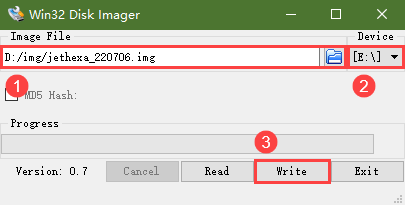

>[!Note]
>
>**The path where the image file is stored must not contain any Chinese characters.**

2. If the following prompt appears, click "**Yes**".

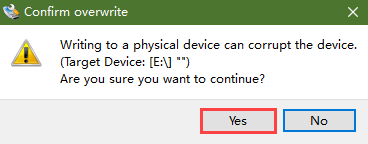

3. If the prompt "**Write Successful**" appears, it indicates that the flashing was successful. If an error occurs, please close any firewall or similar software, reinsert the SD card, and repeat the process described in this section.


>[!Note]
>
>**After successful flashing, if a prompt asking whether to format the partition appears, you can ignore it.**