# 3. Basic Operation Course

## 3.1 Start Jetson Orin Nano

1. Insert the SSD that has flashed the system into the SSD slot on the main board and screw the slot firmly.

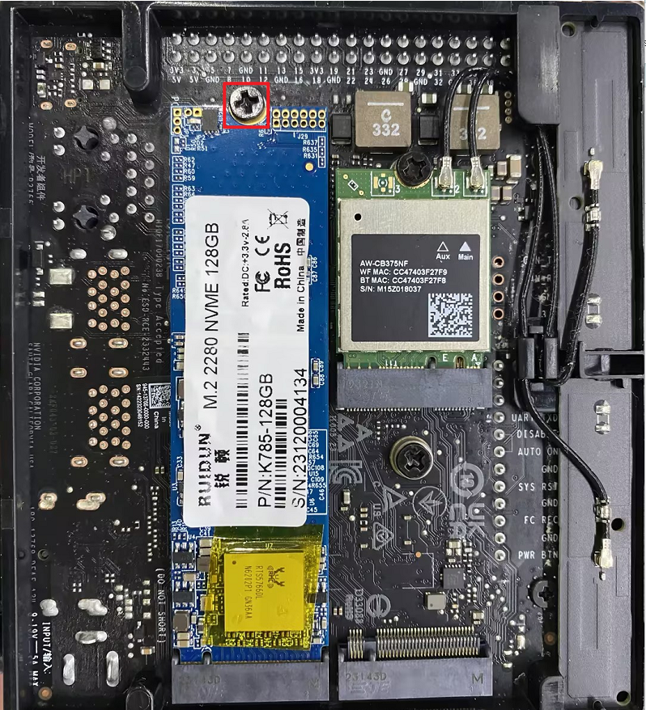

2. Connect the power supply and the HDMI cable to the monitor.

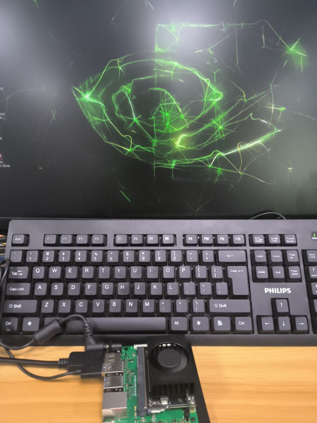

3. Use the provided official 19V 2.37A round-head DC connector power adapter to power the Jetson Orin Nano.

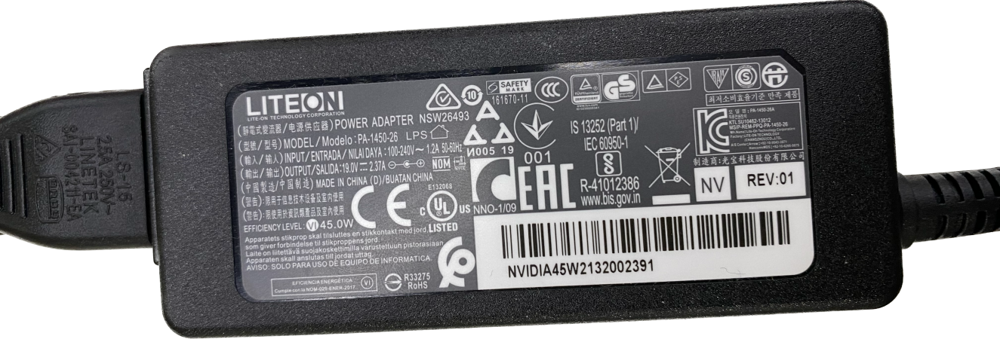

4. The power supply does not have a switch and it will powers on automatically, with DS1 indicator lighting up. Wait for the system to boot into the desktop; this process will be displayed on the screen.

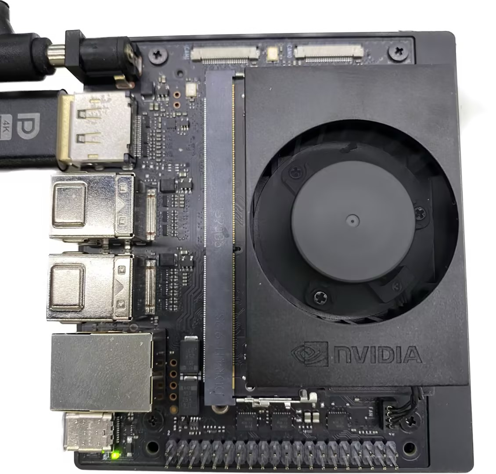

## 3.2 Introduction to System Desktop

The Jetson Orin Nano system desktop is shown in the figure below:

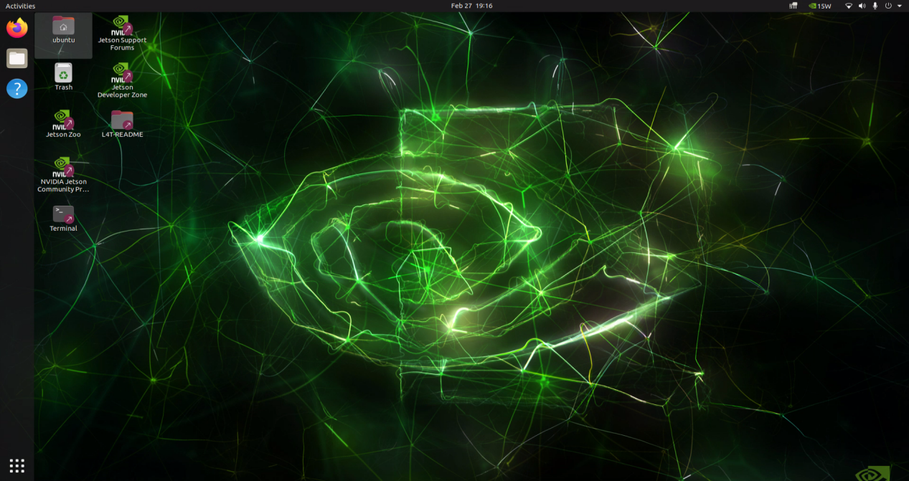

### 3.2.1 Taskbar

The left-side of the system desktop is the taskbar. The table below outlines the related functions:

|                           **Icon**                           |       **Name**       |                       **Description**                        |
| :----------------------------------------------------------: | :------------------: | :----------------------------------------------------------: |
| 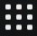 | Search your computer | Used to search for the applications and files within the system |
|  |        Files         |                         File manager                         |
| 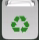 |        Trash         |                 Used to store deleted files                  |
|  |       Browser        |                       Browse the web.                        |

### 3.2.2 Menu Bar

The top of the system desktop is the menu bar. The table below outlines the related functions:

|                           **Icon**                           |         **Function**          |
| :----------------------------------------------------------: | :---------------------------: |
| 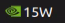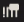 |   Device-relating settings    |
|  |     WiFi status indicator     |
| 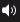 |        Speaker volume         |
|  |       Microphone volume       |
| 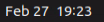 |     System date and time      |
|  | System control menu drop-down |
| 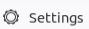 |   System function settings    |

### 3.2.3 Desktop Application 

The system desktop includes some applications. The table below outlines the related functions:

|                             Icon                             |               Name               |                         Description                          |
| :----------------------------------------------------------: | :------------------------------: | :----------------------------------------------------------: |
|  |   NVIDIA Jetson Developer Zone   |      A shortcut to access NVIDIA Jetson developer zone.      |
|  |   NVIDIA Jetson Support Forums   |      A shortcut to access NVIDIA Jetson support forums.      |
|  |        NVIDIA Jetson Zoo         | A shortcut to access the installation instructions webpage.This web page provides instructions for installing various open-source packages and frameworks on NVIDIA Jetson. |
|  |            L4T-README            | A shortcut to access a specific folder.This folder contains the document files. |
|  | NVIDIA Jetson Community Projects |    A shortcut to access NVIDIA Jetson community projects.    |
| 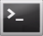 |             Terminal             |   Control the system by entering commands in the terminal.   |

## 3.3 Network Configuration (Wired and Wireless)

###  3.3.1 Overview 

The Jetson Orin Nano needs to be connected to a network for further operations. This section will outline three network connection methods for Jetson Orin Nano:

Wired network connection: Use an ethernet cable to connect to the RJ45 port on the Jetson Orin Nano to achieve network connectivity.

Wireless network connection: After installing a network card onto the Jetson Orin Nano, it can access network by connecting a WIFI.

* **RJ45**

The RJ45 interface refers to a standardized connector, with 8 positions, commonly used for connecting hardware internationally. There are two main types of RJ45 interfaces: the DTE type used for Ethernet network cards, routers, and the DCE type used for switches, among others. The RJ45 interface supports three speeds: 10M, 100M, and 1000M, and features automatic negotiation of speed and duplex mode."

* **Wireless Network Card**

The wireless network card functions similarly to a standard computer network card. It is used to connect to a local area network (LAN). It is a device for transmitting and receiving signals and can only connect to the internet when it finds an available internet gateway. Wireless network cards are limited to the range of an existing wireless local area network (WLAN).

###  3.3.2 Wired Connection (Recommended)

* **Operation Steps**

>[!Note]
>
>**When developing the Jetson Orin Nano, it is recommended to use a wired connection to ensure a stable network environment. After flashing the system, you can simply connect the Ethernet cable to access the network.**

1. Connect the Ethernet cable to the RJ45 interface highlighted in the red box in the figure below:

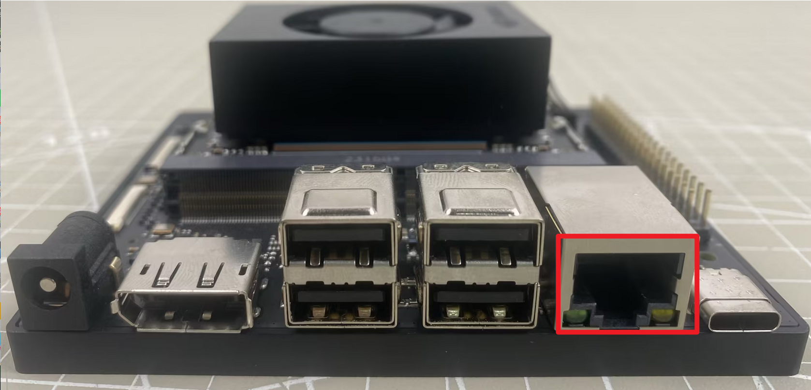

2. The connection result is as follow. When the indicator in the yellow cable connection port flashes quickly, indicating a successful network connection.

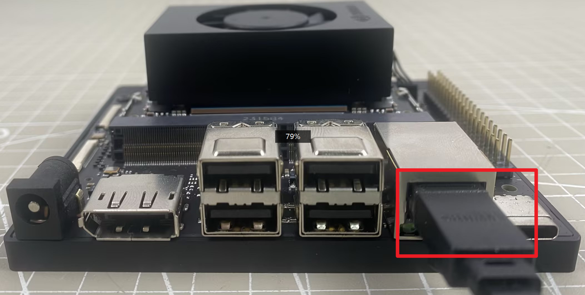

* **Check Connection Status**

1. Power on Jetson Orin Nano and connect it to a monitor.

2. Double click 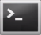 on the system desktop to open the terminal.

3. Enter the command ifconfig to check the network connection status. If you see that eth0 has an IP address of 192.168.11.211 (as shown in the example image), it indicates that the network connection is successful.

>[!Note]
>
>**The IP address of eth0 may change depending on the router connection. The router needs to have the DHCP server function enabled. In normal cases, DHCP services do not need to be manually activated.**

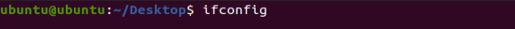

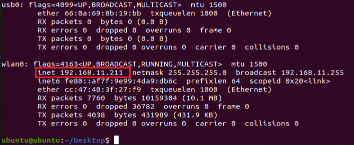

###  3.3.3 Wireless Connection

* **Network Card Installation**

>[!Note]
>
>**The network card has pre-installed before the shipment. This method requires connecting a monitor.**

1. Prepare yourself the Jetson Orin Nano board, screwdriver, network card, and antenna. Loose the screws to install as pictured:

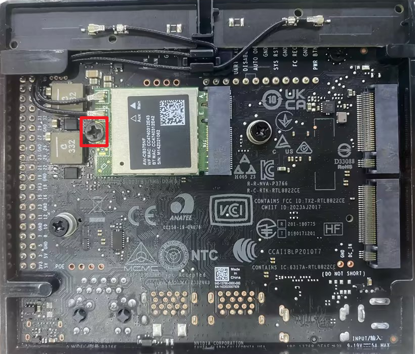

2. Designate the red box as slot 1 and the blue box as slot 2 for connecting the antenna.

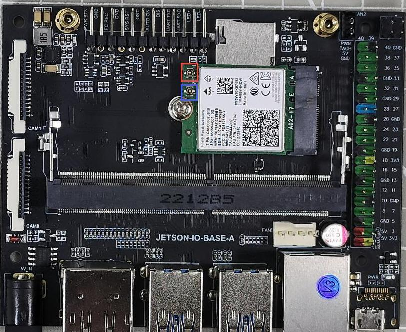

3. The antenna has a front and back side, as shown in the image below. The blue box indicates the back side, and the red box indicates the front side. You need to connect the back side to the corresponding position.

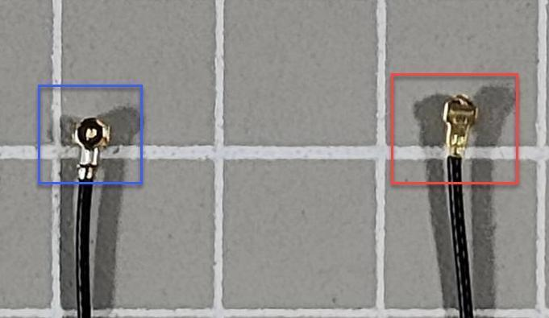

When installing the antenna, it needs to be aligned with the slot properly to be installed correctly.

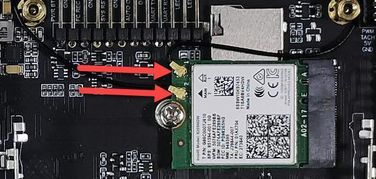

* **Connection Operations**

1. Power on the Jetson Orin Nano and connect it to a monitor.

2. Click on the symbol group at the top -\> Click the drop-down menu -\> Select **'Network**,' -\> Choose the network -\> Click **'Connect'** and then enter the password. In this case, 'hiwonder_5G' network has already been connected. .

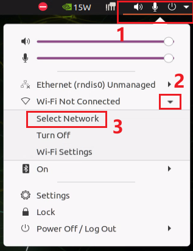

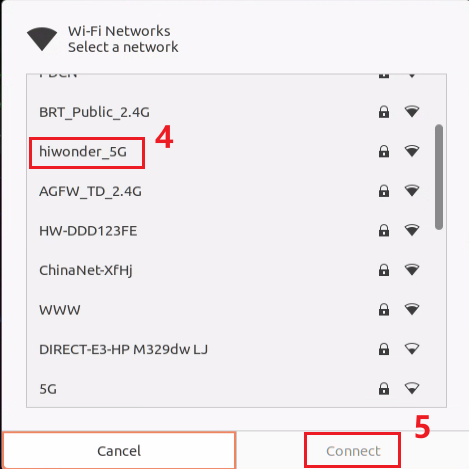

* **Check Connection Status**

Enter the command "**ifconfig**" to check the network connection status. If the IP address for wlan0 is 192.168.11.211, then the network connection is successful.

>[!Note]
>
>**The IP address for wlan0 will change according to the connected router. The router needs to have the DHCP server function enabled, but typically the DHCP service does not need to be manually activated.**

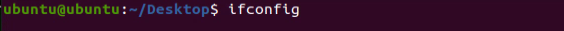


Check the IP address on the wlan0 line. In my case, the IP is 192.168.2.211

###  3.3.4 Control Jetson Orin Nano via USB Cable

>[!Note]
>
>**This method only provides a connection between the computer and the Jetson Orin Nano board within a local network. If the local network itself is not connected to a public network, the Jetson Orin Nano will still be unable to access external resources.**
>**Additionally, make sure to connect the Jetson Orin Nano to the power supply and wait for it to boot up before connecting the USB cable.**

* **Connection**

1. Power on the Jetson Orin Nano, then connect a USB cable to the location highlighted in the red box on the Jetson Orin Nano, and connect the other end to the computer.

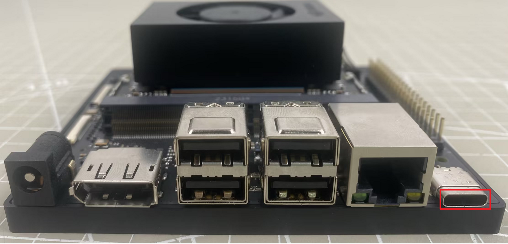

2. The installation result is as follow:

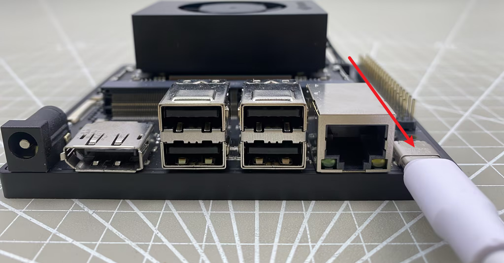

* **Check Device**

1. Power on Jetson Orin Nano, right-click "**This PC**", and select "**Manage**".

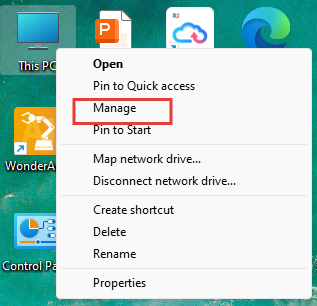

2. Click "**Device manger**". If you find "**Remote NDIS Compatible Device**", which means device is connected.

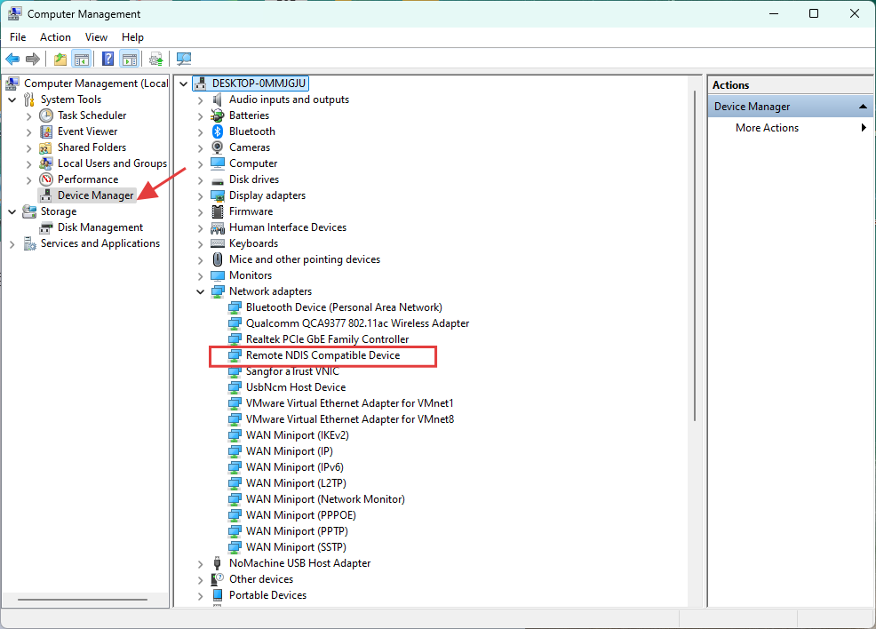

* **Check Device IP Address**

1. Right-click on the network connection as shown in the image below and select '**Open Network and Internet settings'**.


2. Click '**Change adapter options**' to view the network adapters.


The adapter within the red box is the one we need to use.

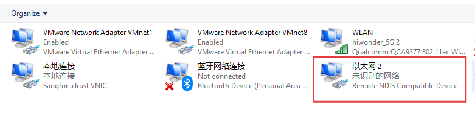

3. Right-click on '**Status**'.

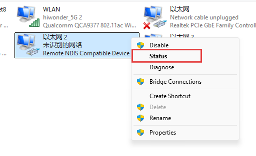

4. Click '**Details**'.


5. If the information shown in the image appears, it means we can remotely access the Jetson Nano via 192.168.55.1.

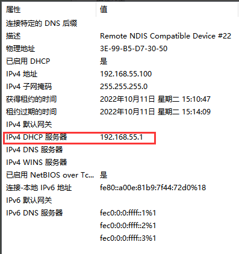

## 3.4 Remote Connection

This section applied to the users who need to perform remote login via SSH when the development board does not have a separate monitor connected.

### 3.4.1 SSH Remote Connection

* **SSH Introduction**

SSH is a network protocol (with a default port number of 22) used for encrypted login between computers, allowing remote control via command line. The Jetson Orin Nano system has SSH services enabled by default, so as long as the network connection is working properly, you can log in directly using SSH.

If you need to use SSH, it is necessary to obtain the IP address of the development board. The development board has a built-in SSH service, allowing direct access via IP address.

* **Preparations**

Before getting started, some preparations are necessary. In addition to the development board, the items below need to be prepared.

1. A mobile phone

2. A laptop (If you're using a desktop, a USB wireless network adapter needs to be prepared.)

3. A wireless network adapter for Jetson Orin Nano. Insert the network adapter into any USB port on the development board.

4. A card reader and an SD card or SSD with pre-installed official system image.

5. MobaXterm tool (The remote login tool can be accessed in "02 Tool". )

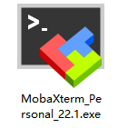

* **Check IP without a Screen**

You can find the corresponding IP address of the development board by referring to the content in "**[2. Configuration Guide -\>2.2 Flashing Firmware Using SDK Manger Tool ](https://wiki.hiwonder.com/projects/Jetson-Orin-Nano/en/latest/docs/2_Conifiguration_Guide.html#flashing-firmware-using-sdk-manger-tool)**"

* **Check IP with a Screen**

Follow the steps below to obtain the IP address of the development board:

1. Create a hotspot on your phone. Here uses the hotspot name (hiwonder_5G) and the password (hiwonder).

2. Connect the PC to the created hotspot.

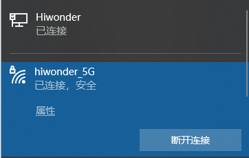

3. Power on the development board (it needs to be connected to a screen), and connect it to the same WI-FI as your computer.

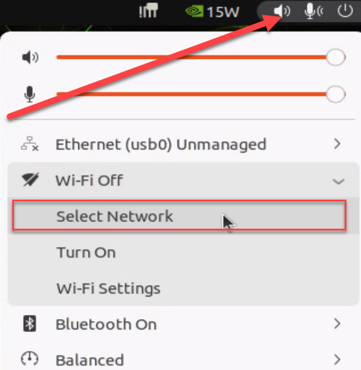

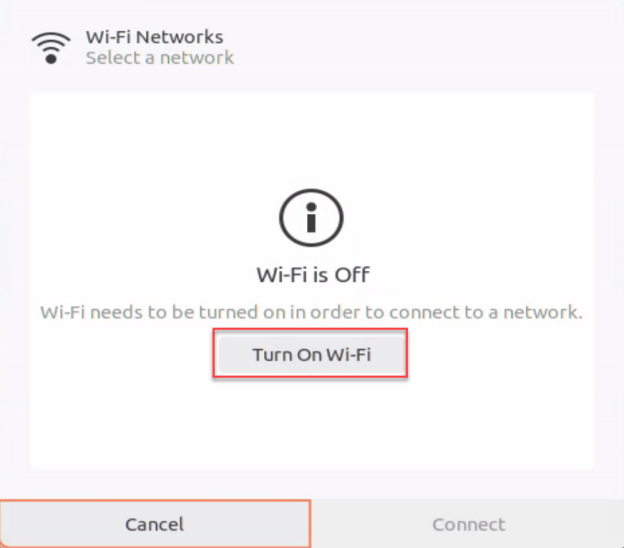

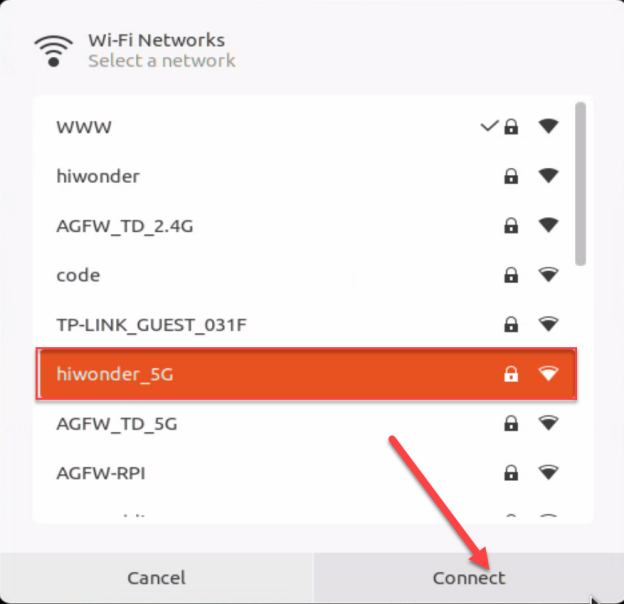

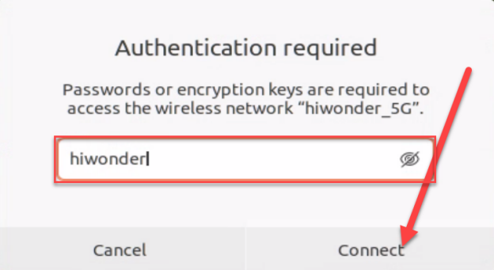

4. After a successful connection, you need to obtain the IP address of the development board. Double click 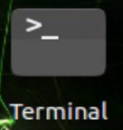 to open the terminal. Enter the following command and press Enter.

```bash
ifconfig
```

5. The device "wlan0" in the image below displays the current status of the current development board's network adapter. After connecting to the hotspot, the assigned IP address is "192.168.1.102". Please record the IP address.

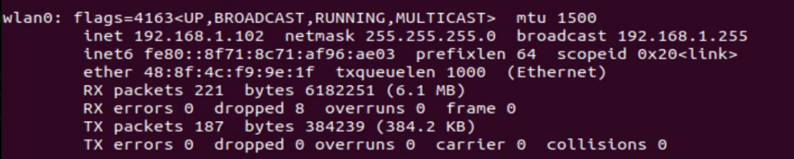

* **Remote Connection via SSH**

1. After the above preparations are complete, open the MobaXterm on your computer.

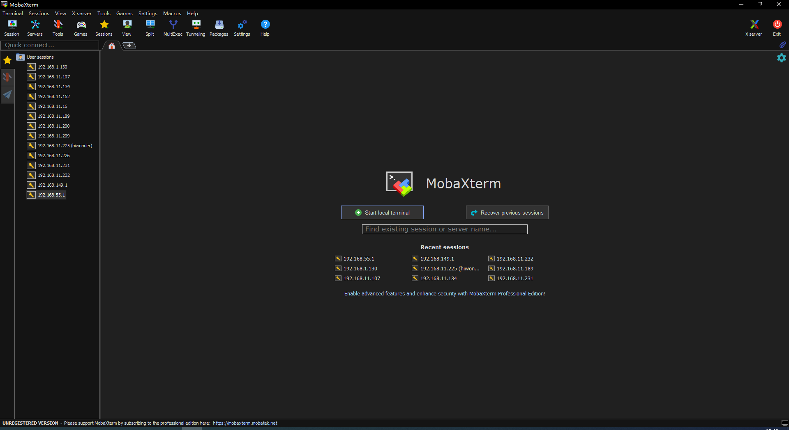

2. Click "**Session**" to create a session.

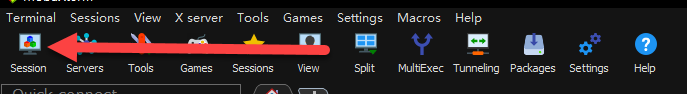

3. Click "**SSH**", input the IP address of the development board "**192.168.1.102**", and then click "**OK**".

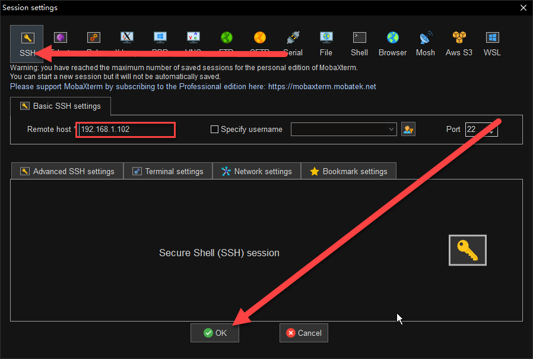

>[!Note] 
>
>**Your computer and the development board need to remain on the same network.**

4. The interface will prompt you to enter a username and password (default username: ubuntu, password: ubuntu; use the credentials you set up). After entering, press the Enter key. Please note that as in Linux systems, the password will not be visually displayed as you type it.

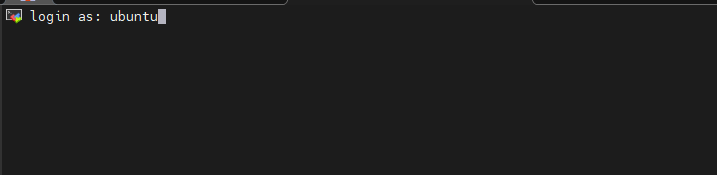

>[!Note]
>
>**The username name must be input in the lowercase mode. Even if the username includes uppercase letters, it must be entered in lowercase during login.**

5. If the password is entered correctly, you will successfully login the system. The system interface will appear as shown in the image below:

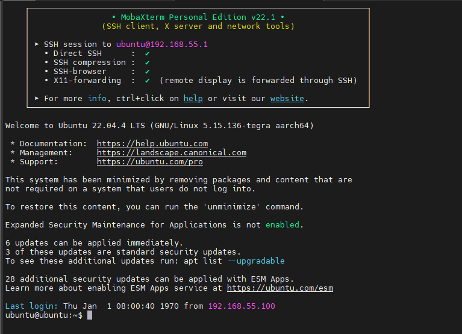

<p id="anchor_3_4_1_6"></p>

* **Transfer Files from PC to Jetson Orin Nano**

1. After connecting via SSH, drag the target file into the MobaXterm file area.

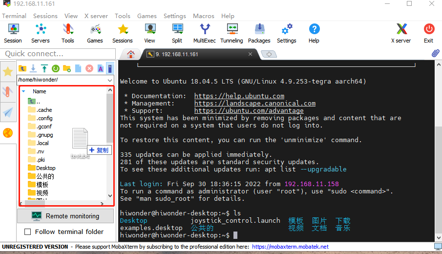

2. The file will be automatically transferred to the home directory of Jetson Orin Nano system. The command "**ls**" is entered to view all files.

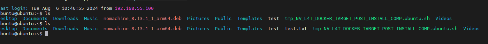

* **Transfer Files from Jetson Orin Nano to PC**

1. After connecting via SSH, drag the target file in the MobaXterm file area to your computer desktop. The file will be automatically transferred to the desktop.

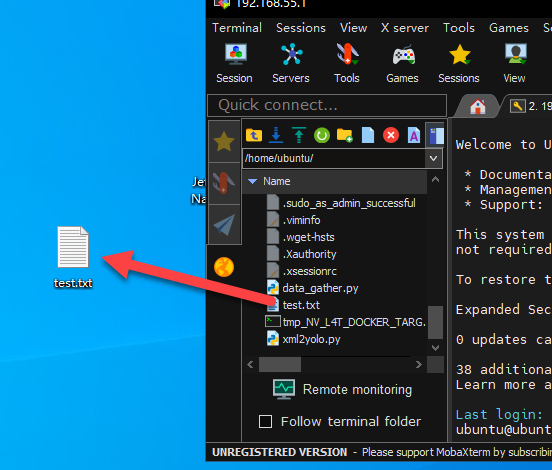

### 3.4.2 Configure Virtual Desktop

If you want to use this development without connecting to an external screen, please refer to this section. After performing this step, the screen will not display when connected.

* **Check the IP of Development Board**

You can find the corresponding IP address of the development board by referring to the content in "**[2. Configuration Guide -\>2.2 Flashing Firmware Using SDK Manger Tool ](https://wiki.hiwonder.com/projects/Jetson-Orin-Nano/en/latest/docs/2_Conifiguration_Guide.html#flashing-firmware-using-sdk-manger-tool)**"

* **Connect to Development Board**

Refer to the steps in 1.4 to input the queried IP address and connect to the development board.

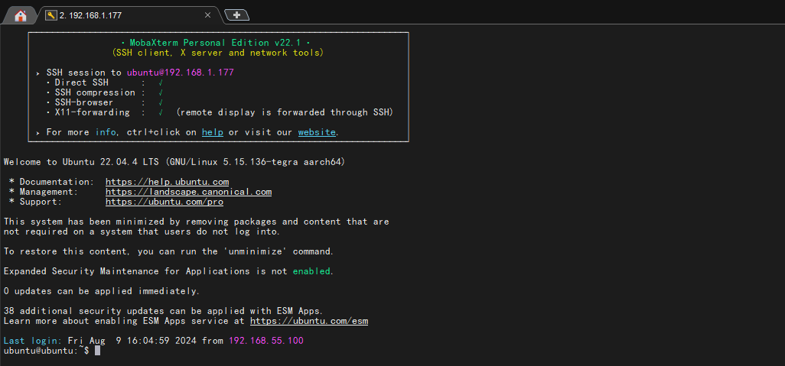

* **Install Necessary Libraries**

1. Enter the following command and press Enter to install "**xserver-xorg-core-hwe-18.04**".

```bash
sudo apt-get install xserver-xorg-core-hwe-18.04
```

2. Install "**xserver-xorg-video-dummy**" by entering the command:

```bash
sudo apt-get install xserver-xorg-video-dummy
```

* **Configure Remote Desktop**

1. Enter the command and press Enter to configure virtual desktop file.

```bash
sudo vim /usr/share/X11/xorg.conf.d/xorg.conf
```

2. Copy the code below into the file, then click the middle mouse in the command-line window after copying:

```py
Section "Monitor"
Identifier "Monitor0"
HorizSync 28.0-80.0
VertRefresh 48.0-75.0
Modeline "1920x1080_60.00" 172.80 1920 2040 2248 2576 1080 1081 1084 1118 -HSync +Vsync
EndSection
Section "Device"
Identifier "Card0"
Driver "dummy"
VideoRam 256000
EndSection
Section "Screen"
DefaultDepth 24
Identifier "Screen0"
Device "Card0"
Monitor "Monitor0"
SubSection "Display"
Depth 24
Modes "1920x1080_60.00"
EndSubSection
EndSection
```

It will appear as the image shown below after entering:

Once done, press "Esc" and input ":wq", press Enter to save and exit.

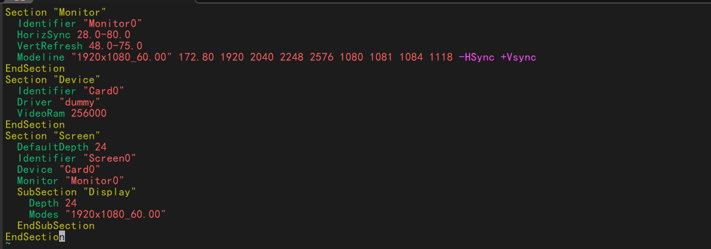

3. Restart the robot by executing the following command.

```bash
sudo reboot
```

* **Restore Screen Display** 

Enter the command and press Enter to delete the virtual desktop configuration file. After restarting, the scree will display.

```bash
sudo rm -r /usr/share/X11/xorg.conf.d/xorg.conf
```

### 3.4.3 Remote Desktop Configuration and Usage

* **Nomachine**

NoMachine allows users to access and control remote Windows, Linux PCs, or other devices from another computer, enabling work or entertainment operations.

NoMachine's remote desktop technology uses a new remote protocol that extracts desktop data and only transmits certain parameters. It also encrypts data transmission via SSH, offering faster speeds and higher security compared to VNC or direct XDMCP.

* **Preparations**

Before getting started, some preparations are necessary. In addition to the development board, the items below need to be prepared.

1. A mobile phone

2. A laptop (If you're using a desktop, a USB wireless network adapter needs to be prepared.)

3. A wireless network adapter for Jetson Orin Nano. Insert the network adapter into any USB port on the development board.

4. A card reader and an SD card or SSD with pre-installed official system image.

5. Nomachine software.

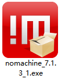

* **Check IP without a Screen**

You can find the corresponding IP address of the development board by referring to the content in "**[2. Configuration Guide ->2.2 Flashing Firmware Using SDK Manger Tool](https://wiki.hiwonder.com/projects/Jetson-Orin-Nano/en/latest/docs/2_Conifiguration_Guide.html#flashing-firmware-using-sdk-manger-tool)**"

* **Configure NoMachine on Jetson Orin Nano**

1. Enter the URL "<https://www.nomachine.com/download>" in a web browser on your computer to go the NoMachine download page. 

Find "**NoMachine for ARM**" on the page, and click it to enter the ARM version download page.

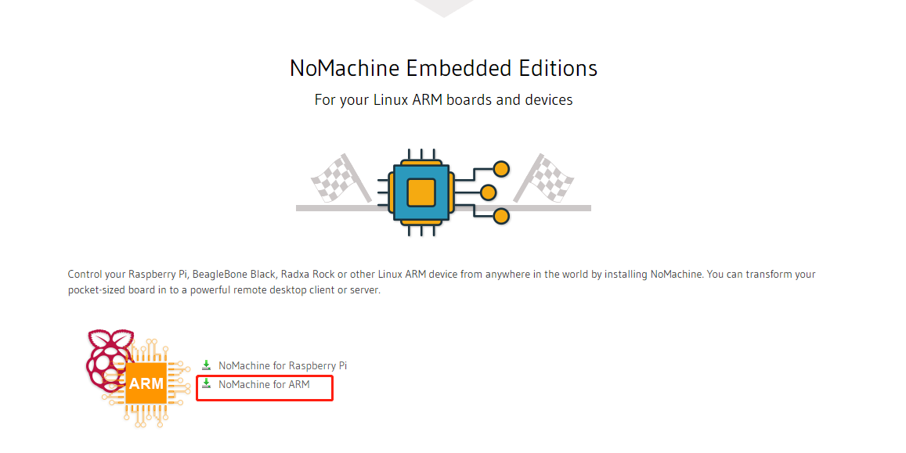

2. Then click "**NoMachine for ARM ARMv8 DEB**" to go to the download page. 

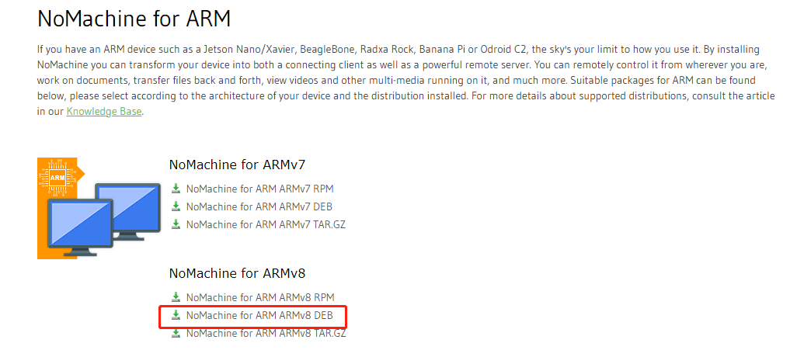

3. Click "**Download**" to begin downloading Nomachine. 

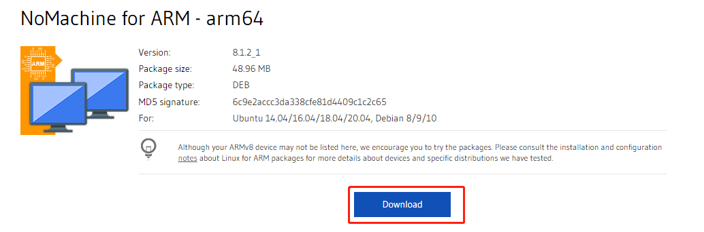

4. Connect to the development board using the obtained IP address, and then follow "**[3.4.1 SSH Remote Connection -> Transfer Files from PC to Jetson Orin Nano](#anchor_3_4_1_6)**", drag the installation package to the root directory.

5. Enter the command, replacing "**nomachine_8.13.1_1_arm64.deb**" with the actual file name you downloaded. Press Enter to execute, and wait for the installation to complete.

```bash
sudo dpkg -i nomachine_8.13.1_1_arm64.deb
```

* **NoMachine Installation and Operation**

**1. Install NoMachine**

1. Navigate to the directory where you extract NoMachine installation package. Double click to open the NoMachine installation package "**nomachine_7.1.3_1.exe**".

2. Click "Next".


3. Select the installation language as "**English**", check "**I accept the agreement**" and click "**Next**".


4. Keep the default installation path, then click "**Next**".


5. When the following prompt appears, click "**Finish**".


6. Click "**Yes**" to restart your computer. (Do not skip this step!)

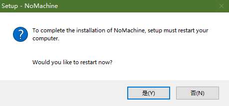

**2. NoMachine Operations**

1. Open NoMachine, enter the obtained IP address "**192.168.1.102**" in the search bar, and click "**Connect to new host 192.168.1.102**" to create a connection to this address.

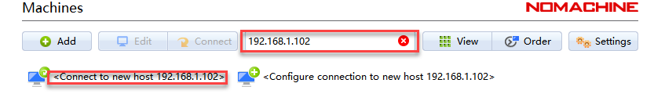

2. Set the username and password for login. Then click "**login**", and you will see the remote desktop of the development board.

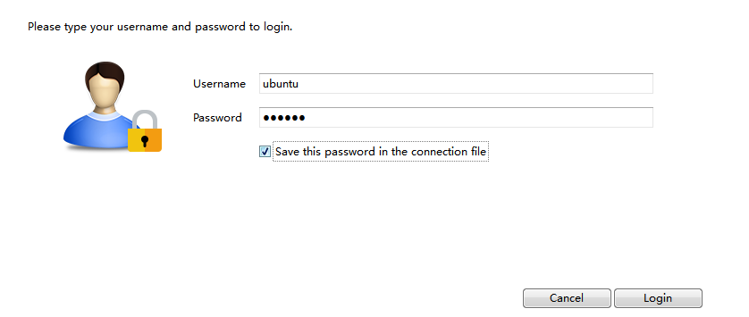

* **Connect Using a Data Cable**

You can improve performance by enabling a remote NDIS compatible device. The specific steps are as follows:

>[!Note]
>
>**If you need to use this method to connect the development board, you will need to use another method to enter the system for configuration.**
>* Open a terminal and enter the command:
>**sudo sed -i 's#exit 0#echo device \> /sys/class/usb_role/usb2-0-role-switch/role\nexit 0#g' /opt/nvidia/l4t-usb-device-mode/nv-l4t-usb-device-mode-start.sh**
>* Or use our pre-configured image. You can refer to the content"**[2. Conifiguration Guide -> 2.3 Flashing the System Using an SSD](https://wiki.hiwonder.com/projects/Jetson-Orin-Nano/en/latest/docs/2_Conifiguration_Guide.html#flashing-system-using-an-ssd)**" to perform the system flashing.

1. Power on the Jetson Orin Nano, then connect a USB cable (a standard Type-C data cable will work) to the location highlighted in the red box on the Jetson Orin Nano as shown in the image below, with the other end connected to your computer.

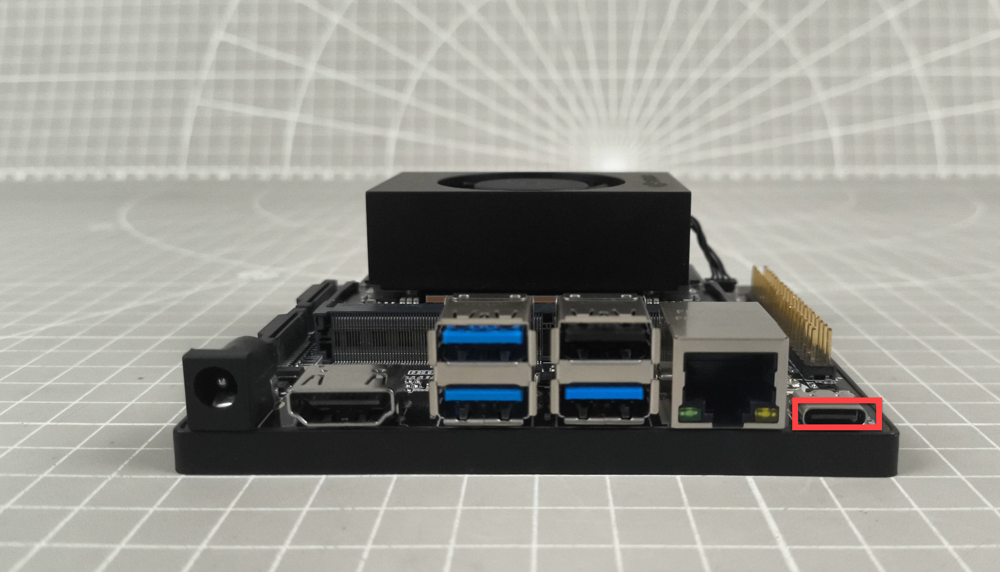

2. The connection result is as pictured:

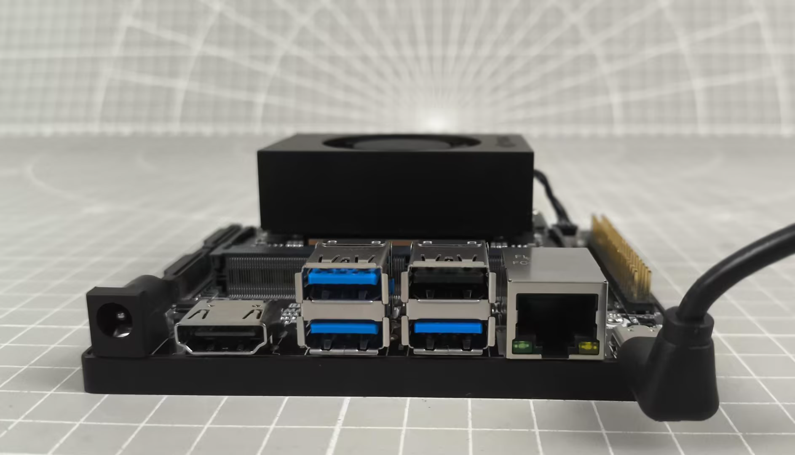

3. After completing the driver installation, open NoMachine. Enter the IP address "**192.168.55.1**" to establish a connection.

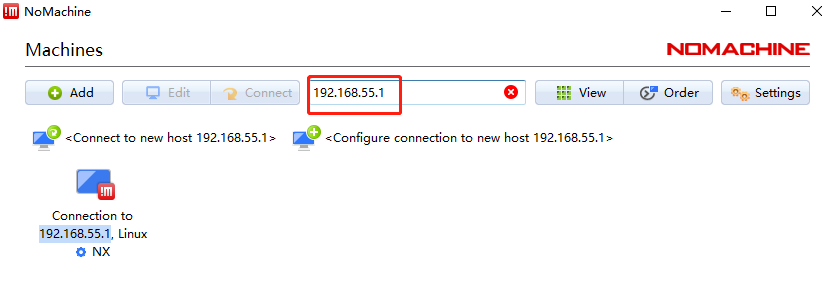

### 3.4.4 Control Jetson Orin Nano via a USB Cable

>[!Note]
>
>**This method only provides a connection between the computer and the Jetson Orin Nano board within the local network. If the local network is not connected to the public internet, the Jetson Orin Nano will still be unable to access external resources.  Additionally, please connect the Jetson Orin Nano to the power supply first, and wait for it to boot up before connecting the USB cable.**

>[!Note]
>
>**If you need to use this method to connect the development board, you will need to use another method to enter the system for configuration.**
>
>* Open a terminal and enter the command:
>**sudo sed -i 's#exit 0#echo device \> /sys/class/usb_role/usb2-0-role-switch/role\nexit 0#g' /opt/nvidia/l4t-usb-device-mode/nv-l4t-usb-device-mode-start.sh**
>* Or use our pre-configured image. You can refer to the content"**[2. Conifiguration Guide -\> 2.3 Flashing the System Using an SSD](https://wiki.hiwonder.com/projects/Jetson-Orin-Nano/en/latest/docs/2_Conifiguration_Guide.html#flashing-system-using-an-ssd)**" to perform the system flashing".

* **Connection**

1. Power on the Jetson Orin Nano, then connect a USB cable (a standard Type-C data cable will work) to the location highlighted in the red box on the Jetson Orin Nano as shown in the image below, with the other end connected to your computer.


2. The connection result is as pictured:


* **Check Device IP Address**

1. As shown in the image, right-click the network connection icon and select '**Open 'Network & Internet**' settings.

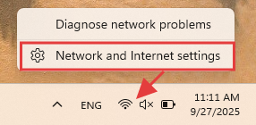

2. Click on "**Change adapter options**" to view the adapters.

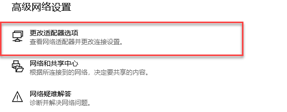

The adapter inside the red box is the one we need to use.

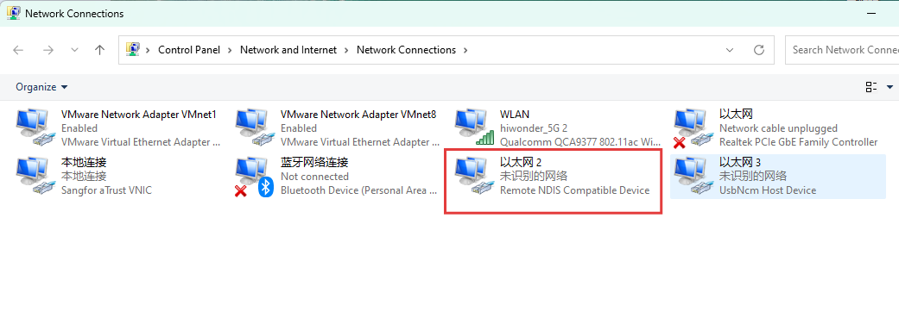

3)  Right-click on "**Status**."


4. Click on "**Details**."

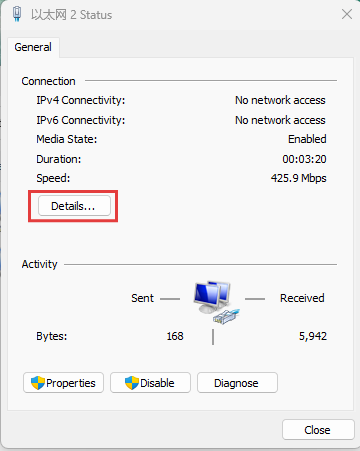

If the information shown in the image below appears, it indicates that we can remotely access the development board via "**192.168.55.1**" (this IP can be used for "**1 SSH Remote Connection and 3 Remote Desktop Configuration and Use**").


## 3.5 USB Drive Usage and Auto Mount

###  3.5.1 UB Drive Usage

Jetson Orin Nano can extend its storage capacity by mounting a USB drive to the system directory. Before starting, prepare a USB drive, as the process will format the USB drive. Please back up any data on the USB drive in advance.

###  3.5.2 Mount USB Drive

1. Start Jetson Orin Nano and connect the USB drive to any USB port of Jetson Orin Nano.

2. Double click on 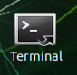to open a command line terminal.

3. Enter command "**sudo mkfs.ext4 /dev/sda1**" and press Enter to format USB drive.

```bash
sudo mkfs.ext4 /dev/sda1
```

4. If the following prompt occurs, type "**y**" and press Enter to confirm and proceed with the operation.

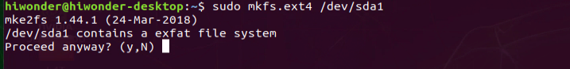

After the following prompt appears, it indicates that the formatting was successful.

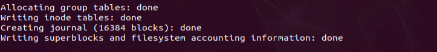

5. Next, enter the command "**sudo mount /dev/sda1 /mnt**" to mount the USB drive to the "**/mnt**" directory. You can change this directory to any other existing directory if needed.

```bash
sudo mount /dev/sda1 /mnt
```

6. Finally, enter the command "**df -h**" to check if the mounting was successful.

```bash
df -h
```

When you see the following information, it indicates that the mounting was successful.

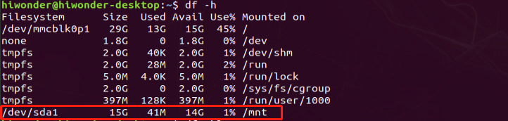

###  3.5.3 Auto-mount after Booting up

After a manual mount, a system reboot will cause the mount to fail and require another mount. To avoid this, you can modify the file under the system path "**/etc/fstab**", which is used to store the static information of the file system.

When the system starts up, it will automatically read the information from this file, and will automatically mount the file system specified in this file to the specified directory, completing the function of automatic mounting on boot, as follows

1. Start Jetson Orin Nano, insert USB drive to any USB port of Jetson Orin Nano.

2. Double click to open a command line terminal.

3. Enter command "**sudo vim /etc/fstab**" to edit fstab file.

```bash
sudo vim /etc/fstab
```

4. Press the **'i**' key to enter the edit mode, and at the corresponding location in the file, enter "**/dev/sda1 /mnt ntfs defaults 0 0**". Make sure to align the format with the previous line.

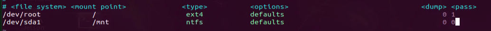

The input content correspond to six categories in the file. `file system` is the partition or storage to be mounted. `type` is the file system type of the device or partition to be mounted. `options` is the parameter to be used when mounting. `dump` is whether to back up the system file, 0 is ignored, 1 is backed up. `pass` is the retrieval sequence of file system, o for ignore, 1 for priority retrieval (usually the root directory), 2 for non-priority retrieval.

5. After confirming that the input is correct, press the "Esc" key, type ":wq", and press Enter to exit and save.

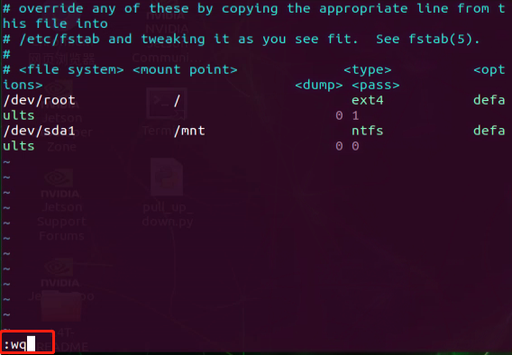

6. Enter the command "**sudo mount -a**" to verify if the recently edited content is correct.

```bash
sudo mount -a
```

7. Finally, enter the command df -h to check if the mounting was successful.


## 3.6 NVIME System Backup

This part needs to operated on the virtual machine.

###  3.6.1 Backup with a Hard Drive Enclosure

* **Preparations**

Remove the SSD from the main board and insert it into an enclosure connected to the virtual machine. At this point, the computer will then automatically recognize the SSD (an SSD enclosure is required).

Open the terminal on the virtual machine, and install the partition management tool by entering the command:

```bash
sudo apt install gparted
```

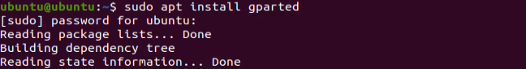

* **Connect the Hard Disk to Virtual Machine**

According to the image below, connect the hard drive to the virtual machine. The device name 'Realtek RTL9210' may vary depending on the type of SSD enclosure used. Make sure the corresponding device is connected to the virtual machine.

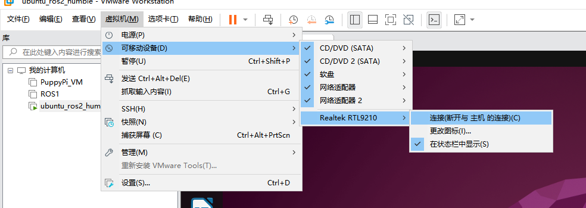

* **Resize the Image** 

1. Open a new terminal and open the gparted by run the command:

```bash
sudo gparted
```

Enter the password when the following prompt appears: **ubuntu**

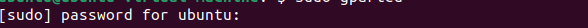

2. Choose the corresponding hard disk.

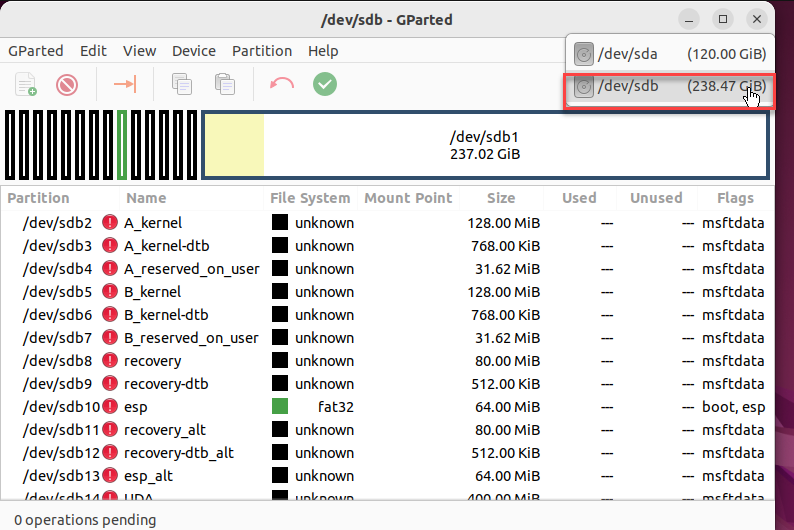

3. Unmount the hard disk

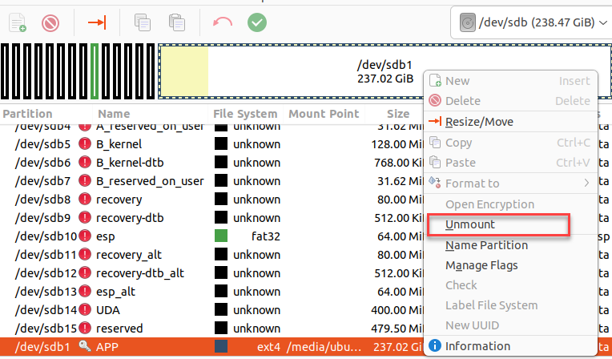

4. Resize the image.

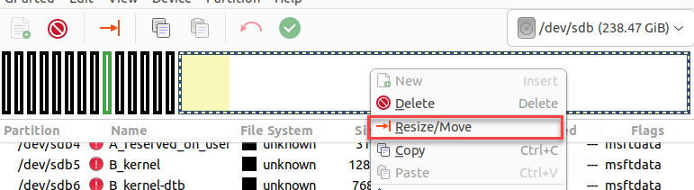

5. Slide the bar to the far left until it cannot move further to determine that the current hard drive usage is 23032M. Then, add 5000M as extra space. (If you directly enter 23032M, it may prevent the system from booting, so adjust the slider accordingly and then press 'Resize/Move.')

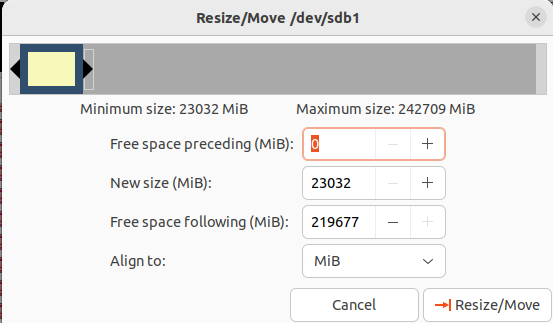

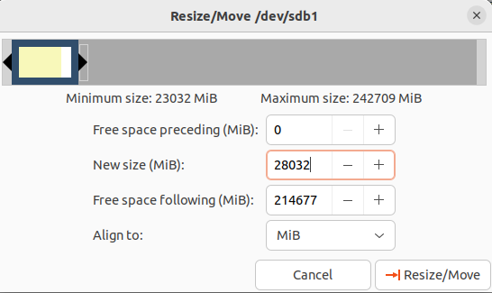

6. Click  and select "**Apply**" to confirm and apply the changes.

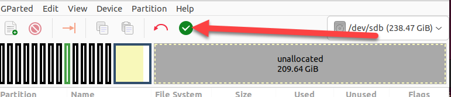

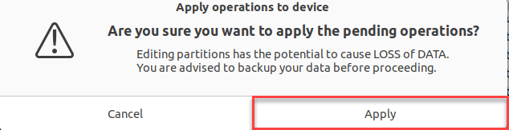

7. Wait for the partition to complete, then click "**Close**".

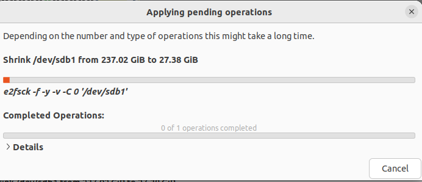

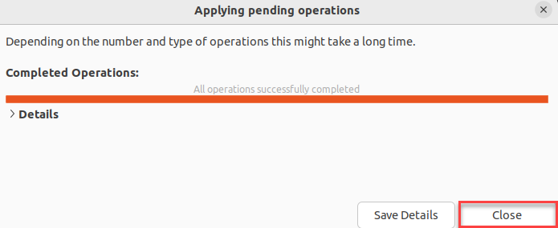

8. Close the gparted.

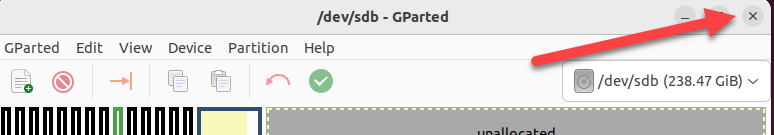

* **Output the Image**

1. Enter the following command to confirm the image size:

```bash
sudo fdisk -l
```

You can see that the image size is 27.4G. We need to record the number under **'End'**: 60461055.

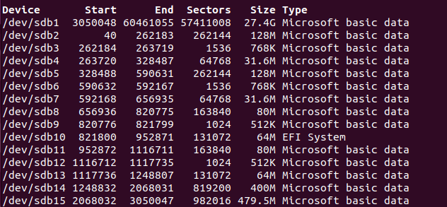

2. Run the following command to out the image:

```bash
sudo dd if=/dev/sdb of=./orin_nano.img bs=512 count=60461056
```

3. This output shows data for the device /dev/sdb. The image is located in the current directory with the name orin_nano.img. The block size is 512, and the total size is 60461056. Originally, the total size was 60461055, so we need to add a little extra space to ensure the image will boot correctly. Therefore, we need to increase the total size by 1.

4. Open a new terminal and check the output process by entering:

```bash
sudo watch -n 5 pkill -USR1 ^dd$
```

Enter the password when the following prompt appear: **ubuntu**


You can see the output process in the previous command line:

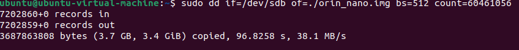

###  3.6.2 Backup Using the Motherboard

* **Modify Parameters**

>[!Note]
>
>* **This method requires that you have used the SDK Manager within the virtual machine to flash the image in order to have the corresponding resources available.**
>* **Before performing a backup or flashing, make sure to put the development board into Force Recovery mode. You can refer to '[2. Conifiguration Guide -\> 2.2 SDK Management Tool Firmware Flashing -\> 2.2.3 Install System](https://wiki.hiwonder.com/projects/Jetson-Orin-Nano/en/latest/docs/2_Conifiguration_Guide.html#flash-image)' to learn how to put the development board into Force Recovery mode before starting the backup or flashing process.**
>* **When backing up, ensure that the virtual machine has enough space to store the image. For example, if the SSD is 256GB, the virtual machine should have more than 256GB of available space.**
>* **Enter the command 'df -h' to check the remaining space.**

1. Enter the command to navigate to the backup script location:

```bash
cd /home/ubuntu/nvidia/nvidia_sdk/JetPack_6.0_Linux_JETSON_ORIN_NANO_TARGETS/Linux_for_Tegra/tools/backup_restore
```

2. Enter the command to modify the script and change the read location.

```bash
vim nvbackup_partitions.sh
```

3. Locate the position shown in the image below and change it to the content highlighted in the red box. After making the changes, press the 'ESC' key, type "**:wq"**, and press Enter to save and exit.

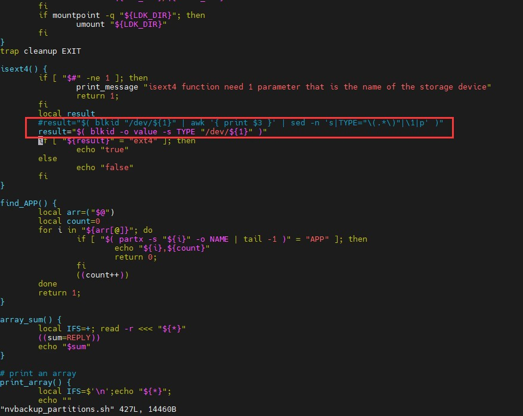

* **Back up Image** 

1. Open a new terminal and enter the command to navigate to the backup location:

```bash
cd /home/ubuntu/nvidia/nvidia_sdk/JetPack_6.0_Linux_JETSON_ORIN_NANO_TARGETS/Linux_for_Tegra/
```

2. Enter the command to back up the image:

```bash
sudo ./tools/backup_restore/l4t_backup_restore.sh -e nvme0n1 -b jetson-orin-nano-devkit
```

During the flashing process, the motherboard will reboot. The virtual machine will display '**Waiting for target to boot-up...'**. You need to select the device to connect to the virtual machine according to the content shown in the image below.

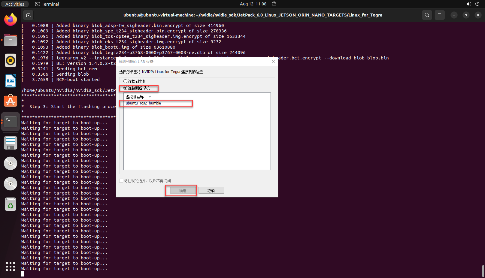

After the backup is completed, the image is stored in the following path:

"**/home/ubuntu/nvidia/nvidia_sdk/JetPack_6.0_Linux_JETSON_ORIN_NANO_TARGETS/Linux_for_Tegra/tools/backup_restore**"

The file is stored in a folder named "**image**".

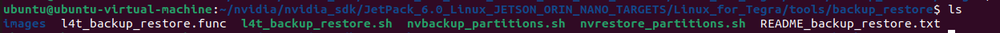

* **Flash Image**

1. Ensure that the backup image is stored in the following path:

"**/home/ubuntu/nvidia/nvidia_sdk/JetPack_6.0_Linux_JETSON_ORIN_NANO_TARGETS/Linux_for_Tegra/tools/backup_restore**" in a folder named "**image**".

2. Open a new terminal. Run the following command to navigate to the folder location.

```bash
cd /home/ubuntu/nvidia/nvidia_sdk/JetPack_6.0_Linux_JETSON_ORIN_NANO_TARGETS/Linux_for_Tegra/
```

3. Enter the command to begin flashing the image:

```bash
sudo ./tools/backup_restore/l4t_backup_restore.sh -e nvme0n1 -r jetson-orin-nano-devkit
```

During the flashing process, the mainboard will restart, and the virtual machine will display the message "**Waiting for target to boot-up...**". We need to connect the device to connect the device to the virtual machine according to the instructions shown in the image below:

