# 5. Hardware Control Course

## 5.1 Jetson.GPIO Library Introduction and Import

### 5.1.1 GPIO Introduction

GPIO, a general-purpose input/output, is known as I/O port. It can allocate input and output by software, and set level to read and set the status of peripheral equipment.

### 5.1.2 GPIO Library Instruction

Jetson Orin Nano features a 40-pin GPIO interface. The GPIO voltage on the Jetson Orin Nano is 3.3V, so voltages higher than 3.3V should not be connected to the Nano GPIO pins without using using a level shifter. Generally, the system already includes the Jetson.GPIO library, so there is no need for the installation and configuration described below. You can find the source code and related API documentation for the Jetson.GPIO library here: https://github.com/NVIDIA/jetson-gpio.

The GPIO interface functions as shown below:


## 5.2 Read GPIO Pin Input

**1. Introduction to GPIO Pin**

GPIO, a general-purpose input/output, is a set of pins on an electronic circuit board which can be used to receive or transmit electrical signals. It’s a standard interface used to connect with external hardware device to realize external communication, external hardware control or external hardware data collection.

**2. Introduction to GPIO Input**

Input involves detecting the voltage levels on each pin, which are categorized as high or low. High voltage is represented by the symbol “1” and indicates an active voltage state; low voltage, often referring to a ground connection, is represented by the symbol “0”.

**3. Introduction to GPIO Pin**

Jetson Orin Nano development board features a 40-pin interface used to connect expansion board. Calling jetson-gpio library can control GPIO and PWM ports, as well as perform read, write, and interrupt operations.

The pins layout is as follow:


**4. Run Program**

If you are using the system image we provide, you can find the corresponding program in the folder “[**3. Basic Operation Course -> 3.2 Introduction to System Desktop** ]().” 
This method requires that the purchased kit includes the expansion board.

1. Install the expansion board as shown in the image below:

   

   

   

2. After connecting the power and powering on, import the “**button_demo.py**” program file from the same directory into the main directory of the board's system. You can refer to “**[3. Basic Operation Course -> 3.4 Remote Connection]()**” for the import method.


3. Double click  to open the terminal. Enter the command, and press Enter to execute the program. After execution, the program will print the input data for pin 37. It will print 1 for voltage input and 0 for no voltage input.

   ```py
   python3 button_demo.py
   ```

   

4. To close the program, you can use the shortcut key “**Ctrl+C”**.

**5. Project Outcome**

After starting, the command line terminal will display the current status of keys `key1` and `key2`. `0` indicates that the key is pressed, while `1` indicates that the key is released.

For example, if you press and hold `key1`, the number following `key1` will change from `1` to `0`. When you release the key, the number will change back from `0` to `1`.


## 5.3 GPIO PIN Output Configuration

**1. Introduction to GPIO Pin**

GPIO, a general-purpose input/output, is a set of pins on an electronic circuit board which can be used to receive or transmit electrical signals. It’s a standard interface used to connect with external hardware device to realize external communication, external hardware control or external hardware data collection.

**2. GPIO Output**

Output is a function required to control the pin level, and the high and low level can be presented by 1 and 0. For example, if you want to switch a LED light on, the pin connected to LED needs to be set for high level state, which will form voltage difference with another low level end to generate current to enable LED light up.

**3. Introduction to GPIO Pin**

Jetson Orin Nano development board features a 40-pin interface used to connect expansion board. Calling jetson-gpio library can control GPIO and PWM ports, as well as perform read, write, and interrupt operations.

The pins layout is as follow:

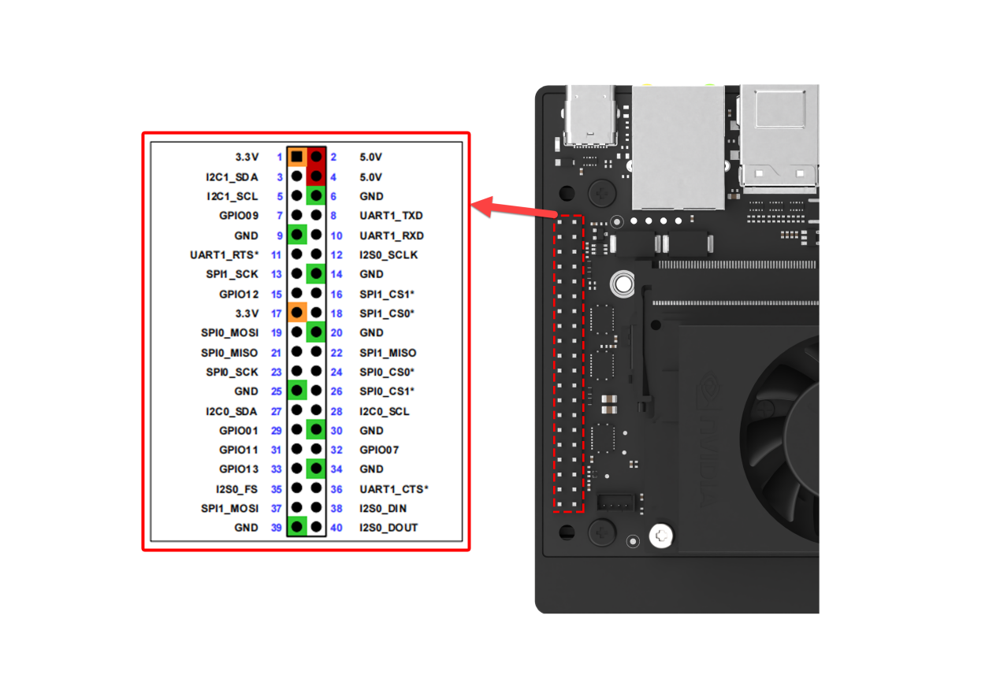

**4. Run Program**

If you are using the system image we provide, you can find the corresponding program in the folder “**[3. Basic Operation Course -> 3.2 Introduction to System Desktop]()** .”  

This method requires that the purchased kit includes the expansion board.

1. Install the expansion board as shown in the image below:

   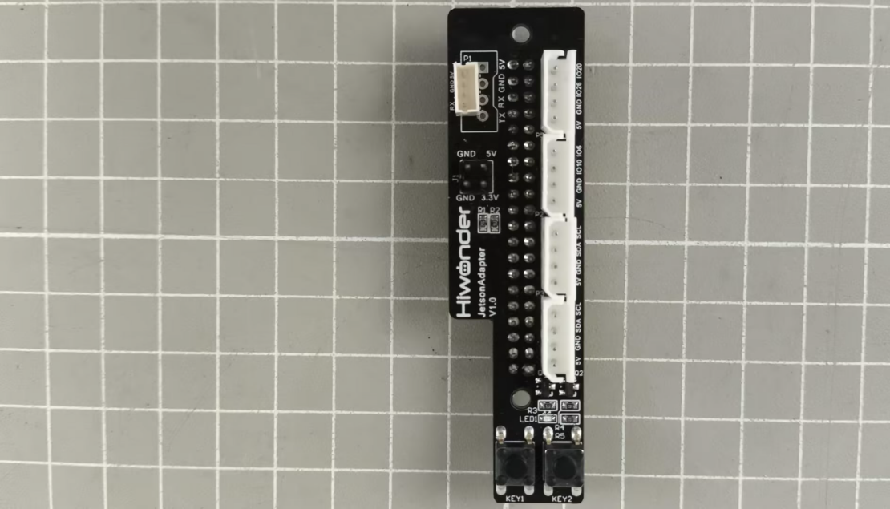

   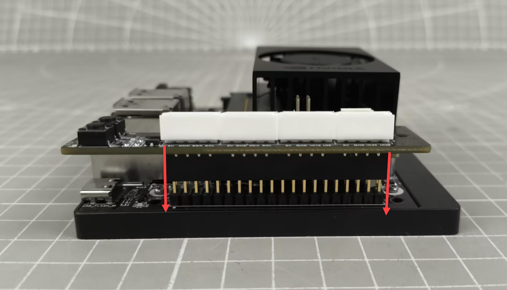

   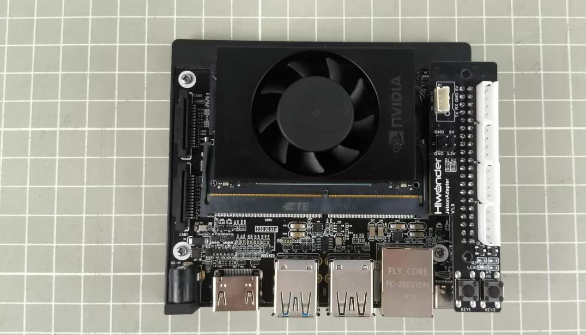

2. Import the program file “**led_demo.py**” program file from the same directory into the main directory of the board's system. You can refer to “**[3. Basic Operation Course -> 3.4 Remote Connection]()**” for the import method.

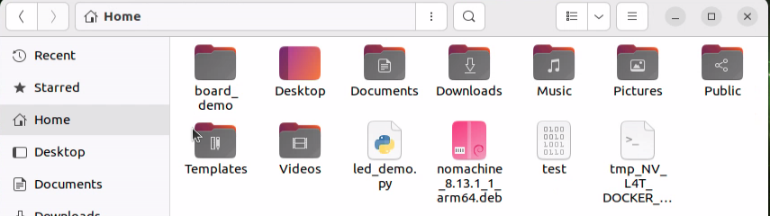

3. Double click  to open the terminal. Enter the command, and press Enter to execute the program.

   ```py
   python3 led_demo.py
   ```

4. When running the program, the LED light will blink rapidly twice, stay on continuously once, and then repeat this sequence in a loop.

**5. GPIO Output Configuration**

1. Double click . Enter the command to install the busybox.

   ```py
   sudo apt-get install busybox -y
   ```

2. Select the pins to be driven. In here, we will use BCM encoding 24 as an example. (24 presents the pins for driving the small light on the expansion board.) According to the table below, its physical pin number is 18.

   

3. You’ll need to find the Soc Pin Name corresponding the physical pin 18 from the below table. Here it is “**GP39_SPI3_CS0_N**”. You need to take note of it for future reference.

   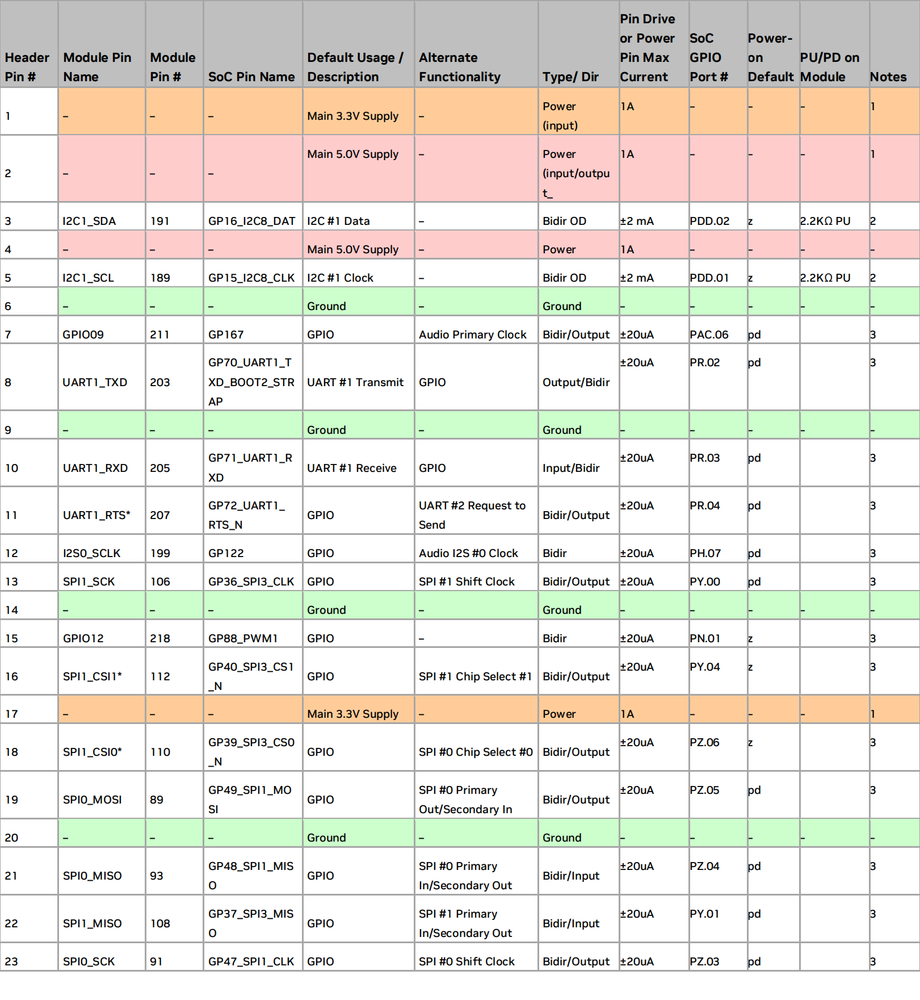

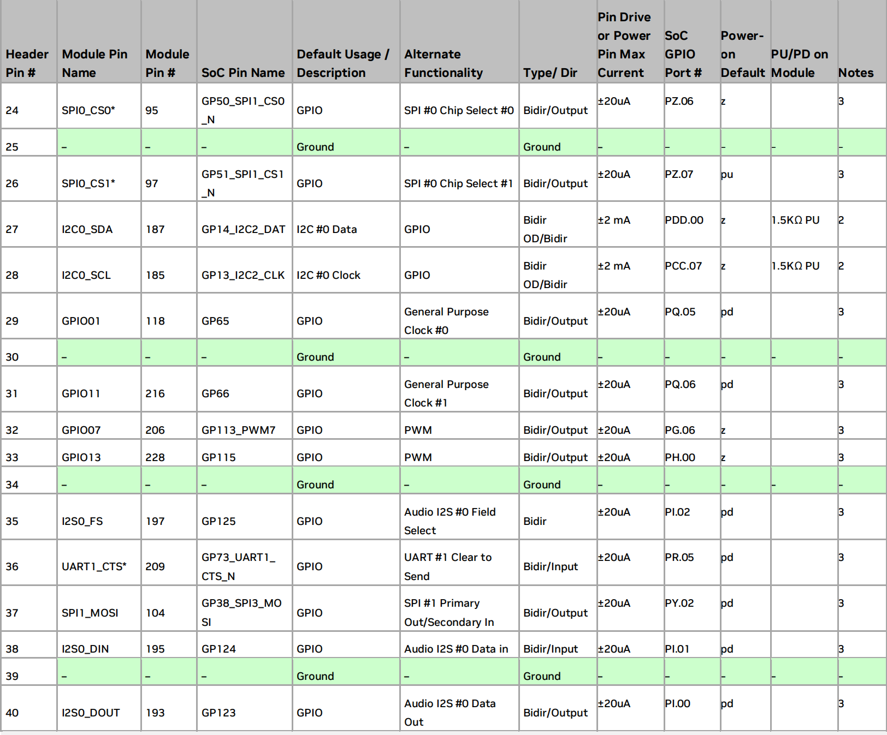

4)  Open the “**Orin-TRM_DP10508002_v1.2p.pdf**” in the same directory, and search for “**SPI3_CS0**” within the file. Locate “**PADCTL_G2_SPI3_CS0_0**” and record the Offset parameter：0X10

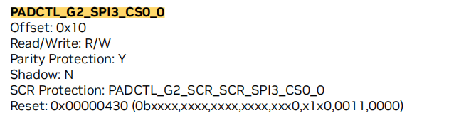

5. Locate the character corresponding to “G2” according to the table below, which is “PADCTL_A13”

   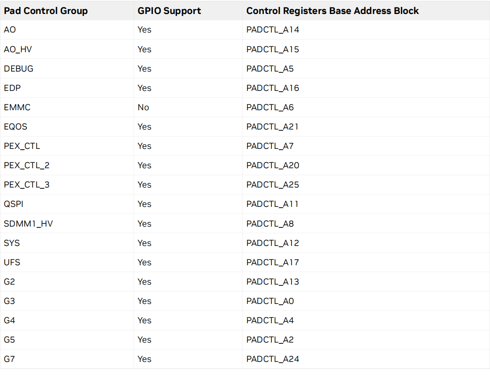

   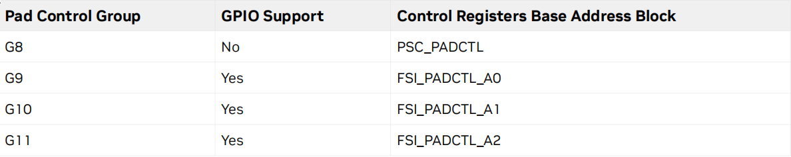

6. Open the file “**Orin-TRM_DP10508002_v1.2p.pdf**” file in the same directory, and search for “System Address Map”. You need note the parameter corresponding to “**PADCTL_A13**”: 0x0243d000. Calculate the corresponding Pinmux register address: 0x0243d000 + 0X10 = 0x0243d010

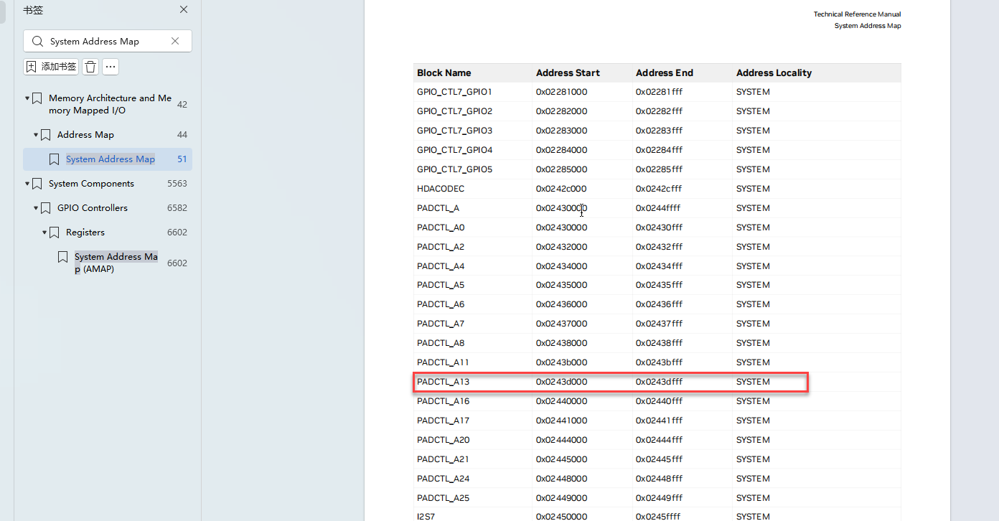

7. Double click . Enter the command and press Enter to check the value corresponding to 0x0243d010. The recorded value: 0x00000055.

   ```py
   sudo busybox devmem 0x0243d010
   ```

   

8. Convert 0x00000055 to binary: 1010101

9. Set the 10<sup>th</sup> bit of 1011001 to 0. Since the loading zeros in binary are omitted, the result is: 1010101.

10. Set the 6<sup>th</sup> bit of 1010101 to 0. Since the loading zeros in binary are omitted, the result is: 10101

11. Set the 4<sup>th</sup> bit of 10101 to 0. Since the loading zeros in binary are omitted, the result is 101.

12. Convert 101 to hexadecimal: 0x005.

13. Double click . Enter the command to set the offset value. Then, run the .py program that requires GPIO output.

    ```py
    sudo busybox devmem 0x0243d010 w 0x005
    ```

You can also place this command inside the .py file, as shown in the inage below:


## 5.4 UART Communication Configuration and Programming

### 5.4.1 Introduction to UART Communication

Communication protocol plays an important role in enabling communication between devices. They are designed in different ways depending on the system requirements, and there protocols have specific rules that must be agreed upon by the devices to achieve successful communication.

Embedded systems, microcontrollers, and computers mostly use UART as a form of device-to-device hardware communication protocol. Among the available communication protocols, UART uses only two wires for its transmit and receive ends.

Although it is a widely used method for hardware communication, it has not always been fully optimized. When using the UART module within microcontrollers, the correct implementation of the frame protocol is often overlooked.

By definition, UART is a hardware communication protocol that uses asynchronous serial communication at a configurable speed. Asynchronous means there is no clock signal to synchronize the output bits from the transmitting device to the receiving end.

Each UART device has two signal lines named:

· **Transmitter (Tx)**

· **Receiver (Rx)**

The primary purpose of the transmitter and receiver lines in each device is to send and receive serial data for serial communication.

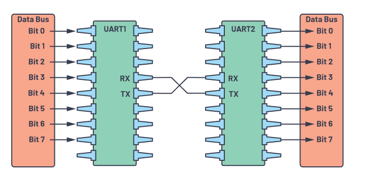

The UART sends data to the control data bus, which transmits data in parallel form. As a result, the data is now serially transmitted bit by bit over the transmission line (wire) to the receiving UART. In turn, this converts the serial data back into parallel data for the receiving device.

The UART lines serve as a communication medium, sending and receiving data from one to another. It’s important to note that UART devices have dedicated transmit and receive pins for sending or receiving data.

For UART and most serial communication, the same baud rate needs to be set on both the transmitting and receiving devices. The baud rate is the rate at which information is transmitted to the communication channel. In the context of a serial port, the baud rate set will determine the maximum number of bits transmitted per second.

In UART, data is transmitted in the form of packets. The process of connecting the transmitter and receiver involves creating serial data packets and controlling these physical hardware lines. A data packet consists of a start bit, data frame, parity bit, and stop bit.

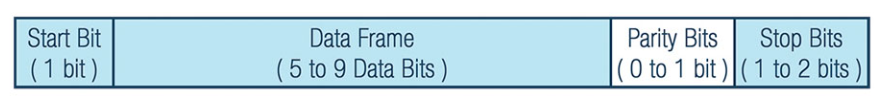

- **Start Bit**

  The UART data transmission line usually remains at a high voltage level when not transmitting data. To begin data transmission, the transmitting UART pulls the transmission line low for one (1) clock cycle. When the receiving UART detects the voltage transition from high to low, it starts reading the bits in the data frame at the baud rate frequency.

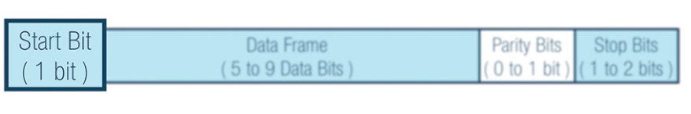

- **Data Frame**

  The data frame contains the actual data being transmitted. If a parity bit is used, the data frame can be five (5) to eight (8) bits long. If no parity bit is used, the data frame can be nine (9) bits long. In most cases, the least significant bit is transmitted first.

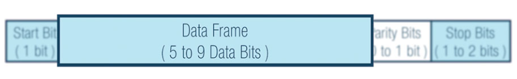

- **Parity**

  Parity describes whether a number is even or odd. The parity bit is a method used by the receiving UART to check if the data has changed during transmission. Bits can be altered due to electromagnetic interference, mismatched baud rates, or long-distance data transmission.

  After the receiving UART reads the data frame, it counts the number of bits that are 1 and checks whether the total count is even or odd. If the parity bit is 0 (even parity), the number of 1s or logic high levels in the data frame should total to an even number. If the parity bit is 1 (odd parity), the number of 1s or logic high levels in the data frame should total to an odd number.

  When the parity bit matches the data, the UART knows that the transmission is error-free. However, if the parity bit is 0 and the total count is odd, or if the parity bit is 1 and the total count is even, the UART knows that the bits in the data frame have changed.

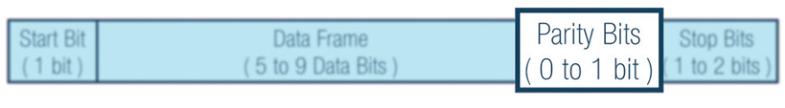

- **Stop Bit**

  To signal the end of a data packet, the transmitting UART drives the data transmission line from low voltage to high voltage, maintaining this state for one (1) to two (2) bit durations.

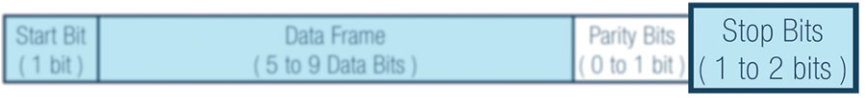

### 5.4.2 Preparation on Your Computer

* **Install Serial Debugging Tool**

Double click “**serial_port_utility_539_3728.exe**” in the same the folder to install program. Please refer to the following steps.

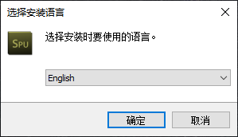

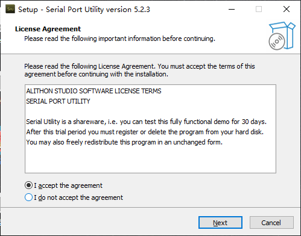

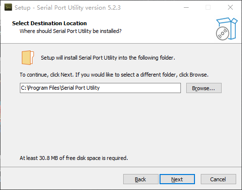

It is recommended to select other installation path.

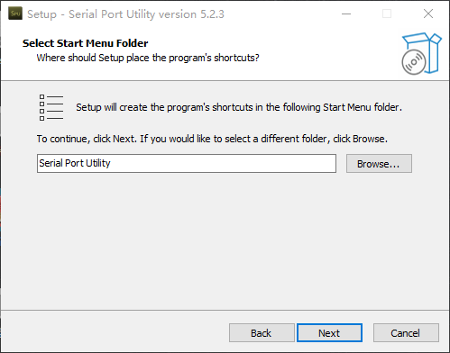

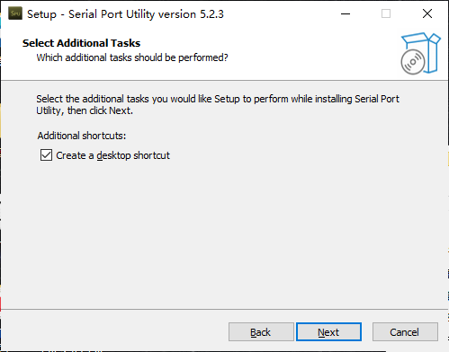

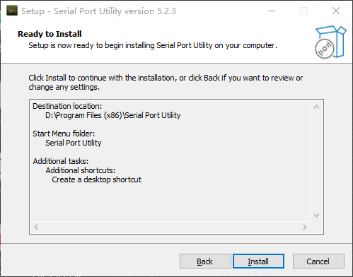

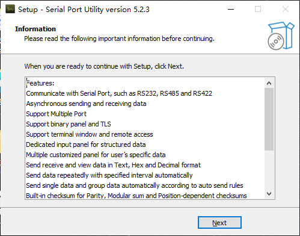

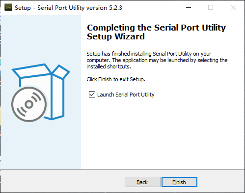

### 5.4.3 Preparations on Jetson Orin Nano

* **Install Library Files**

Power on Jetson Orin Nano board. Double click  to open the terminal. Enter the command and press Enter to execute the program. Then open the terminal and install the serial function library by entering the command:

```py
sudo apt-get install python3-serial
```

* **Set Serial Port Permissions**

If you are using the system image we provide, you can find the corresponding program in the folder “**[3. Basic Operation Course -> 3.2 Introduction to System Desktop]()** .”  
This method requires that the purchased kit includes the expansion board.

1. Power on Jetson Orin Nano and connect it to the remote system desktop via NoMachine.

2. Minimize the NoMachine window and drag the "**UART.rules**" file to the NoMachine system desktop.

   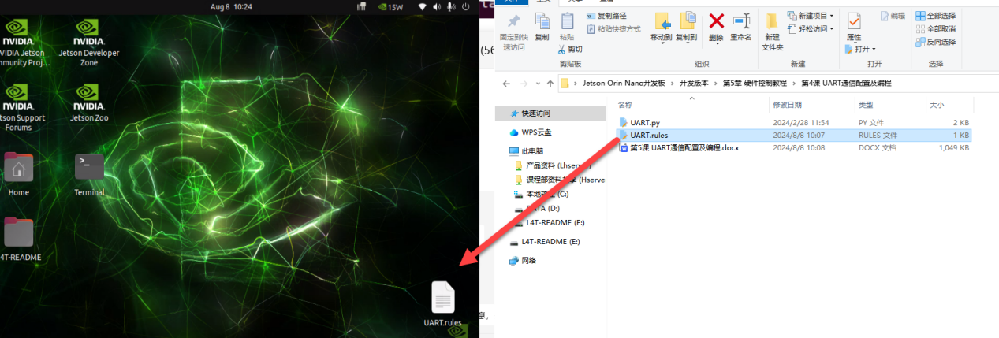

3. Double click . Enter the following command, and press Enter to copy the serial port rule file into the system.

   ```py
   sudo cp ~/Desktop/UART.rules /etc/udev/rules.d/
   ```

4. Double click  to open a new terminal. Enter the command, and press Enter to read and update the rules.

   ```py
   sudo udevadm control --reload-rules
   sudo service udev restart
   sudo udevadm trigger
   ```

   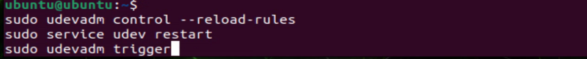

* **Hardware Wiring Instructions**

According to the Jetson Orin Nano pinout diagram, the pins below will be used:


Use a USB-to-TTL module to connect Jetson Orin Nano to PC using a female-to-female Dupond wire, as follow:

```py
Jetson Orin Nano Pin 8 (TXD) <--> USB-to-TTL Module RXD
Jetson Orin Nano Pin 10 (RXD) <--> USB-to-TTL Module TXD
Jetson Orin Nano Pin 6 (GND) <--> USB-to-TTL Module GND
```

### 5.4.4 Example Program - Send and Receive

This section shows how to display the received string sent from the Jetson Orin Nano using a serial port debugging assistant on the computer. Characters sent from the computer through the serial port debugging assistant can also be displayed on the Jetson Orin Nano.

* **Start Serial Debugging Tool**

After inserting the USB-to-TTL tool into any USB port on the computer, open the Device Manager and check if the port is recognized, as shown in the image below:

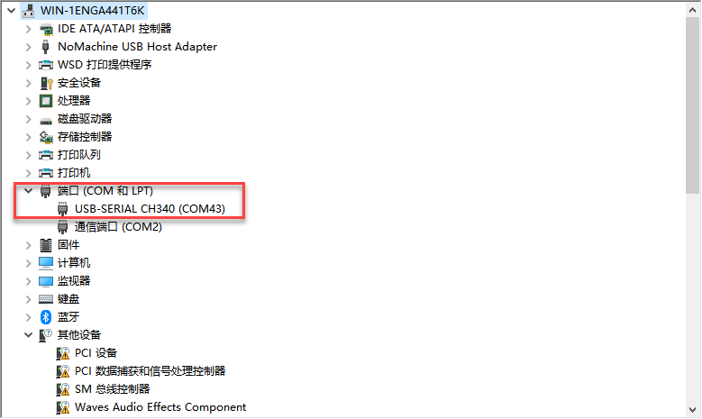

If the port with the CH340 identifier does not appear, check if the CH340 driver is installed on the computer (the driver package can be found in the directory of this section). If the driver is installed but the port is still not recognized, try using a different USB port for troubleshooting.

Double-click the installed “Serial Port Utility”.


After opening the Serial Port Utility, select the port with the CH340 identifier. Set the baud rate, data bits, and other properties according to the settings shown in the image below. Then, click  to proceed.

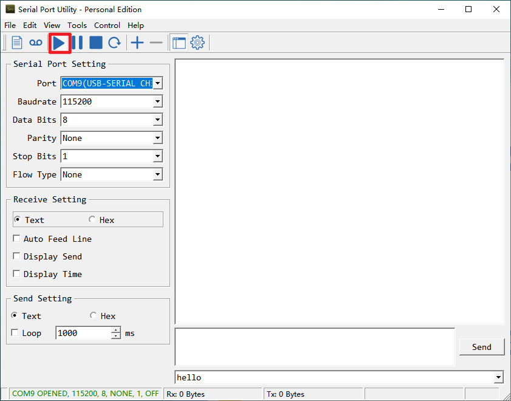

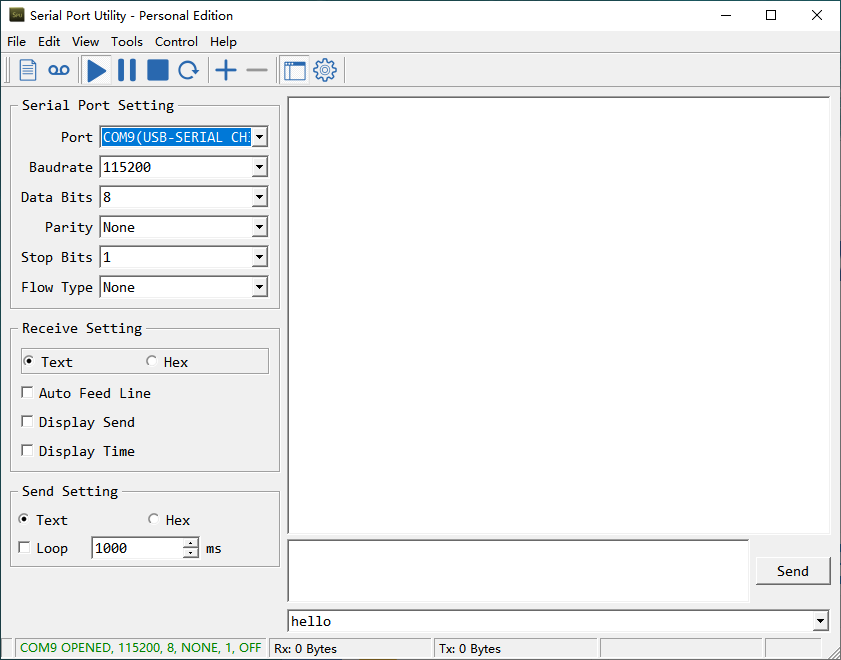

* **Import Example Program**

1)  Power on Jetson Orin Nano and connect it to the remote system desktop via NoMachine.

2)  Minimize the NoMachine window and drag the "**UART.py**" file to the NoMachine system desktop.

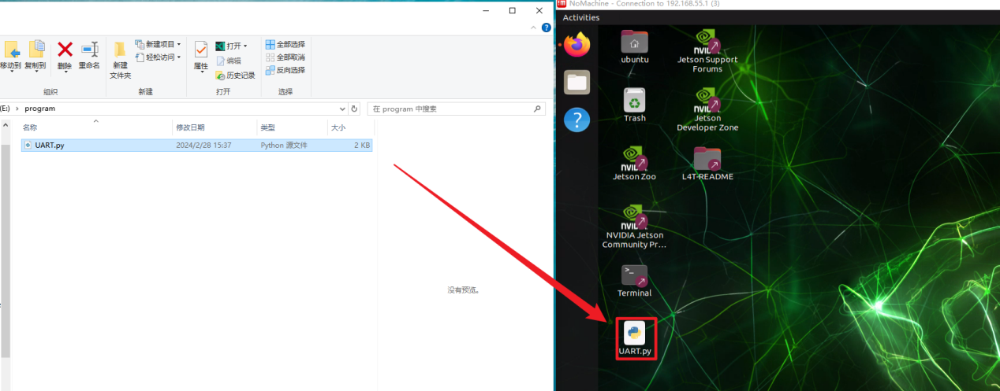

3. Enter the command to add execution permission to the program.

   ```py
   chmod a+x /home/ubuntu/Desktop/UART.py
   ```

* **Run Program**

1. Turn on Jetson Orin Nano, and connect it to the remote system desktop via NoMachine.

2. Double click  to open the terminal.

3. Enter the command to switch the desktop.

   ```py
   cd Desktop/
   ```


4. Run the test code by entering the command:

   ```py
   python3 UART.py
   ```

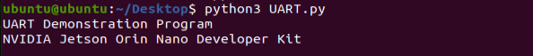

* **Check Outcome**

**1. Serial Port Debugging Terminal**

In the serial port debugging assistant, you can receive messages sent from the Jetson Orin Nano. Set the baud rate to **115200**, as shown below:

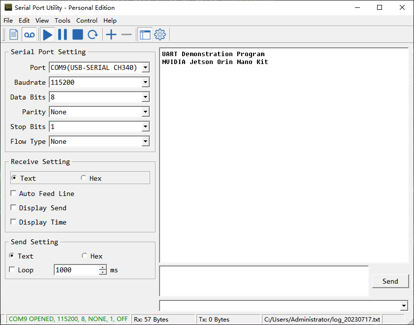

You can type something in the field below, for example, "hello," and then click Send.

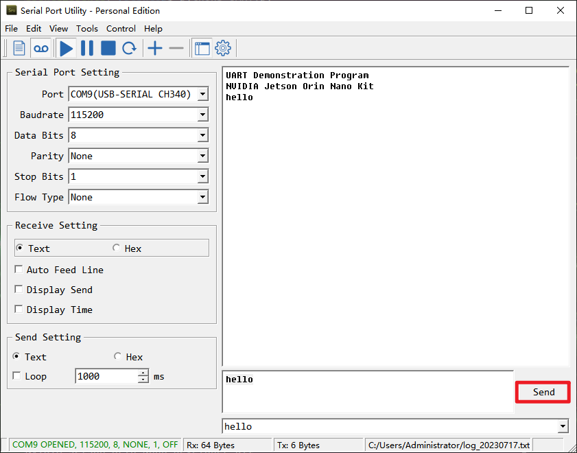

**2. Jetson Orin Nano Terminal**

On the command line interface of Jetson Orin Nano, you can receive messages sent from the computer.


## 5.5 IIC Communication

### 5.5.1 Introduction to IIC Communication

IIC is also called as I2C and Inter-Integrated Circuit is short for IICBus.

It is a serial bus composed of data line SDA and clock SCL, which can send and receive data in both directions between CPU (microcontroller) and IIC module, and between IIC module and IIC module.

Features of IIC: IIC is half-duplex, not full-duplex.

IIC is a true multi-host bus, (compare SPI needs to fix the host before each communication, while IIC can change the host during the communication), if two or more hosts request the bus at the same time, the bus data can be prevented from being corrupted by conflict detection and arbitration.

The start and stop signals are sent by the host. Devices connected to the I2C bus with a hardware interface to the I2C bus can easily detect the start and stop signals.

After the start signal a 7-bit slave address + 1 direction bit must be sent, with a "0" indicating that the host sends data and a "1" indicating that the host receives data.

Whenever the host sends a byte of data to the slave, the host always needs to wait for an answer signal from the slave to confirm whether the slave has successfully received the data.

The start signal is required, the end signal and the answer signal, both can be left out.

> [!NOTE]
>
> **In practice, the microcontroller is usually used as the host and other devices as slaves. The microcontroller first sends a message to the device indicating that it wants to read the data, after which the transmission direction is changed and the device sends data to the microcontroller.**

- **IIC physical connection**

There are many IIC devices that use IIC communication, such as gyroscope accelerometer MPU6050, EEPROM memory chip AT24C02, etc. Through the IIC bus, data can be transferred between them and the microcontroller.

There are only two IIC communication lines, the data line SDA with high and low levels transmits binary data, and the clock line SCL provides clock beats through square wave signals.

Multiple IIC devices can be connected in parallel on the IIC bus, with each device having a specific address and sharing the IIC bus on a time-sharing basis. The actual use of the IIC is of course also connected to a power supply as well as a common ground.

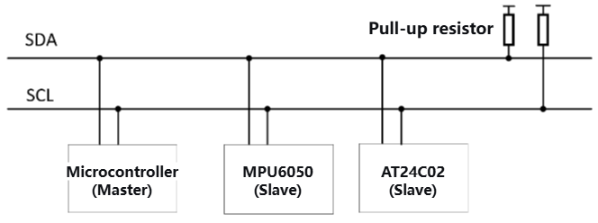

- **IIC time sequence**

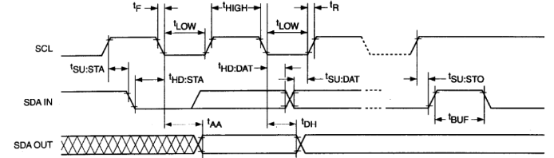

- **Start and Stop of IIC**

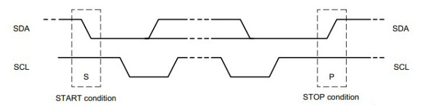

**Start:** When the clock line SCL is high, the data line SDA transitions from high to low.

**Stop:** When the clock line SCL is high, the data line SDA transitions from low to high.

> [!NOTE]
>
> When both SDA and SCL are high, it indicates the idle state of the I2C bus.

- **IIC Acknowledge**

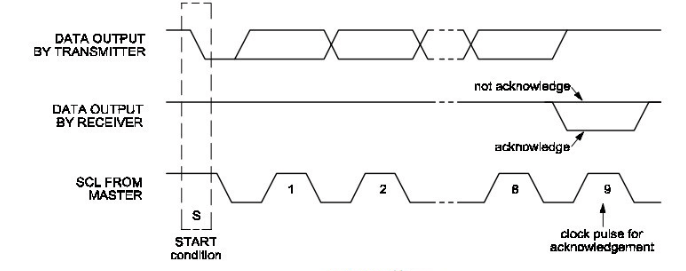

The lower waveform: the SCL is the clock pulse from master

The upper waveform: SDA, the 8-bit data output by transmitter.

The middle waveform: SDA, when the slave device pulls it low on the ninth clock signal, indicates that it has received the data sent by the master. If it is pulled high, it indicates a non-acknowledgment.

> [!NOTE]
>
> **The upper and the middle part refer to the same SDA wire. IIC acknowledge is a mutual relationship. When a microcontroller sends data to an IIC device, the IIC device needs to acknowledge to indicate that the data has received. Similarly, when the microcontroller receives data from an IIC device, it also needs to provide an acknowledge to the IIC device.**

If there is no need to continue reading, a non-acknowledgment is sent. The recipient, thinking that the data was not received, will refrain from sending further data.

- **IIC complete transmission timing**

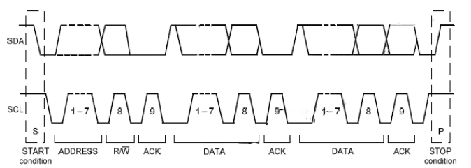

After the Start condition (S) is issued, the master device sends a 7-bit Slave Address, followed by an 8th bit known as the Read/Write (R/W) bit.

The R/W bit indicates whether the master device is receiving data from the slave or sending data to it.

The master device then releases the SDA line and waits for an acknowledgment (ACK) signal from the slave device. Each byte of data transfer is followed by an acknowledgment bit.

When an acknowledgment is generated, the slave device pulls the SDA line low and maintains it low while the SCL line is high.

Data transmission ends with a Stop condition (P), which releases the bus. However, the master device can also issue a repeated Start condition to communicate with another slave device without sending a Stop condition.

All SDA signal changes occur while the SCL clock is low, except for the Start and Stop conditions.

### 5.5.2 Hardware Wiring

According to the Jetson Orin Nano pinout diagram, the following pins will be used:

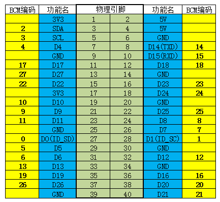

Here, we use an I2C interface accelerometer sensor as an example. Other modules with I2C interfaces can follow the same connection method. The module is connected to the Jetson Orin Nano pins using female-to-female Dupont wires, as shown below:

```py
PIN 3 (Jetson Orin Nano) \<--\> SDA (Accelerometer)
PIN 5 (Jetson Orin Nano) \<--\> SCL (Accelerometer)
PIN 6 (Jetson Orin Nano) \<--\> GND (Accelerometer)
```

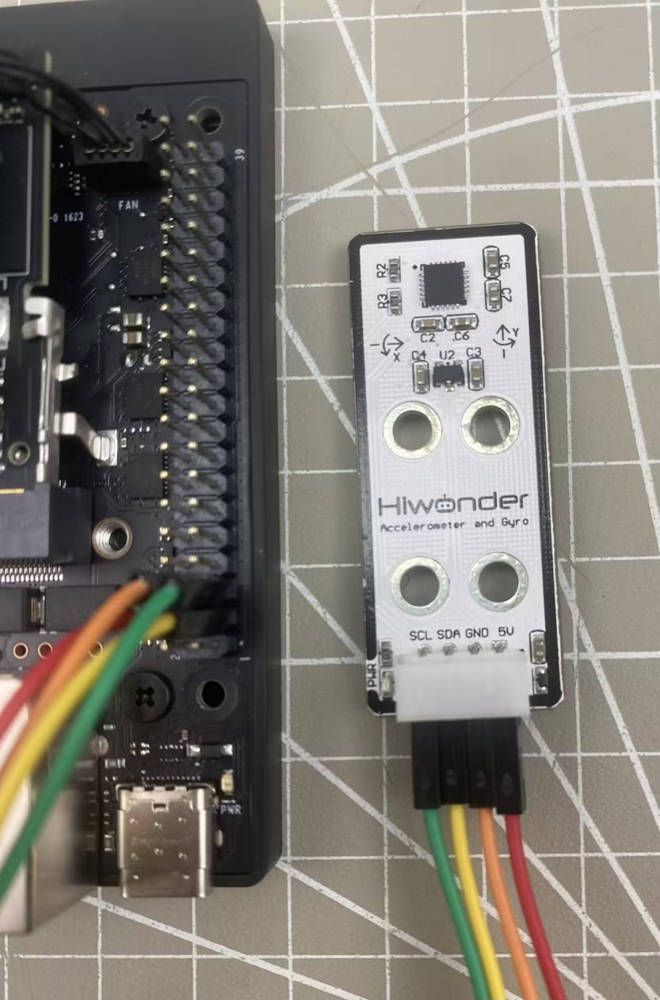

### 5.5.3 Install IIC Library File

1. Start Jetson Orin Nano board. Then open the terminal, enter the following command command to update the library list.

   ```py
   sudo apt-get update
   ```


2)  Enter the command to install I2C library.

```py
sudo apt-get install -y i2c-tools
```


After entering the command, you will be prompted to input a password. For this example, use the default password **ubuntu**. (Users should enter their own password according to their settings.)

After installation is complete, check whether the installation is successful by entering the following command:

```py
apt-cache policy i2c-tools
```

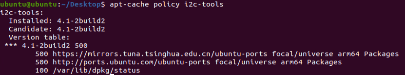

### 5.5.4 I2C-Tools Usage

* **i2cdetect**

i2cdetect is used to detect the I2C BUS status on the system.

Enter the following commands in sequence to list all installed buses.

```py
i2cdetect -F 2
```

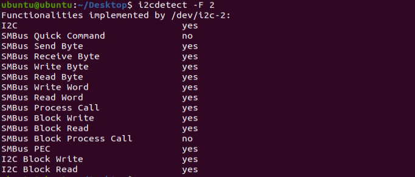

```py
i2cdetect -l
```

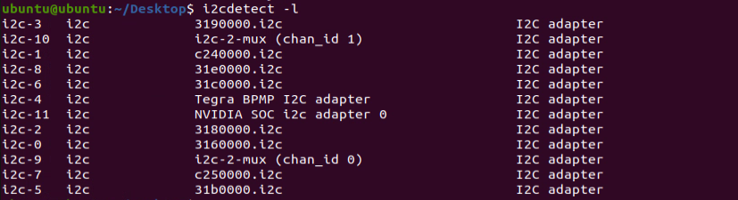

Enter the following command to scan for the devices connected to the bus, such as bus number 1.

```py
i2cdetect -y -r -a 1
```


If devices are detected, their addresses will be listed. For example, on bus number 1, if there is a device at address 0x68 (e.g., an OLED module connected), it will be shown.

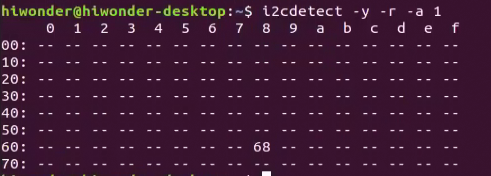

* **i2cdump**

**i2cdump** is used to view the values of device registers. For example, for the MPU6050 accelerometer we are using, its registers can be referenced in the image below:

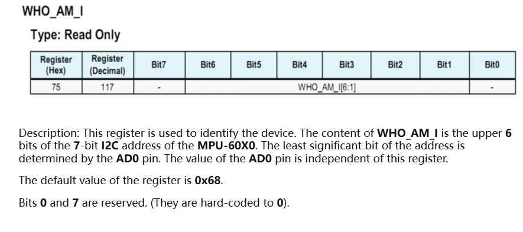

Enter the following command to view the values of all registers for the device at address 0x68 on bus number 1:

```py
i2cdump -y 1 0x68
```


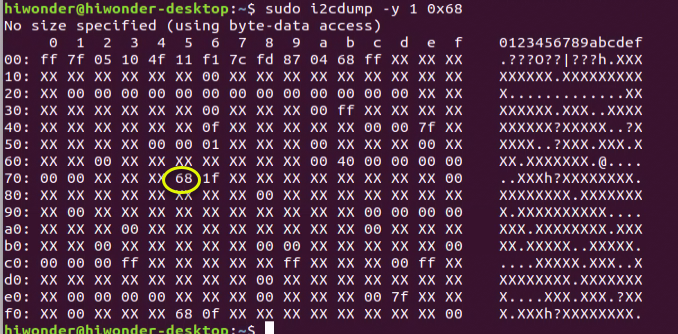

Here, you can see that the default value of the register, 68, is displayed.

* **i2cget**

**i2cget** is used to view the value of a single register on a device and is suitable for single-byte registers.

For example, to read the value of register **0x6b** on the device at address **0x68**, enter the following command:

```py
i2cget -y 1 0x68 0x6b
```


*  **i2ctransfer**

**i2ctransfer** is used for reading and writing device register values and is suitable for double-byte registers. For example, to read 16 bytes of data starting from register address 0x6b on the device at address 0x68 on bus number 1, enter the following command:

```py
i2ctransfer -f -y 1 w2@0x68 0x01 0x6b r16
```


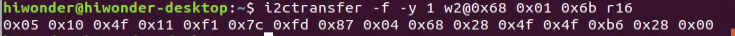

For example, to write 3 bytes of data to the device at address 0x68 on bus number 1, starting from register address 0x6b, write the value 0x25 and then read it back for verification.

```py
i2ctransfer -f -y 1 w3@0x68 0x01 0x6b 0x25
```

