# 7. AI Fundamental Course

## 7.1 CSI Camera Introduction and Installation

### 7.1.1 Introduction to CSI Camera

**The Camera Serial Interface (CSI) is** is a interface specification of the Mobile Industry Processor Interface(MIPI) Alliance with higher bandwidth and lower power consumption compared to USB cameras, and Jetson series provide a sef of Camera SubSystem to improve efficiency, making it ideal for video image input on intelligent robots.

### 7.1.2 CSI Camera Installation

* **Preparation**

1)  Jetson Orin Nano board

2)  CSI Camera

3)  Ribbon cable

* **Assembly**

1. Gently pull up on the edges of the CSI port’s plastic clip.

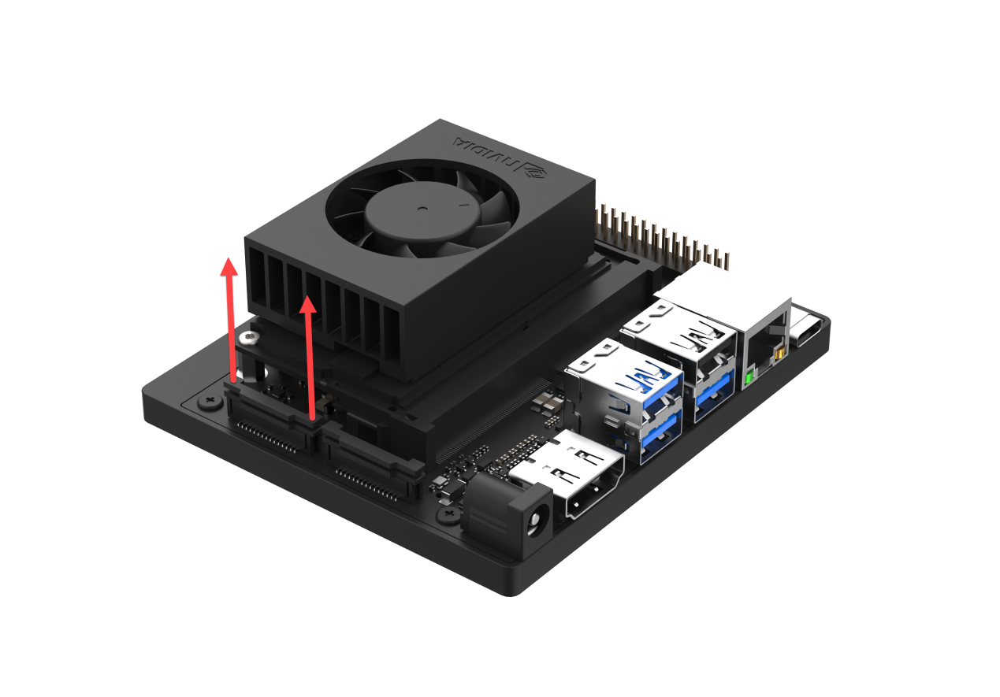

2. Insert the ribbon cable into the interface; make sure the connectors at the ribbon cable are facing the contacts in the port. Then push the collar back into place.

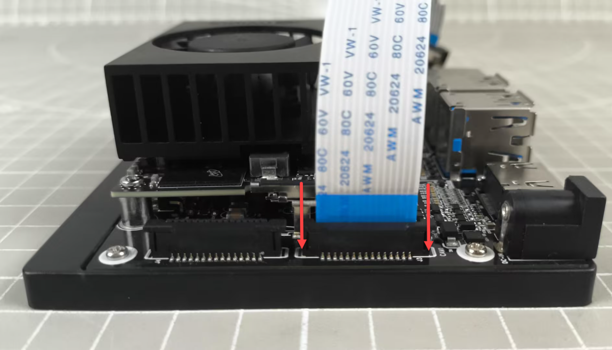

3. Lift the collar on the camera module.

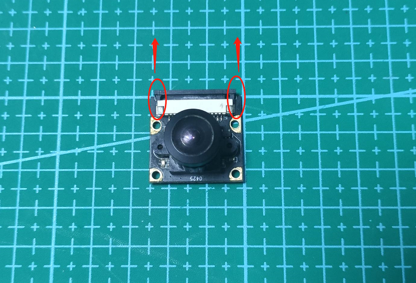

4. Connect the other end of the ribbon cable into the interface of the CSI camera module with the conductors facing in the same direction as the camera’s lens. Then, press the collar down again.

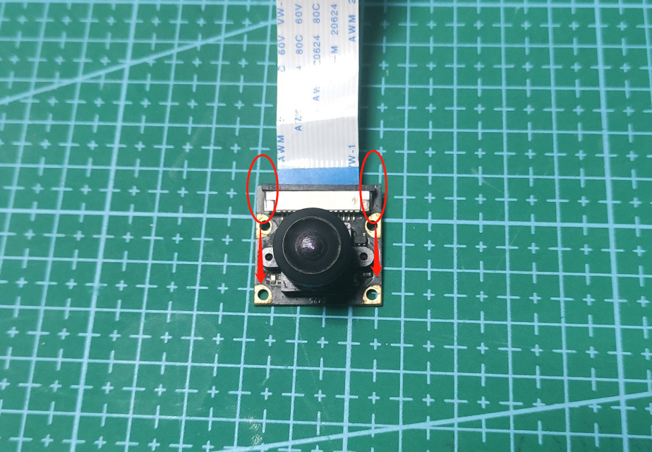

5. The installation effect is shown in the figure below:

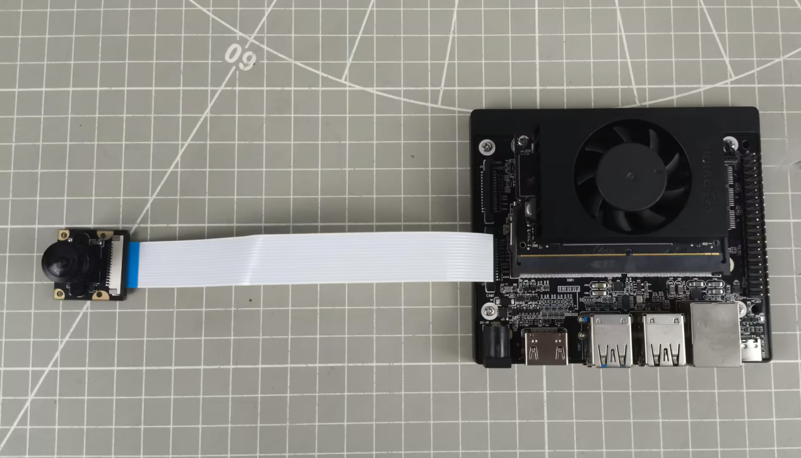

## 7.2 CSI Camera Testing and Use

> [!NOTE]
>
> **Before starting this section, it is necessary to complete the installation of the camera module according to the tutorial in the previous lesson.**

###  7.2.1 Operation Steps

The input command should be case sensitive, and "Tab" key can be used to complement the key words.

If you use the system image we provide, you can find the corresponding program in the folder "**[3. Basic Operation Course -> 3.2 Introduction to System Desktop](https://wiki.hiwonder.com/projects/Jetson-Orin-Nano/en/latest/docs/3_Basic_Operation_Course.html#introduction-to-system-desktop)** ."

1. Power on the Jetson Orin Nano board, and connect it to the ubuntu desktop using NoMachine.

2. Import the program file "**Camera.py**" under the same folder with this document to the home directory of the board system.

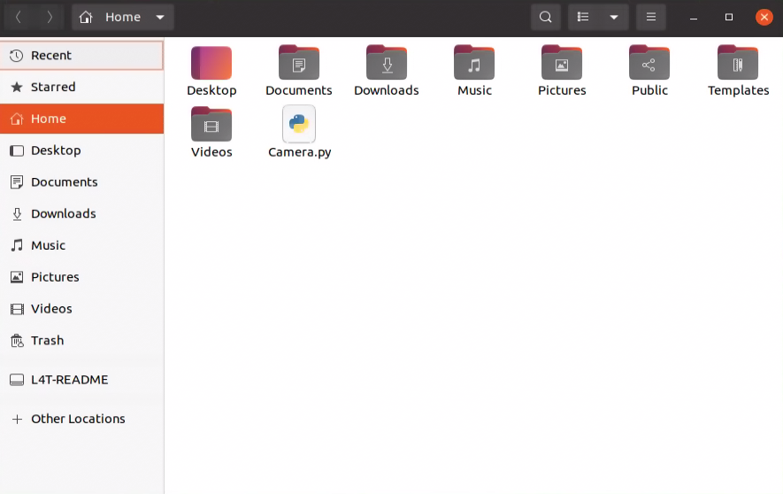

3. Double click 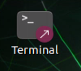 or use the shortcut key "**Ctrl+Alt+T**" to open the terminal.

4. Enter the command and press Enter to start the game.

```bash
python3 Camera.py
```

5)  To close this program, press "Ctrl+C".

###  7.2.2 Program Outcome

After the game starts, the screen will display the transmitted image.


###  7.2.3 Program Analysis

- **Read CSI Camera**

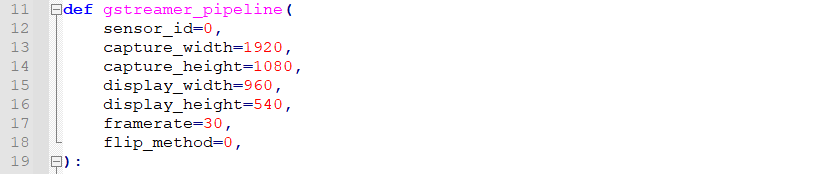

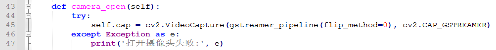

The pose is primarily adjusted through the parameters within the "VideoCapture" function. Using the code "**cv2.VideoCapture(gstreamer_pipeline(flip_method=0), cv2.CAP_GSTREAMER)**" as an example, the parameters inside the function brackets are explained as follows:

1)  The first parameter `gstreamer_pipeline(flip_method=0)` is a framework passed into the `gstreamer_pipeline` function, where the video data reading preoperties are set.

2)  The second parameter `cv2.CAP_GSTREAMER`, is used to select the pipeline transmission mode.

- **Read and Display Image**


First, the read method is called to capture the video frame, and then the imshow method is used to display the image. Using the code `cv2.imshow("img", frame)` as an example, the parameters inside the function brackets are explained as follows:

1. The first parameter, `img`, is the title of the display window.

2. The second parameter, `frame`, is the transmitted image.

When the "**q**" key is pressed to close, the release method is first called to release the camera, followed by the destroyAllWindows method to close all windows.

## 7.3 Madiapipe Introduction and Installation

###  7.3.1 Introduction to MediaPipe

MediaPipe is an open-source multimedia machine learning framework. It can run cross-platform on mobile devices, workstations and servers, with support for mobile GPU acceleration. MediaPipe also supports TensorFlow and TF Lite inference engines, allowing any TensorFlow and TF Lite models to be used within MediaPipe. Additionally, on mobile and embedded platforms, MediaPipe supports GPU acceleration on the device itself.

###  7.3.2 MediaPipe Pros and Cons

* **MediaPipe Pros**

1)  MediaPipe supports various platforms and languages, including iOS, Android, C++, Python, JAVAScript, Coral, etc.

2)  Swift running. Models can run in real-time.

3)  Models and codes are with high reuse rate.

* **MediaPipe Cons**

1)  For mobile devices, MediaPipe will occupy 10M or above.

2)  As it greatly depends on Tensorflow, you need to alter large amount of codes if you want to change it to other machine learning frameworks, which is not friendly to machine learning developer.

3)  It adopts static image which can improve efficiency, but make it difficult to find out the errors.

* **How to use MediaPipe**

The figure below shows how to use MediaPipe. The solid line represents the part to coded, and the dotted line indicates the part not to coded. MediaPipe can offer the result and the function realization framework quickly.


* **Install MediaPipe**

1. Power on Jetson Orin Nano, and connect it to the remote system desktop using NoMachine.

2. Double click 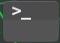 to open the terminal.

3. Enter the command below to install and update the APT download list.

```py
sudo apt update
```

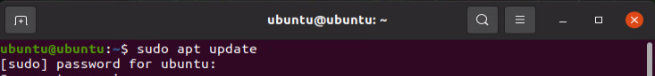

4. Enter the command to install pip.

```py
sudo apt install python3-pip
```

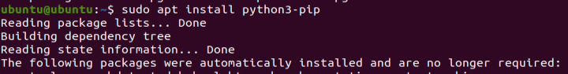

5. Enter the command to update pip.

```py
python3 -m pip3 install --upgrade pip3
```


6. Then enter the command to install.

```py
pip3 install -i https://pypi.tuna.tsinghua.edu.cn/simple mediapipe
```


7. Enter the command to uninstall Numpy.

```py
pip3 uninstall numpy
```


If Numpy is higher than 2.0 version, it can not be used with Mediapipe, and the version needs to be downgraded. After entering this command, if it shows that NumPy version is 1.x, you can type "n" in the subsequent prompt to cancel uninstallation.

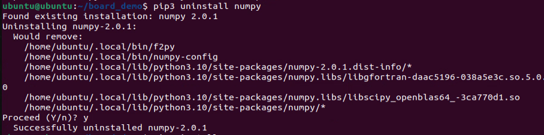

8. Run the command to install NumPy.

```py
pip3 install numpy==1.21.5
```


## 7.4 Image Background Segmentation

In this lesson, we will use MediaPipe's Selfie Segmentation model to separate trained models (such as face, hand, etc.) from the background and then add a virtual background.

### 7.4.1 Introduction

Firstly, import MediaPipe’s selfie segmentation model, and obtain the live camera feed by subscribing to the topic messages. Next, perform the image flipping processing, and drawn the segmentation map on the background image. To improve the segmentation around the edges, apply bilateral filtering. Finally, replace the virtual background with a virtual one.

### 7.4.2 Operation Steps

The input command should be case sensitive, and "Tab" key can be used to complement the key words.

If you use the system image we provide, you can find the corresponding program in the folder "[**3. Basic Operation Course -> 3.2 Introduction to System Desktop** ](https://wiki.hiwonder.com/projects/Jetson-Orin-Nano/en/latest/docs/3_Basic_Operation_Course.html#introduction-to-system-desktop)."

1. Power on Jetson Orin Nano board, and connect it to the remote system desktop using NoMachine.

2. Connect it to the network. For specific operations, please refer to the tutorials located in "**[3. Basic Operation Course -> 3.3 Network Configuration (Wired and Wireless)](https://wiki.hiwonder.com/projects/Jetson-Orin-Nano/en/latest/docs/3_Basic_Operation_Course.html#network-configuration-wired-and-wireless)**" to access the network. Some models may need to be re-downloaded.

3. When entering the system desktop, drag the program file "**self_segmentation.py**" under the same directory to the remote desktop.

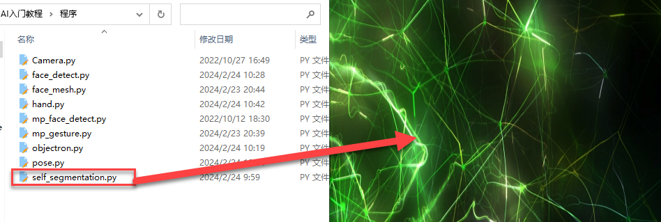

4. Then right click on the blank area of the system desktop, and select "**Open in Terminal**" to open the command-line terminal:


5. Enter the following command and press Enter to run the background segmentation detection program.

```py
python3 self_segmentation.py
```


6)  To close the program, please use the shortcut key "Ctrl+C" to exit the program.

### 7.4.3 Program Outcome

After the program starts, the frame turns into a completely gray virtual background. When a person enters the frame, they will segmented from the background.


### 7.4.4 Program Analysis


- **Build a Selfie Segmentation Model**

Import the selfie segmentation model from the MediaPipe toolkit.

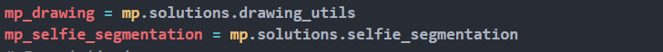

The first parameter "**model_selection**" is for model selection. MediaPipe is available in the general model and the landscape model. Both models are based on MobileNetV3 and have been modified to improve the efficiency. The general model runs on a 256x256x3 (HWC) tensor and output a 256x256x1 tensor representing the segmentation mask.

The landscape model is similar to the general model but runs on a 144x256x3 (HWC) tensor. It has fewer FLOP, making it faster than the general model. Noted that before feeding the input image into the ML mode, MediaPipe Selfie Segmentation automatically resizes the input image to the required tensor dimensions.

- **Retrieve Live Camera Feed**

Invoke the `VideoCapture()` function from cv2 library to retrieve the camera feed.


The parameter within the function parenthesis refers to the camera interface. You can also use "0" to access the default camera.

If the current device has only one camera connected, either "0" or "-1" can be used as the camera ID. If multiple cameras are connected, "0" presents the first camera, "1" represents the second camera, and so on for additional cameras.


Convert the color space by calling the `cvtColor()` function from the cv2 library.

Before performing segmentation on the image, convert the image to the RGB color space.

- **Draw the segmentation image**

Based on the previously built selfie segmentation model, draw the segmentation map of the person and the background in the image.


- **Boundary Filtering**

To improve segmentation around the edges, you can apply bilateral filtering to `results.segmentation_mask`


`np.stack((results.segmentation_mask,) * 3, axis=-1) > 0.1` — The smaller the last parameter, the more edges are included.

- **Change Background**

Remove the background from the segmentation map and replace it with a virtual background.

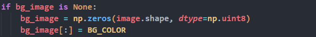

Use np.zeros(image.shape, dtype=np.uint8) to remove the background and replace it with BG_COLOR. BG_COLOR can be either a color or an image. For a color, use its RGB value; for an image, ensure its dimensions match the camera's resolution.


- **Display the Transmitted Image**

Use the imshow() function from the cv2 library to display the camera feed in a specified window.


The first parameter inside the function’s parentheses, `'MediaPipe Selfie Segmentation'`, is the window name, and the second parameter`, output_image`, is the image to be displayed.

## 7.5 3D Object Detection

This section uses MediaPipe’s 3D object detection model to display 3D bounding boxes of objects in the image.

Object detection is a widely studied problem in computer vision. By extending predictions to 3D, you can capture the size, position, and orientation of objects in the world, enabling various applications in robotics, autonomous vehicles, image retrieval, and augmented reality.

### 7.5.1 Program Logic

First, import MediaPipe’s 3D Objection and obtain the live camera feed by subscribing to topic messages.

Next, process the image, such as flipping it, and perform 3D object detection on it.

Finally, draw 3D bounding boxes on the image. Here will use a cup as an example.

### 7.5.2 Operation Steps

The input command should be case sensitive, and "Tab" key can be used to complement the key words.

If you use the system image we provide, you can find the corresponding program in the folder "**[3. Basic Operation Course -> 3.2 Introduction to System Desktop](https://wiki.hiwonder.com/projects/Jetson-Orin-Nano/en/latest/docs/3_Basic_Operation_Course.html#introduction-to-system-desktop)** ."

1. Power on Jetson Orin Nano board, and connect it to the remote system desktop using NoMachine.

2. Connect it to the network. For specific operations, please refer to the tutorials located in "**[3. Basic Operation Course -\> 3.3 Network Configuration (Wired and Wireless)](https://wiki.hiwonder.com/projects/Jetson-Orin-Nano/en/latest/docs/3_Basic_Operation_Course.html#network-configuration-wired-and-wireless)**" to access the network. Some models may need to be re-downloaded.

3. When entering the system desktop, drag the program file "**objectron.py"** under the same directory to the remote desktop.

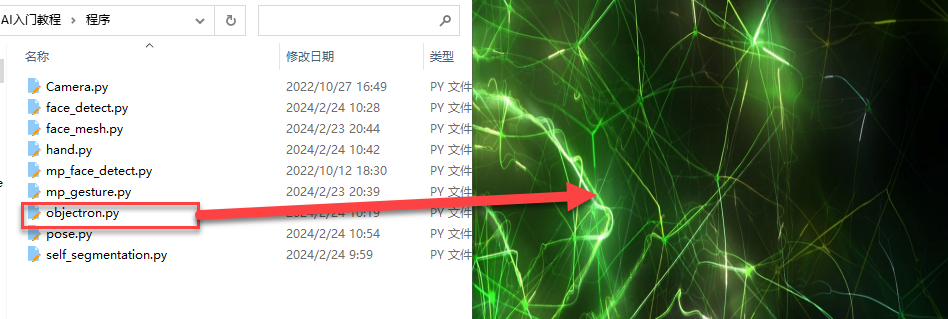

4. Then right click on the blank area of the system desktop, and select "**Open in Terminal**" to open the command-line terminal:


5. Enter the following command and press Enter to run 3D object detection.

```py
python3 objectron.py
```


6)  To close the program, please use the shortcut key "Ctrl+C" to exit the program.

### 7.5.3 Program Outcome

7. After starting the program, 3D bounding boxes will appear around objects in the image. Currently, we support the detection of four types of objects: cups (with handles), shoes, chairs, and cameras. The example here uses a cup, as shown in the image below:

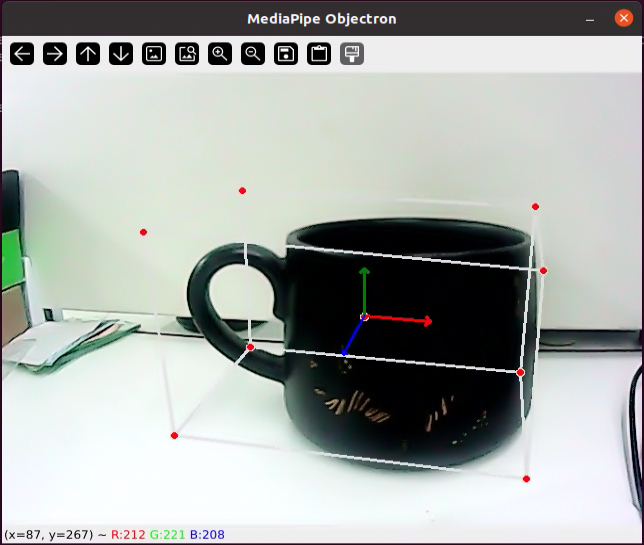

### 7.5.4 Program Analysis

- **Build a 3D Detection Model**

Import the Objectron (3D Object Detection) model from the MediaPipe toolkit.

```py
with mp_objectron.Objectron(static_image_mode=False,
                                max_num_objects=1,
                                min_detection_confidence=0.4,
                                min_tracking_confidence=0.5,
                                model_name='Cup') as objectron:
```

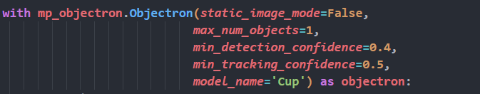

The first parameter, `static_image_mode=False,` specifies whether the image is in static mode. If set to false, the input image is treated as a video stream. If set to true, object detection runs on each input image, which is suitable for processing a batch of static, potentially unrelated images. The default is false.

The second parameter, `max_num_objects=1,` specifies the maximum number of objects to detect, with the default value being 5.

The third parameter, `min_detection_confidence=0.4,` is the minimum detection confidence. This value (\[0.0, 1.0\]) determines the confidence threshold for successful detections from the object detection model. The default is 0.5.

The fourth parameter, `min_tracking_confidence=0.4,` is the minimum confidence for object tracking. Setting this to a higher value can improve the robustness of the solution but may increase latency.

The fifth parameter, `model_name='Cup',` specifies the name of the 3D bounding box model. This name determines which 3D bounding box marker model to display. Currently supported models are {'Shoe', 'Chair', 'Cup', 'Camera'}, with the default being 'Shoe'.

- **Retrieve Live Camera Feed**

Invoke the `VideoCapture()` function from cv2 library to retrieve the camera feed.


The parameter within the function parenthesis refers to the camera interface. You can also use "0" to access the default camera.

If the current device has only one camera connected, either "0" or "-1" can be used as the camera ID. If multiple cameras are connected, "0" presents the first camera, "1" represents the second camera, and so on for additional cameras.


Convert the color space by calling the `cvtColor()` function from the cv2 library.

- **Detection**

Based on the previously built Objectron (3D Object Detection) model, detect the 3D shape of objects.


- **Draw 3D Bounding Boxes**

After detecting the 3D shape of objects, iterate through the identified objects and use `mp_drawing.draw_landmarks()` and `mp_drawing.draw_axis()` to draw 3D bounding boxes around them.

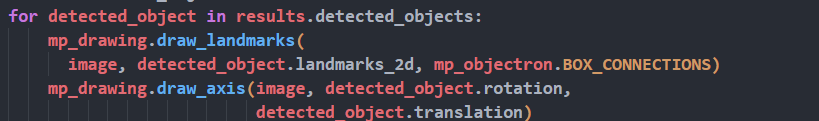

- **Display the Transmitted Image**

Use the `imshow()` function from the cv2 library to display the camera feed in a specified window.


The first parameter inside the function’s parentheses, 'MediaPipe Selfie Segmentation', is the window name, and the second parameter, output_image, is the image to be displayed.

## 7.6 Facial Detection

### 7.6.1 Program Logic

First, import MediaPipe's face detection model and obtain the live camera feed by subscribing to topic messages.

Next, use OpenCV to process the image, such as flipping and converting the color space.

Then, compare the face detection model's minimum confidence to determine if the face detection was successful. Once a face is detected, perform face landmark detection, where each face is represented by a detection message containing a bounding box and six key points (right eye, left eye, nose tip, mouth center, right ear region, and left ear region).

Finally, draw a bounding box around the face and mark the six key points on the face.

### 7.6.2 Operation Steps

The input command should be case sensitive, and "Tab" key can be used to complement the key words.

If you use the system image we provide, you can find the corresponding program in the folder "**[3. Basic Operation Course -> 3.2 Introduction to System Desktop](https://wiki.hiwonder.com/projects/Jetson-Orin-Nano/en/latest/docs/3_Basic_Operation_Course.html#introduction-to-system-desktop)** ."

1. Power on Jetson Orin Nano board, and connect it to the remote system desktop using NoMachine.

2. Connect it to the network. For specific operations, please refer to the tutorials located in "**[3. Basic Operation Course -> 3.3 Network Configuration (Wired and Wireless)](https://wiki.hiwonder.com/projects/Jetson-Orin-Nano/en/latest/docs/3_Basic_Operation_Course.html#network-configuration-wired-and-wireless)**" to access the network. Some models may need to be re-downloaded.

3. When entering the system desktop, drag the program file "**face_detect.py"** under the same directory to the remote desktop.

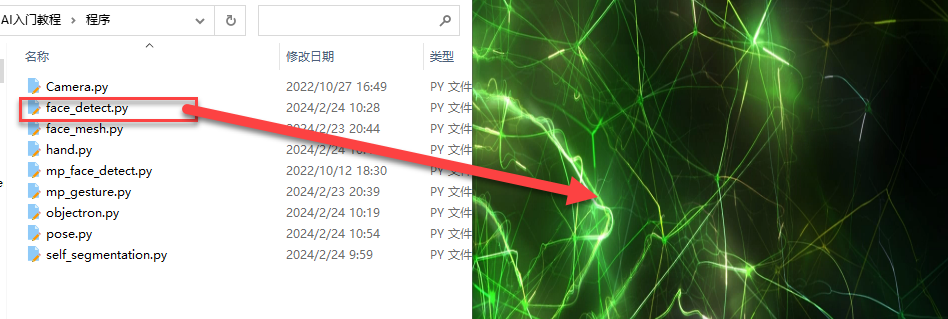

4. Then right click on the blank area of the system desktop, and select "**Open in Terminal**" to open the command-line terminal:

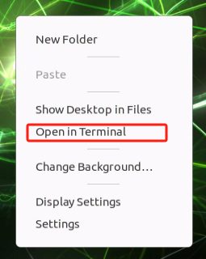

5. Enter the following command and press Enter to run the program.

```py
python3 face_detect.py
```


6)  To close the program, please use the shortcut key "Ctrl+C" to exit the program.

### 7.6.3 Program Outcome

After starting the program, if the face is detected, it will draw a bounding box around the face in the returned feed.

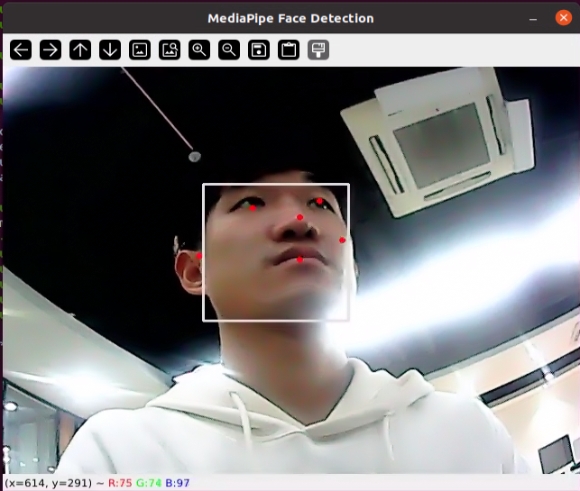

### 7.6.4 Program Analysis

- **Build a Face Detection Model**

Import the face detection model from the MediaPipe toolkit.


The first parameter, "**min_detection_confidence**", is the minimal confidence, with a default value of 0.5. The range is \[0.0, 1.0\].

- **Retrieve Live Camera Feed**

Invoke the `VideoCapture()` function from cv2 library to retrieve the camera feed.


The parameter within the function parenthesis refers to the camera interface. You can also use "0" to access the default camera.

If the current device has only one camera connected, either "0" or "-1" can be used as the camera ID. If multiple cameras are connected, "0" presents the first camera, "1" represents the second camera, and so on for additional cameras.


Convert the color space by calling the `cvtColor()` function from the cv2 library.

Before performing detection on the image, you need to convert the image to the RGB color space.

- **Face Detection**

Based on the previously built face detection model, detect faces in the image.


- **Draw the Face**

Use the `mp_drawing.draw_detection()` function to draw a bounding box around the detected face in the image.


- **Display the Transmitted Image**

Use the `imshow()` function from the cv2 library to display the camera feed in a specified window.


The first parameter inside the function’s parentheses, `'MediaPipe Face Detection'`, is the window name, and the second parameter, `image`, is the image to be displayed.

## 7.7 3D Facial Detection

### 7.7.1 Program Logic

First, it's important to understand that the machine learning pipeline (linear model, akin to a pipeline) consists of two real-time deep neural network models working in tandem: one for detecting face locations by processing the complete image, and another for operating on these locations and predicting approximate 3D facial landmarks through regression.

For 3D facial landmarks, we use transfer learning to train a network with multiple objectives. This network predicts 3D landmark coordinates on synthetic rendering data and annotates 2D semantic contours on real-world data. The resulting network, based on both synthetic and real-world data, provides accurate 3D landmark predictions.

The 3D landmark network receives cropped video frames as input without requiring additional depth input. The model outputs the positions of 3D points and the probability that the face appears and is reasonably aligned in the input.

Next, process the image through flipping, color space conversion, and other adjustments. Then, compare the face detection model’s minimum confidence to determine if the face detection was successful.

Finally, render the detected faces in the image as 3D meshes.

### 7.7.2 Operation Steps

The input command should be case sensitive, and "Tab" key can be used to complement the key words.

If you use the system image we provide, you can find the corresponding program in the folder "**[3. Basic Operation Course -> 3.2 Introduction to System Desktop](https://wiki.hiwonder.com/projects/Jetson-Orin-Nano/en/latest/docs/3_Basic_Operation_Course.html#introduction-to-system-desktop)** ."

1. Power on Jetson Orin Nano board, and connect it to the remote system desktop using NoMachine.

2. Connect it to the network. For specific operations, please refer to the tutorials located in "**[3. Basic Operation Course -> 3.3 Network Configuration (Wired and Wireless)](https://wiki.hiwonder.com/projects/Jetson-Orin-Nano/en/latest/docs/3_Basic_Operation_Course.html#network-configuration-wired-and-wireless)**" to access the network. Some models may need to be re-downloaded.

3. When entering the system desktop, drag the program file "**face_mesh.py"** under the same directory to the remote desktop.

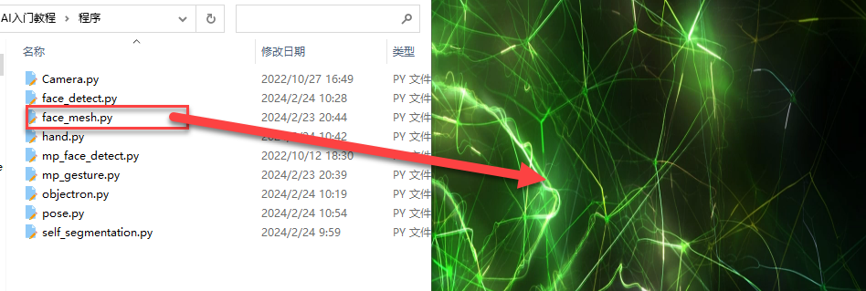

4. Then right click on the blank area of the system desktop, and select "**Open in Terminal**" to open the command-line terminal:


5. Enter the following command and press Enter to run 3D object detection.

```bash
python3 face_mesh.py
```


6)  To close the program, please use the shortcut key "Ctrl+C" to exit the program.

### 7.7.3 Program Outcome

After starting the program, if the camera detects a face, it will display the 3D outline of the face in the transmitted image.

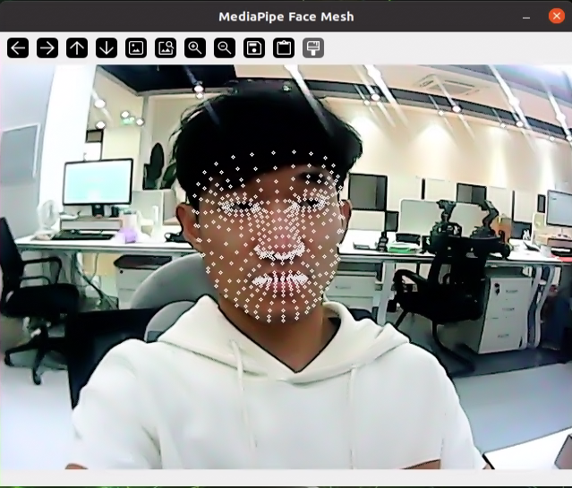

### 7.7.4 Program Analysis

- **Build a Face Mesh Model**

Import the face mesh model from the MediaPipe toolkit.


The first parameter, `max_num_faces,` is the maximum number of faces to detect, with a default value of 1.

The second parameter, `min_detection_confidence,` is the minimum confidence for face detection, with a default value of 0.5. The range is \[0.0, 1.0\].

The third parameter, `min_tracking_confidence,` is the minimum confidence for face tracking. Setting it to a higher value can improve the robustness of the solution, but it may result in increased latency.

- **Retrieve Live Camera Feed**

Invoke the `VideoCapture()` function from cv2 library to retrieve the camera feed.


The parameter within the function parenthesis refers to the camera interface. You can also use "0" to access the default camera.

If the current device has only one camera connected, either "0" or "-1" can be used as the camera ID. If multiple cameras are connected, "0" presents the first camera, "1" represents the second camera, and so on for additional cameras.


Convert the color space by calling the `cvtColor()` function from the cv2 library. Before performing detection on the image, you need to convert the image to the RGB color space.

- **Face Detection**

Based on the previously built face mesh model, detect faces in the image.


- **Draw Facial Mesh**

Use the `mp_drawing.draw_landmarks()` function to draw the facial mesh of the detected face in the image.

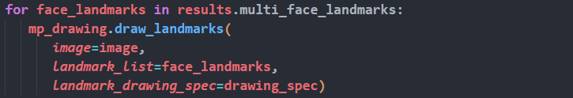

- **Display the Transmitted Image**

Use the `imshow()` function from the cv2 library to display the camera feed in a specified window.


The first parameter inside the function’s parentheses, `'MediaPipe Face Mesh',` is the window name, and the second parameter, `image`, is the image to be displayed.

## 7.8 Hand Key point Detection

### 7.8.1 Program Logic

First, it's important to understand that MediaPipe's hand detection model utilizes a machine learning pipeline composed of multiple models (linear models, akin to a pipeline). The model processes the entire image and returns a directional hand bounding box. The hand landmark model operates on the cropped image area defined by the hand detector and returns high-fidelity 3D hand keypoints.

After importing the hand detection model, obtain the real-time camera feed by subscribing to topic messages.

Next, process the image through transformations such as flipping and color space conversion, which significantly reduces the need for data augmentation by the hand landmark model.

Additionally, in our pipeline, crops can be generated based on previously identified hand landmarks. Hand detection is re-invoked to reposition the hand only when the landmark model can no longer recognize the hand.

Finally, detect the hand keypoints in the image and draw them.

### 7.8.2 Operation Steps

The input command should be case sensitive, and "**Tab**" key can be used to complement the key words.

If you use the system image we provide, you can find the corresponding program in the folder "**[3. Basic Operation Course -> 3.2 Introduction to System Desktop](https://wiki.hiwonder.com/projects/Jetson-Orin-Nano/en/latest/docs/3_Basic_Operation_Course.html#introduction-to-system-desktop)** ."

1. Power on Jetson Orin Nano board, and connect it to the remote system desktop using NoMachine.

2. Connect it to the network. For specific operations, please refer to the tutorials located in "**[3. Basic Operation Course -> 3.3 Network Configuration (Wired and Wireless)](https://wiki.hiwonder.com/projects/Jetson-Orin-Nano/en/latest/docs/3_Basic_Operation_Course.html#network-configuration-wired-and-wireless)**" to access the network. Some models may need to be re-downloaded.

3. When entering the system desktop, drag the program file "**hand.py**" under the same directory to the remote desktop.

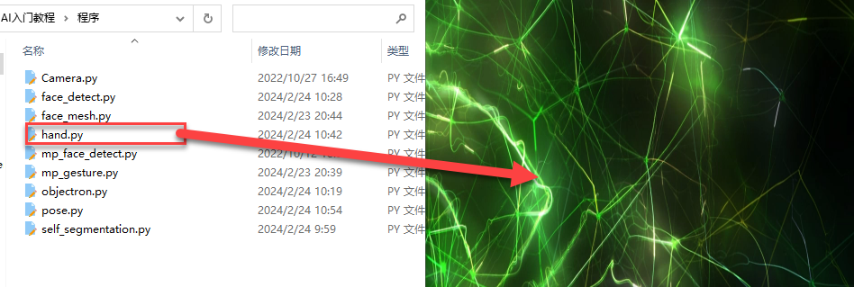

4. Then right click on the blank area of the system desktop, and select "**Open in Terminal**" to open the command-line terminal:


5. Enter the following command and press Enter to run the program.

```bash
python3 hand.py
```


6)  To close the program, please use the shortcut key "Ctrl+C" to exit the program.

### 7.8.3 Program Outcom

After starting the program, if the camera detects a hand, it will display the hand’s key points and the connections between the key points in the transmitted camera.

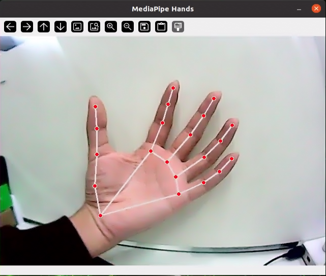

### 7.8.4 Program Analysis

- **Build a Hand Detection Model**

Import the hand detection model from the MediaPipe toolkit.

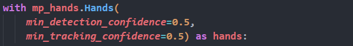

The first parameter, `min_detection_confidence`, is the minimum confidence for hand detection, with a default value of 0.5. The range is \[0.0, 1.0\].

The second parameter, `min_tracking_confidence`, is the minimum confidence for hand tracking. Setting this to a higher value can improve the robustness of the solution but may result in increased latency.

- **Retrieve Live Camera Feed**

Invoke the `VideoCapture()` function from cv2 library to retrieve the camera feed.


The parameter within the function parenthesis refers to the camera interface. You can also use "0" to access the default camera.

If the current device has only one camera connected, either "0" or "-1" can be used as the camera ID. If multiple cameras are connected, "0" presents the first camera, "1" represents the second camera, and so on for additional cameras.


Convert the color space by calling the `cvtColor()` function from the cv2 library.

Before performing detection on the image, you need to convert the image to the RGB color space.

- **Detection**

Based on the previously built hand model, detect the hand in the image.


- **Draw Hand Keypoints**

Use the `mp_drawing.draw_landmarks()` function to draw the hand mesh of the detected hand in the image.

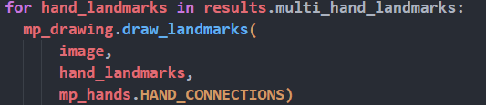

- **Display the Transmitted Image**

Use the `imshow()` function from the cv2 library to display the camera feed in a specified window.


The first parameter inside the function’s parentheses, `'MediaPipe Hands'`, is the window name, and the second parameter, `image`, is the image to be displayed.

## 5.9 Human Body Key point Detection

### 5.9.1 Program Logic

First, import the human body detection model.

Next, process the image by flipping it and converting the color space. Compare the minimum confidence of the human body detection model to determine if the body detection is successful.

Then, compare the minimum tracking confidence to define the success of tracking the pose. If the pose does not meet the criteria, body detection will be automatically invoked on the next input image.

After importing MediaPipe’s body detection model, obtain the real-time camera feed by subscribing to topic messages.

Finally, detect and draw the body key points in the image.

### 5.9.2 Operation Steps

 The input command should be case sensitive, and "Tab" key can be used to complement the key words.

If you use the system image we provide, you can find the corresponding program in the folder "**[3. Basic Operation Course -> 3.2 Introduction to System Desktop](https://wiki.hiwonder.com/projects/Jetson-Orin-Nano/en/latest/docs/3_Basic_Operation_Course.html#introduction-to-system-desktop)** ."

1. Power on Jetson Orin Nano board, and connect it to the remote system desktop using NoMachine.

2. Connect it to the network. For specific operations, please refer to the tutorials located in "**[3. Basic Operation Course -> 3.3. Network Configuration (Wired and Wireless)](https://wiki.hiwonder.com/projects/Jetson-Orin-Nano/en/latest/docs/3_Basic_Operation_Course.html#network-configuration-wired-and-wireless)**" to access the network. Some models may need to be re-downloaded.

3. When entering the system desktop, drag the program file "**pose.py**" under the same directory to the remote desktop.

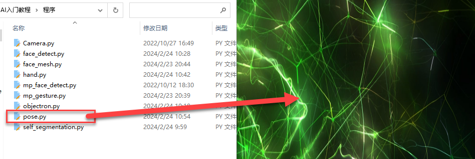

4. Then right click on the blank area of the system desktop, and select "**Open in Terminal**" to open the command-line terminal:


5. Enter the following command and press Enter to run the program.

```bash
python3 pose.py
```


6)  To close the program, please use the shortcut key "Ctrl+C" to exit the program.

### 5.9.3 Program Outcom

After starting the program, if the camera detects a human pose, it will display the human body key points and the connections between them in the transmitted image.


### 5.9.4 Program Analysis

- **Build a Human Body Detection Model**

Import the human body detection model from the MediaPipe toolkit.

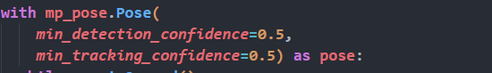

The first parameter, `min_detection_confidence`, is the minimum confidence for body detection, with a default value of 0.5. The range is \[0.0, 1.0\].

The second parameter, `min_tracking_confidence`, is the minimum confidence for body tracking. Setting this to a higher value can improve the robustness of the solution, but may result in increased latency.

- **Retrieve Live Camera Feed**

Invoke the `VideoCapture()` function from cv2 library to retrieve the camera feed.


The parameter within the function parenthesis refers to the camera interface. You can also use "0" to access the default camera.

If the current device has only one camera connected, either "0" or "-1" can be used as the camera ID. If multiple cameras are connected, "0" presents the first camera, "1" represents the second camera, and so on for additional cameras.


Convert the color space by calling the `cvtColor()` function from the cv2 library.

Before performing detection on the image, you need to convert the image to the RGB color space.

- **Detection**

Based on the previously built human body model, detect the human body in the image.


- **Draw Keypoints**

Use the `mp_drawing.draw_landmarks()` function to draw the body key points and the connections between them in the detected body on the image.

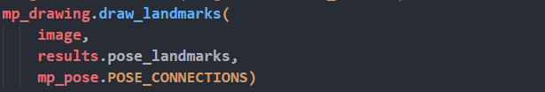

- **Display the Transmitted Image**

Use the `imshow()` function from the cv2 library to display the camera feed in a specified window.


The first parameter inside the function’s parentheses, `'MediaPipe Pose'`, is the window name, and the second parameter, `image`, is the image to be displayed.