# 8. AI Advanced Course

## 8.1 Introduction to Deep Learning Frameworks

### 8.1.1 Machine Learning Introduction

* **What “Machine Learning” is**

Machine Learning forms the cornerstone of artificial intelligence, serving as the fundamental approach to endow machines with intelligence. It spans multiple interdisciplinary fields such as probability theory, statistics, approximation theory, convex analysis, and algorithm complexity theory.


In essence, machine learning explores how computers can acquire new knowledge or skills by mimicking human learning behaviors and continuously enhancing their performance by reorganizing existing knowledge structures. Practically, it entails utilizing data to train models and leveraging these models for predictions.

For instance, consider AlphaGo, the pioneering artificial intelligence system that triumphed over human professional Go players and even world champions. AlphaGo operates on the principles of deep learning, wherein it discerns the intrinsic laws and representation layers within sample data to extract meaningful insights.

* **Types of Machine Learning**

Machine learning can be broadly categorized into two types: supervised learning and unsupervised learning. The key distinction between these two types lies in whether the machine learning algorithm has prior knowledge of the classification and structure of the dataset.

**1. Supervised Learning**

Supervised learning involves providing a labeled dataset to the algorithm, where the correct answers are known. The machine learning algorithm uses this dataset to learn how to compute the correct answers. It is the most commonly used type of machine learning.

For instance, in image recognition, a large dataset of dog pictures can be provided, with each picture labeled as "dog". This labeled dataset serves as the "correct answer". By learning from this dataset, the machine can develop the ability to recognize dogs in new images.


Model Selection: In supervised learning, selecting the right model to represent the data relationship is crucial. Common supervised learning models encompass linear regression, logistic regression, decision trees, support vector machines (SVM), and deep neural networks. The choice of model hinges on the data's characteristics and the problem's nature.

Feature Engineering: Feature engineering involves preprocessing and transforming raw data to extract valuable features. This encompasses tasks like data cleaning, handling missing values, normalization or standardization, feature selection, and feature transformation. Effective feature engineering can significantly enhance model performance and generalization capabilities.

Training and Optimization: Leveraging labeled training data, we can train the model to capture the data relationship. Training typically involves defining a loss function, selecting an appropriate optimization algorithm, and iteratively adjusting model parameters to minimize the loss function. Common optimization algorithms include gradient descent and stochastic gradient descent.

Model Evaluation: Upon completing training, evaluating the model's performance on new data is essential. Standard evaluation metrics include accuracy, precision, recall, F1 score, and ROC curve. Assessing a model's performance enables us to gauge its suitability for practical applications.

In summary, supervised learning entails utilizing labeled training data to train a model for predicting or classifying new unlabeled data. Key steps encompass selecting an appropriate model, conducting feature engineering, training and optimizing the model, and evaluating its performance. Together, these components constitute the foundational elements of supervised learning.

**2. Unsupervised Learning**

Unsupervised learning involves providing an unlabeled dataset to the algorithm, where the correct answers are unknown. In this type of machine learning, the machine must mine potential structural relationships within the dataset.

For instance, in image classification, a large dataset of cat and dog pictures can be provided without any labels. Through unsupervised learning, the machine can learn to divide the pictures into two categories: cat pictures and dog pictures.


### 8.1.2 Machine Learning Library Introduction

* **Common Type of Machine Learning Framework**

There are a large variety of machine learning frameworks. Among them, PyTorch, Tensorflow, MXNet and paddlepaddle are common.

**1. PyTorch**

PyTorch is a powerful open-source machine learning framework, originally based on the BSD License Torch framework. It supports advanced multidimensional array operations and is widely used in the field of machine learning. PyTorch, built on top of Torch, offers even greater flexibility and functionality. One of its most distinguishing features is its support for dynamic computational graphs and its Python interface.

In contrast to TensorFlow's static computation graph, PyTorch's computation graph is dynamic. This allows for real-time modifications to the graph as computational needs change. Additionally, PyTorch enables developers to accelerate tensor calculations using GPUs, create dynamic computational graphs, and automatically calculate gradients. This makes PyTorch an ideal choice for machine learning tasks that require flexibility, speed, and powerful computing capabilities.

**2. Tensorflow**

TensorFlow is a powerful open-source machine learning framework that allows users to quickly construct neural networks and train, evaluate, and save them. It provides an easy and efficient way to implement machine learning and deep learning concepts. TensorFlow combines computational algebra with optimization techniques to make the calculation of many mathematical expressions easier.

One of TensorFlow's key strengths is its ability to run on machines of varying sizes and types, including supercomputers, embedded systems, and everything in between. TensorFlow can also utilize both CPU and GPU computing resources, making it an extremely versatile platform. When it comes to industrial deployment, TensorFlow is often the most suitable machine learning framework due to its robustness and reliability. In other words, TensorFlow is an excellent choice for deploying machine learning applications in a production environment.

**3. PaddlePaddle**

PaddlePaddle is a cutting-edge deep learning framework developed by Baidu, which integrates years of research and practical experience in deep learning. PaddlePaddle offers a comprehensive set of features, including training and inference frameworks, model libraries, end-to-end development kits, and a variety of useful tool components. It is the first open-source, industry-level deep learning platform to be developed in China, offering rich and powerful features to developers worldwide.

Deep learning has proven to be a powerful tool in many machine learning applications in recent years. From image recognition and speech recognition to natural language processing, robotics, online advertising, automatic medical diagnosis, and finance, deep learning has revolutionized the way we approach these fields. With PaddlePaddle, developers can harness the power of deep learning to create innovative and cutting-edge applications that meet the needs of users and businesses alike.

**4. MXNet**

MXNet is a top-tier deep learning framework that supports multiple programming languages, including Python, C++, Scala, R, and more. It features a dataflow graph similar to other leading frameworks like TensorFlow and Theano, as well as advanced features such as robust multi-GPU support and high-level model building blocks comparable to Lasagne and Blocks. MXNet can run on virtually any hardware, including mobile phones, making it a versatile choice for developers.

MXNet is specifically designed for efficiency and flexibility, with accelerated libraries that enable developers to leverage the full power of GPUs and cloud computing. It also supports distributed computing across dynamic cloud architectures via distributed parameter servers, achieving near-linear scaling with multiple GPUs/CPUs. Whether you're working on a small-scale project or a large-scale deep learning application, MXNet provides the tools and support you need to succeed.

## 8.2 Tensorflow Installation

### 8.2.1 Introduction to Tensorflow

The installation of TensorFlow GPU version requires the configured CUDA. Before installing TensorFlow GPU, some necessary machine learning packages need to installed first. Note that the pre-installed system image already includes tensorFlow, so ther is no need to install again.

### 8.2.2 Operation Steps

The input command should be case sensitive, and “Tab” key can be used to complement the key words.

If you use the system image we provide, you can find the corresponding program in the folder “**[3. Basic Operation Course -> 3.2 Introduction to System Desktop]()** .”

It is necessary to use NoMachine to connect to Jetson Orin Nano for installation.

* **Install pip** 

Python 3.10 is already installed on the Jetson Orin Nano, making it easy to install pip. Double click  on the remote desktop to open the command-line terminal, and then follow the steps below to install the pip,

1. Enter the command to install pip:

```py
sudo apt-get install python3-pip python3-dev
```

2. The installed pip will be an older version, so it needs to be upgraded to the latest version:

```py
python3 -m pip install --upgrade pip
```

3. After running the pip3 -V successfully, if you see a prompt message similar to the following, it indicates that the pip3 has been installed successfully.


* **Install Important Machine Learning Packages**

**NumPy**: A Python library extension that supports a wide range of array and matrix operations, and provides numerous mathematical functions for array computations.

```py
sudo apt-get install python3-numpy
```

**SciPy**: A commonly used software package for mathematics, science, and engineering, capable of handling interpolation, integration, optimization, image processing, solving ordinary differential equations, signal processing, and more.

```py
sudo apt-get install python3-scipy
```

**Pandas:** A tool based on NumPy designed for data analysis tasks. It includes numerous libraries and standard data models, providing tools needed for efficient handling of large datasets. Pandas offers a wide range of functions and methods for quick and easy data processing, making Python a powerful and efficient environment for data analysis.

```py
sudo apt-get install python3-pandas
```

**Matplotlib**: A 2D plotting library for Python that produces publication-quality graphics in various formats and interactive environments across platforms.

```py
sudo apt-get install python3-matplotlib
```

**Scikit-learn**: A simple and efficient tool for data mining and data analysis.

```py
sudo apt-get install python3-sklearn
```

* **Install TensorFlow-GPU Version** 

1)  Confirm that CUDA is installed correctly by running nvcc -V. If you see the CUDA version number, it means CUDA is installed properly.


If an error occurs, refer to the solution methods provided in this link:

```py
https://zhuanlan.zhihu.com/p/513220749
```

2. Install the required packages

   ```py
   sudo apt-get install python3-pip
   sudo python3 -m pip install --upgrade pip
   pip install onnx-graphsurgeon
   sudo pip3 install -U testresources setuptools
   ```

3. Install the Python dependencies

   ```py
   sudo pip3 install -U numpy future mock
   sudo pip3 install -U keras_preprocessing
   sudo pip3 install -U keras_applications gast
   sudo pip3 install -U protobuf pybind11 cython pkgconfig packaging h5py==3.10
   ```

4. To install the TensorFlow GPU version, you need to install the version of TensorFlow that corresponds to your current JetPack version. We also have an offline package in our environment setup attachments, but you should check if it matches your current JetPack version.

   <https://docs.nvidia.com/deeplearning/frameworks/install-tf-jetson-platform-release-notes/tf-jetson-rel.html#tf-jetson-rel>


5. Enter the command to install using the installation package provided in the attachments.

   ```py
   pip3 install tensorflow==2.16.1
   ```


During the download, you might also need to install some software packages online, just type “Y” to proceed.

If no errors occur, the installation was successful:


### 8.2.3 Other Available Tutorials:

- <https://forums.developer.nvidia.com/t/official-tensorflow-for-jetson-nano/71770>

- <https://docs.nvidia.com/deeplearning/frameworks/install-tf-jetson-platform/index.html#install>

## 8.3 Pytorch Installation

### 8.3.1 Introduction to Pytorch

PyTorch is a specialized deep learning software library, using both GPU and CPU. Automatic differentiation is achieved through a tape-based system at the function and neural network layer level. This feature brings high flexibility and speed as a deep learning framework and provides accelerated functionality similar to NumPy. These redistributable components provided by NVIDIA are Python pip Wheel installers for PyTorch, offering GPU acceleration and support for cuDNN.

### 8.3.2 Operation Steps

The input command should be case sensitive, and “Tab” key can be used to complement the key words.

If you use the system image we provide, you can find the corresponding program in the folder “**[3. Basic Operation Course -> 3.2 Introduction to System Desktop]()** .”

Use NoMachine to connect to Jetson Orin Nano, then access the remote desktop.

1. Open the terminal on the remote desktop and enter the command install the required dependencies.

   ```py
   sudo apt-get install libopenblas-dev
   ```

   

2. Copy the file “**torch-2.3.0a0+ebedce2.nv24.02-cp310-cp310-linux_aarch64.whl**” provided in Appendix to the remote system desktop.

   

3. Right click on a blank area of the system desktop to select “**Open in Terminal**” to open the command-line terminal.

   

4. Enter the command:

   ```py
   pip3 install torch-2.3.0a0+ebedce2.nv24.02-cp310-cp310-linux_aarch64.whl
   ```

   

5. Then enter the following command to check if pytorch is installed successfully.

   ```py
   python3
   import torch
   print(torch.__version__)
   ```

6. If the pytorch version information appears, it indicates Pytorch has been successfully installed.

   

### 8.3.3 Install torchvision

Use NoMachine to connect to Jetson Orin Nano, then access the remote desktop.

1. Copy the file “**torchvision-0.18.0-cp310-cp310-linux_aarch64.whl**” provided in Appendix to the remote system desktop.

   

2. Right click on a blank area on the system desktop to select “**Open in Terminal**” to open the command-line terminal.

   

3. Run the command to install torchvision:

   ```py
   pip3 install torchvision-0.18.0-cp310-cp310-linux_aarch64.whl
   ```

   

## 8.4 Yolov5 Model Training

### 8.4.1 Yolo Model Series Introduction

* **Yolo**

YOLO (You Only Look Once) is an one-stage regression algorithm based on deep learning.

R-CNN series algorithm dominates target detection domain before YOLOv1 is released. It has higher detection accuracy, but cannot achieve real-time

detection due to its limited detection speed engendered by its two-stage network structure.

To tackle this problem, YOLO is released. Its core idea is to redefine target detection as a regression problem, use the entire image as network input, and directly return position and category of Bounding Box at output layer.

Compared with traditional methods for target detection, it distinguishes itself in high detection speed and high average accuracy.

* **Yolov5**

YOLOv5 is an optimized version based on previous YOLO models, whose detection speed and accuracy is greatly improved.

In general, a target detection algorithm is divided into 4 modules, namely input end, reference network, Neck network and Head output end. The following analysis of improvements in YOLOv5 rests on these four modules.

1. Input end: YOLOv5 employs Mosaic data enhancement method to increase model training speed and network accuracy at the stage of model training. Meanwhile, adaptive anchor box calculation and adaptive image scaling methods are proposed.

2. Reference network: Focus structure and CPS structure are introduced in YOLOv5.

3. Neck network: same as YOLOv4, Neck network of YOLOv5 adopts FPN+PAN structure, but they differ in implementation details.

4. Head output layer: YOLOv5 inherits anchor box mechanism of output layer from YOLOv4. The main improvement is that loss function GIOU_Loss, and DIOU_nms for prediction box screening are adopted.

### 8.4.2 Yolov5 Model Structure

* **Component**

**1. Convolution layer: extract features of the image**

Convolution refers to the effect of a phenomenon, action or process that occurs repeatedly over time, impacting the current state of things. Convolution can be divided into two components: "volume" and "accumulation". "Volume" involves data flipping, while "accumulation" refers to the accumulation of the influence of past data on current data. Flipping the data helps to establish the relationships between data points, providing a reference for calculating the influence of past data on the current data.

In YOLOv5, the data being processed is typically an image, which is two-dimensional in computer vision. Therefore, the convolution applied is also a two-dimensional convolution, with the aim of extracting features from the image. The convolution kernel is an unit area used for each calculation, typically in pixels. The kernel slides over the image, with the size of the kernel being manually set.

During convolution, the periphery of the image may remain unchanged or be expanded as needed, and the convolution result is then placed back into the corresponding position in the image. For instance, if an image has a resolution of 6 ×6, it may be first expanded to a 7 ×7 image, and then substituted into the convolution kernel for calculation. The resulting data is then refilled into a blank image with a resolution of 6 ×6.

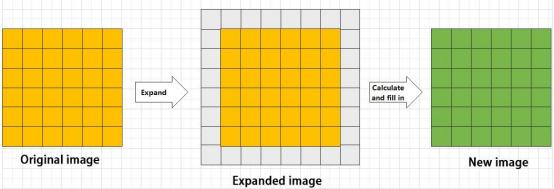

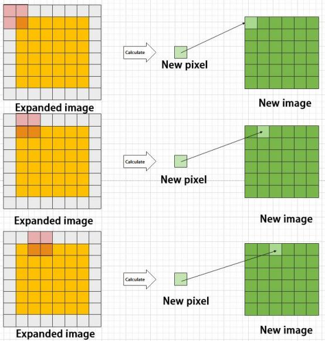

**2. Pooling layer: enlarge the features of image**

The pooling layer is an essential part of a convolutional neural network and is commonly used for downsampling image features. It is typically used in

combination with the convolutional layer. The purpose of the pooling layer is to reduce the spatial dimension of the feature map and extract the most important features.

There are different types of pooling techniques available, including global pooling, average pooling, maximum pooling, and more. Each technique has its unique effect on the features extracted from the image.

Let's take maximum pooling as an example to explain how it works. Before understanding the maximum pooling, we need to understand the filter. Similar to the convolution kernel, the filter requires us to manually set the area. During the calculation, the filter is slid across the image, and the pixels in the area are compared. The maximum value of the pixels in the area is selected and becomes the output for that region. This process results in a reduced feature map size, which helps in reducing computational complexity and prevents overfitting.

In summary, the pooling layer plays a crucial role in feature extraction and downsampling. It helps to extract the most important features from an image and reduce the computational complexity of the neural network. Different types of pooling techniques can be used depending on the application requirements.

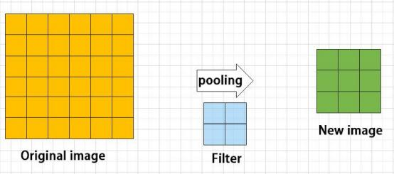

Maximum pooling can extract the most distinctive features from an image, while discarding the remaining ones. For example, if we take an image with a resolution of 6×6 pixels, we can use a 2×2 filter to downsample the image and obtain a new image with reduced dimensions.

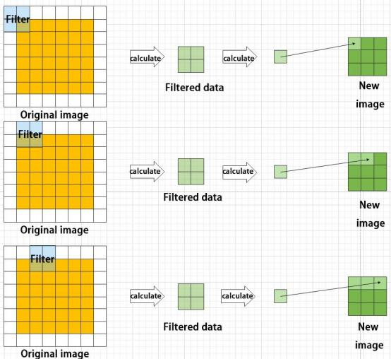

**3. Upsampling layer: restore the size of an image**

This process is sometimes referred to as "anti-pooling". While upsampling restores the size of the image, it does not fully recover the features that were lost during pooling. Instead, it tries to interpolate the missing information based on the available information.

For example, let's consider an image with a resolution of 6 ×6 pixels. Before upsampling, use 3X3 filter to calculate the original image so as to get the new image.

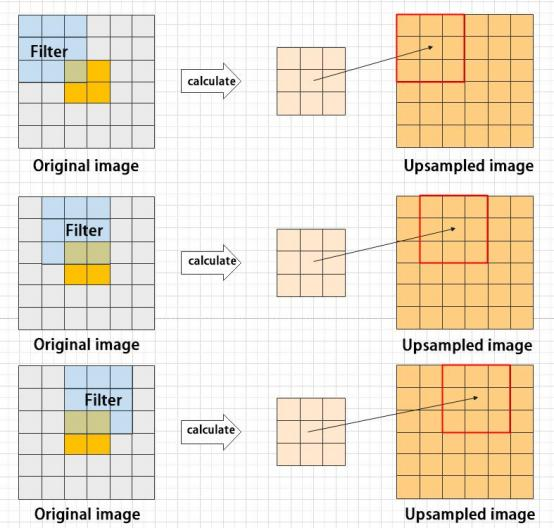

**4. Batch normalization layer: organize data**

It aims to reduce the computational complexity of the model and to ensure that the data is better mapped to the activation function.

Batch normalization works by standardizing the data within each mini-batch, which reduces the loss of information during the calculation process. By

retaining more features in each calculation, batch normalization can improve the sensitivity of the model to the data.

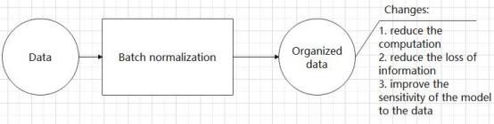

**5. RELU layer: activate function**

The activation function is a crucial component in the process of building a neural network, as it helps to increase the nonlinearity of the model. Without an activation function, each layer of the network would be equivalent to a matrix multiplication, and the output of each layer would be a linear function of the input from the layer above. This would result in a neural network that is unable to learn complex relationships between the input and output.

There are many different types of activation functions. Some of the most common activation functions include the ReLU, Tanh, and Sigmoid. For

example, ReLU is a piecewise function that replaces all values less than zero with zero, while leaving positive values unchanged.

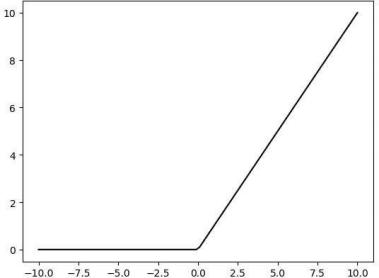

**6. ADD layer: add tensor**

In a typical neural network, the features can be divided into two categories:

salient features and inconspicuous features.

The ADD layer works by adding the tensors of salient features, which can help to amplify their importance and improve the overall performance of the model.

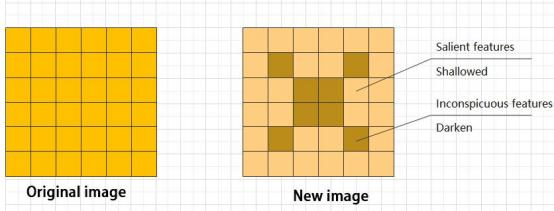

**7. Concat layer: splice tensor**

It is used to splice together tensors of features, allowing for the combination of features that have been extracted in different ways. This can help to increase the richness and complexity of the feature set.

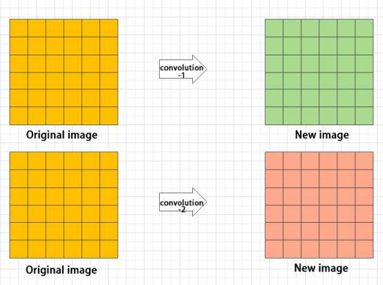

* **Compound Element**

When building a model, using only the layers mentioned above to construct functions can lead to lengthy, disorganized, and poorly structured code. By assembling basic elements into various units and calling them accordingly, the efficiency of writing the model can be effectively improved.

**1. Convolutional unit:**

A convolutional unit consists of a convolutional layer, a batch normalization layer, and an activation function. The convolution is performed first, followed by batch normalization, and finally activated using an activation function.

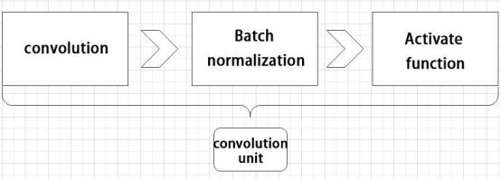

**2. Focus module**

The Focus module for interleaved sampling and concatenation first divides the input image into multiple large regions and then concatenates the small

images at the same position within each region to break down the input image into several smaller images. Finally, the images are preliminarily sampled

using convolutional units.

As shown in the figure below, taking an image with a resolution of 6 ×6 as an example, if we set a large region as 2 ×2, then the image can be divided into 9 large regions, each containing 4 small images.

By concatenating the small images at position 1 in each large region, a 3 ×3 image can be obtained. The small images at other positions are similarly

concatenated, and the original 6 ×6 image will be broken down into four 3 ×3 images.

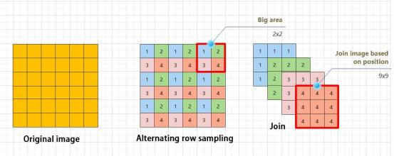

**3. Residual unit**

The function of the residual unit is to enable the model to learn small changes in the image. Its structure is relatively simple and is achieved by combining

data from two paths.

The first path uses two convolutional units to sample the image, while the second path does not use convolutional units for sampling but directly uses the original image. Finally, the data from the first path is added to the second path.

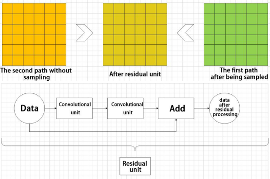

**4. Composite Convolution Unit**

In YOLOv5, the composite convolution unit is characterized by the ability to customize the convolution unit according to requirements. The composite convolution unit is also realized by superimposing data obtained from two paths.

The first path only has one convolutional layer for sampling, while the second path has 2x+1 convolutional units and one convolutional layer for sampling. After sampling and splicing, the data is organized through batch normalization and then activated by an activation function. Finally, a convolutional layer is used for sampling.'


**5. Compound Residual Convolutional Unit**

The compound residual convolutional unit replaces the 2x convolutional layers in the compound convolutional unit with x residual units. In YOLOv5, the

feature of the compound residual unit is mainly that the residual units can be customized according to the needs.

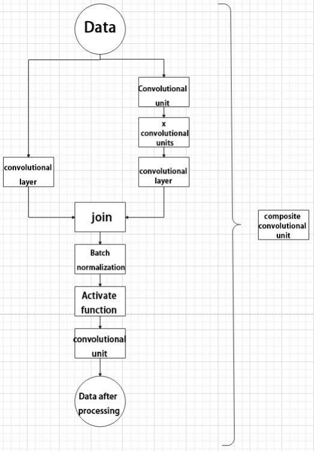

**6. Composite Pooling Unit**

The output data of the convolutional unit is fed into three max pooling layers and an additional copy is kept without processing. Then, the data from the four paths are concatenated and input into a convolutional unit. Using the composite pooling unit to process the data can significantly enhance the features of the original data.'

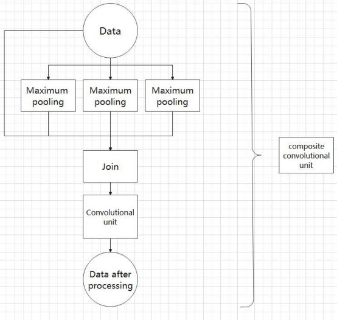

* **Structure**

Composed of three parts, YOLOv5 can output three sizes of data. Data of each size is processed in different way. The below picture is the output

structure of YOLOv5.

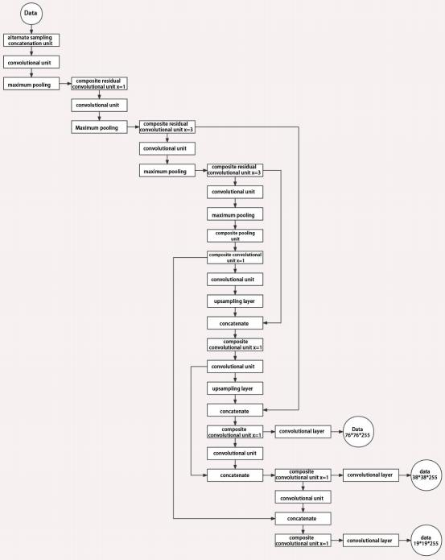

Below is the output structures of data of three sizes.

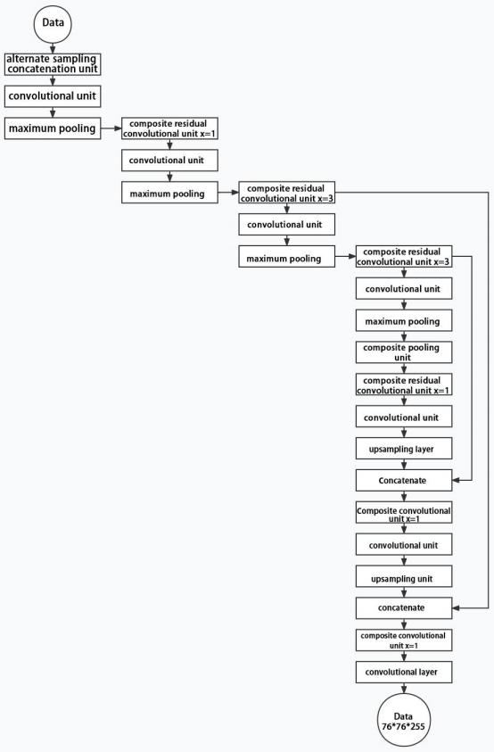

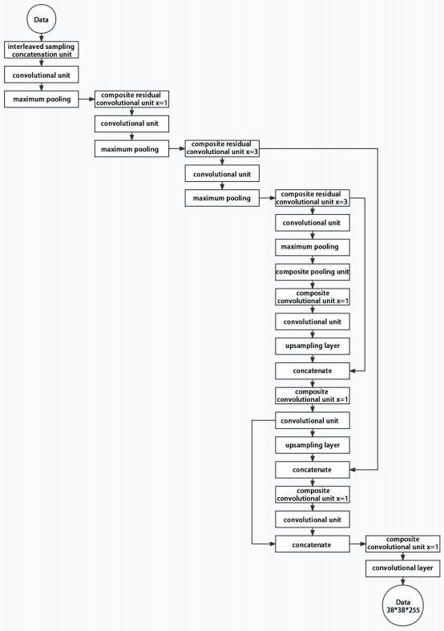

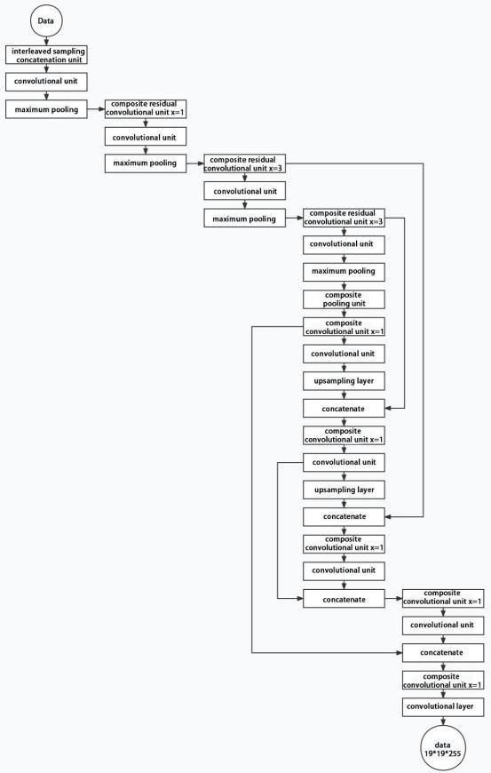

## 8.5 YOLOv5 Object Recognition

### 8.5.1 Prior Bounding Box

When an image is input into model, object detection area requires us to offer, while prior bounding box is that box used to mark the object detection area on image before detection.


### 8.5.2 Prediction Box

The prediction box is not required to set manually, which is the output result of the model. When the first batch of training data is input into model, the prediction box will be automatically generated with it. The position in which the object of same type appear more frequently are set as the center of the prediction box.

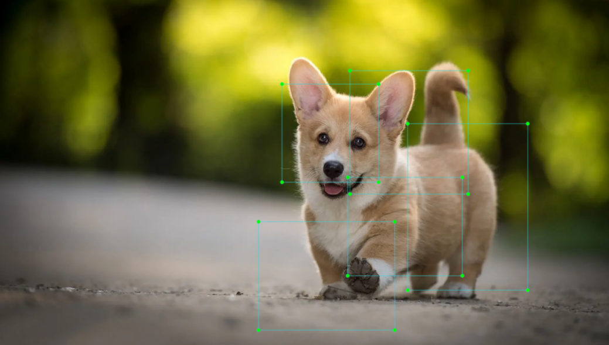

### 8.5.3 Anchor Box

After the prediction box is generated, deviation may occur in its size and position. At this time, the anchor box serves to calibrate the size and position of the prediction box.

The generation position of anchor box is determined by prediction box. In order to influence the position of the next generation of the prediction box, the anchor box is generated at the relative center of the prediction box.


### 8.5.4 Realization Process

After the data is calibrated, a prior bounding box appears on image. Then, the image data is input to the model, the model generates a prediction box based on the position of the prior bounding box. Having generated the prediction box, an anchor box will appear automatically. Lastly, the weights from this training are updated into model.

Each newly generated prediction will be influenced by the last generated anchor box. Repeating the operations above continuously, the deviation of the size and position of the prediction box will be gradually erased until it coincides with the priori box.

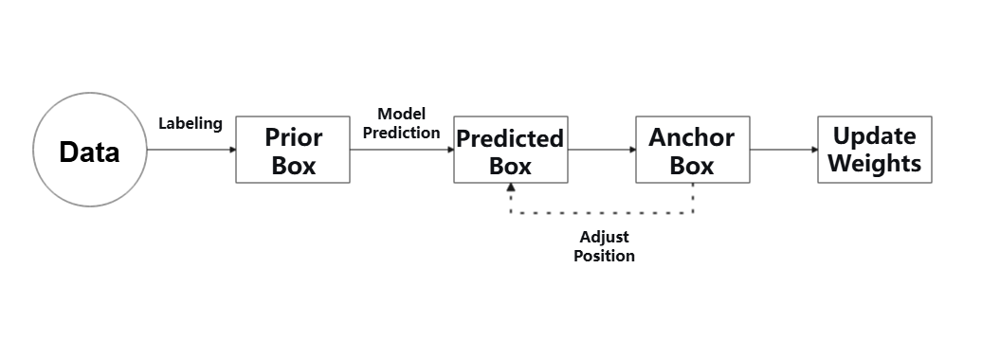

### 8.5.5 Installation & Experience

The input command should be case sensitive, and “Tab” key can be used to complement the key words.

If you use the system image we provide, you can find the corresponding program in the folder “**[3. Basic Operation Course -> 3.2 Introduction to System Desktop]()** .”

* **Installation**

Use NoMachine to connect to Jetson Orin Nano, then access the remote desktop.

1. Drag the file “**yolov5.zip**” provided in “Appendix/AI Courses” to the remote system desktop.

   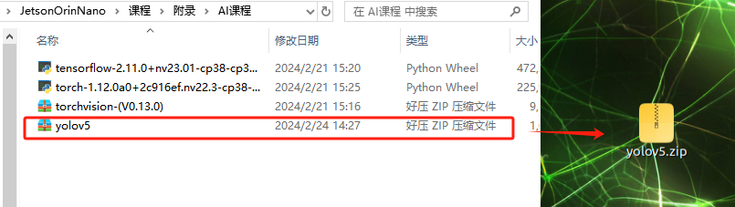

2. Right click on a blank area of the system desktop to select “**Open in Terminal**” to open the command-line terminal.

   

3. Enter the command to extract the file.

   ```py
   unzip yolov5.zip
   ```

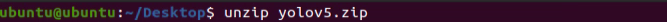

4. Enter the command to modify the dependencies in the txt file.

   ```py
   gedit yolov5/requirements.txt
   ```

   

5. Since torch and torchvision are already installed, comment out the lines indicated by the red box in the image by adding a ‘#’ at the beginning of the lines. Then, press '**Ctrl + S**' or click '**Save**' in the top right corner to save and exit. If they were not previously installed, you can skip this step.

   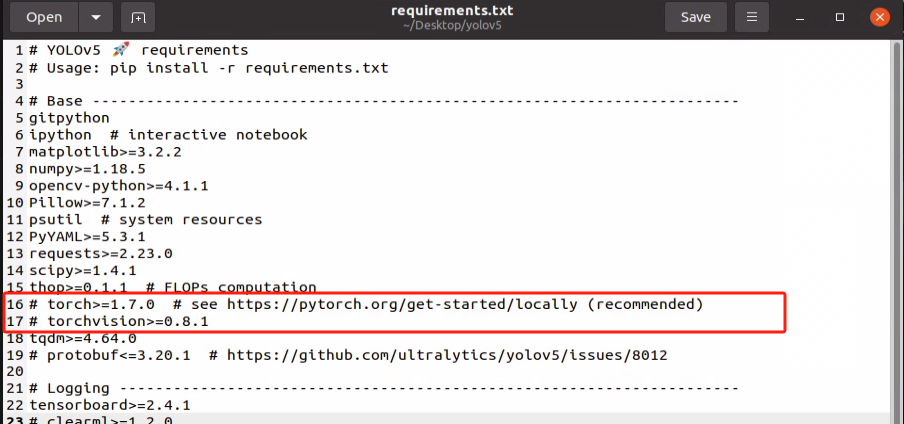

6. Then enter the command to install the related image libraries such as libjpeg，libpython3, libvocade and other dynamic libaray dependencies for the Python interpreter.

   ```py
   sudo apt-get install libjpeg-dev zlib1g-dev libpython3-dev libavcodec-dev libavformat-dev libswscale-dev
   ```

   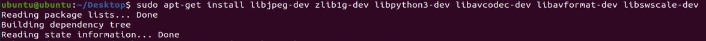

7. Enter the command to navigate to the extracted YoloV5 folder：

   ```py
   cd yolov5/
   ```

   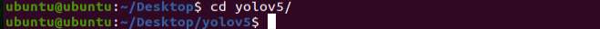

8. Enter the command:

   ```py
   pip3 install -r requirements.txt
   ```

   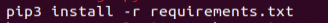

9. If no error occurs during the installation and the prompt message appears at the end, it means that the installation was successful:

   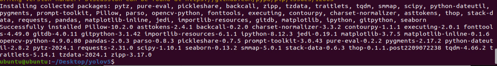

* **User Experience**

1. Double click 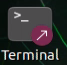 on the system desktop to open a command-line terminal.

2. Enter the command to run the Yolov5 detection script:

   ```py
   python3 detect.py
   ```

   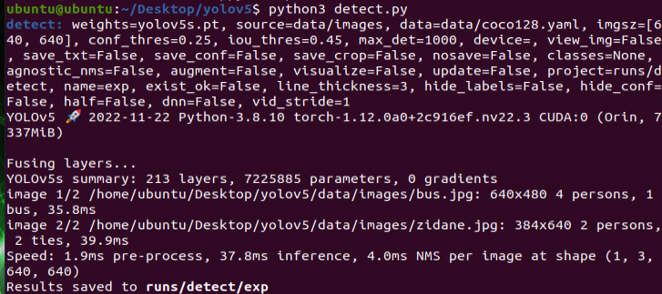

3. If no errors occur, it indicated that Yolov5 is set up successfully, and the recognition results will be stored in the “**yolov5/runs/detect/exp**” directory:

   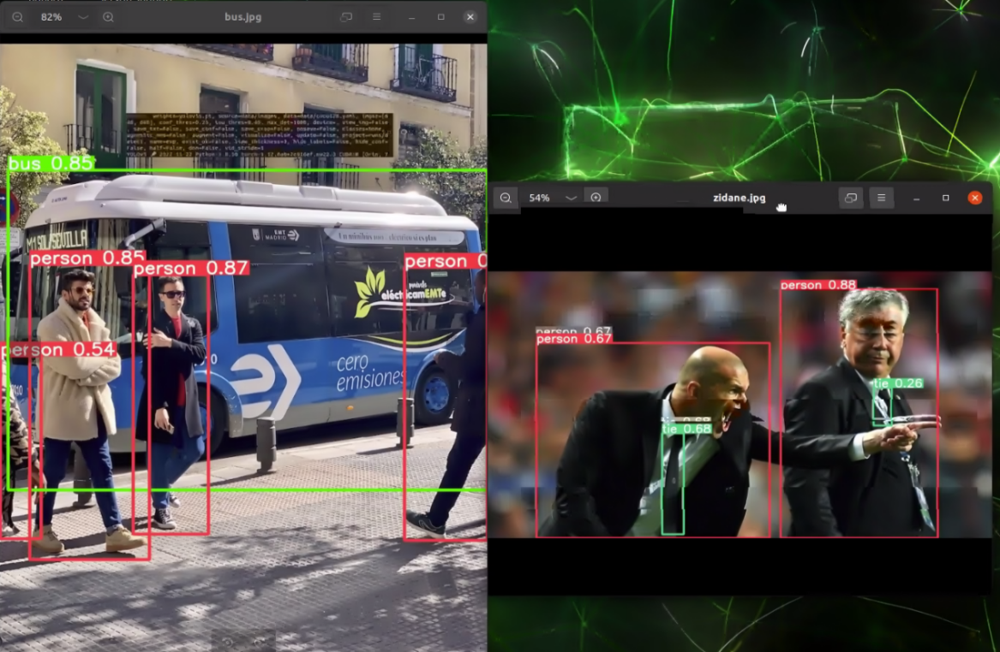

4. Similarly, you can also read and detect the USB camera after connecting it by entering the following command:

   ```py
   python3 detect.py --source 0
   ```

   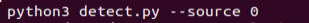

   

## 8.6 Train YOLOv5 Model - Dateset Collection

### 8.6.1 Image Collection 

The input command should be case sensitive, and “Tab” key can be used to complement the key words.

If you use the system image we provide, you can find the corresponding program in the folder “**[3. Basic Operation Course -> 3.2 Introduction to System Desktop]()** .”

Training a YOLOv5 model requires a large amount of data, so we need to start with the data collection and annotation the data for model training.

1)  Power on Jetson Orin Nano, and connect it to NoMachine.

2)  Connect the USB camera to the Jetson Orin Nano.

3)  Minimize the NoMachine desktop, then drag the “**data_gather.py**” file from the same directory to the system desktop.


4. Double click  to open the command-line terminal.

5. Enter the command to access the system desktop.

   ```py
   cd Desktop/
   ```


6. Enter the command to start collecting the data.

   ```py
   python3 data_gather.py
   ```


Press “s” to capture images, and press “q” to exit the program.

7. During the image capture process, the images will be saved in the directory specified by the text prompt.

   

   If the camera feed appears, it indicates that the program is running properly:


> [!NOTE]
>
> * **Press “s” to save the captured image. Holding it down will save images continuously.**
>
> * **Press “q” to exit the program.**
>
> * **To improve model reliability, capture target recognition content from different distances, angles, and orientations.**

After starting data collection, a “My_data” folder will be created on the desktop. It will contain three subfolders: Annotations, imageSets, and JPEGImages. The JPEGImages folder is used to store images, Annotations is for staring annotation files, imageSets is for storing image paths.

### 8.6.2 Image Annotation

> [!NOTE]
>
> **The entered command should be case sensitive and “Tab” key can be used to auto-complete keywords.**

1)  Minimize NoMachine desktop, and drag “**labelImg.zip**” from the same directory with this document to NoMachine desktop.


2. Double click  to open the command-line terminal.

3. Enter the command to access the system desktop.

   ```py
   cd Desktop/
   ```


4. Enter command to extract the file to the desktop.

   ```py
   unzip labelImg.zip -d ./
   ```


5. Enter the command to enter the labelImg folder.

   ```py
   cd labelImg/
   ```


6. Enter the command to install qyqt6 and the necessary extension tools.

   ```py
   sudo apt-get install pyqt5-dev-tools
   ```

   

7. Enter the command to open the annotation software:

   ```py
   python3 labelImg.py
   ```


8)  The icon functions are outlined in the below table:

|                           **Icon**                           | **Shortcut Key** |                      **Instruction**                      |
| :----------------------------------------------------------: | :--------------: | :-------------------------------------------------------: |
|  |      Ctrl+U      |     Select the directory where the picture is saved.      |
|  |      Ctrl+R      | Select the directory where the calibration data is saved. |
|  |        W         |                   Create annotation box                   |
|  |      Ctrl+S      |                      Save annotation                      |
|  |        A         |                Swap to the previous image                 |
|  |        D         |                  Swap to the next image                   |

9)  Use the shortcut “**Ctrl+U**,” select the image storage directory as “**/home/ubuntu/Desktop/my_data/JPEGImages/**,” and click the “**Open**” button.


10) Use the shortcut “**Ctrl+R**,” select the annotation data directory as “**/home/hiwonder/Desktop/my_data/Annotations/**,” and click the “Open” button.


11. Press “**W**” to create an annotation box.

    Move the mouse to the appropriate position, press and hold the left mouse button to drag and create a bounding box that covers the entire target recognition content. Release the left mouse button to complete the selection of the target content.

> [!NOTE]
>
> **The object in the image below is only for demonstrating how to perform annotations and is not included in the materials package provided. You can select any object for annotation and set any label name.**


In the pop-up window, name the target recognition category, for example, “left.” After naming, click the “OK” button or press “Enter” key to save the category.

> [!NOTE]
>
> **Labels can be named with any desired name.**


1. Use the shortcut key “Ctrl+S” to save the annotation data for the current image.

2. Press “D” to move to the next image for annotation. Same steps are applies to the annotation for the remaining images.

3. To facilitate annotation, check the option for the automatic saving in the software. Then follow the previous annotation steps to operate:

   

4. Click  in the system status bar to open the file manger, then navigate to the directory “**~/Desktop/my_data/Annotations**” to view the annotation files for the images.


### 8.6.3 Format Conversion

> [!NOTE]
>
> **The entered command should be case sensitive and “Tab” key can be used to auto-complete keywords.**

1)  Power on Jetson Orin Nano, and connect it to the system desktop using NoMachine.

2)  Minimize NoMachine desktop, and drag “xml2yolo.py” provided in “**Appendix/ AI Course**” to NoMachine desktop.


3. Double click  to open the command0-line terminal.

4. Enter the command and press Enter.

   ```py
   cp ./Desktop/xml2yolo.py ./Desktop/my_data/
   ```


5. Run the command:

   ```py
   cd Desktop/my_data/
   ```


6. Run the command:

   ```py
   gedit classes.names
   ```


7)  Edit the file and enter the class name you annotated, such as “left.” If you added other categories during the annotation process, make sure to add them to this document in the correct order. Press the shortcut “Ctrl + S” or click the “Save” button in the upper right corner to save and exit.


> [!NOTE]
>
> The class names added here must match those used in the image annotation software “**labelImg**”.

8. Enter the command to navigate back to the desktop directory (which is the parent directory of the “my_data” folder). If you have moved your “my_data” folder to a different location, adjust the command accordingly to go to the parent directory.

   ```py
   cd ..
   ```

   

9. nter the command to convert the data format and press Enter. If the prompt shown in the image appears, the conversion was successful.

   ```py
   python3 xml2yolo.py --data /home/ubuntu/Desktop/my_data --yaml /home/ubuntu/Desktop/my_data/data.yaml
   ```


> [!NOTE]
>
> **The content shown in the image is for reference only. Due to variations in the number and names of labels, the details may differ. The changes will depend on the number and names of the labels you have set.**

## 8.7 Train YOLOv5 Model - Training Process

The input command should be case sensitive, and “Tab” key can be used to complement the key words.

If you use the system image we provide, you can find the corresponding program in the folder “**[3. Basic Operation Course -> 3.2 Introduction to System Desktop]()** .”

1. Power on Jetson Orin Nano, and connect it to NoMachine.

2. Connect the USB camera to the Jetson Orin Nano.

3. Based on the location of YOLOv5 folder (In the previous tutorials, it is stored in “~/Desktop” folder), enter the command. The folder location can be modified according to your actual need.

   ```py
   cd Desktop/yolov5/
   ```


4. Enter the command and press Enter to train the model:

   ```py
   python3 train.py --data ~/Desktop/my_data/data.yaml --weights yolov5s.pt --img 160 --epochs 10 --batch 8
   ```


In the command, `--img` specifies the image size; `--batch` denotes the number of images per batch; `--epochs` refers to the number of training epochs; `--data` is the path to the dataset; and `--weights` is the name and path of the weights. The final model will be saved in the yolov5 folder with the name yolov5s.pt.

We can adjust the parameters mentioned above according to the actual situation. To improve model reliability, you can increase the number of training epochs, though this will also increase the training time.

If the following content appears, it indicates that training is in progress.


5. After training is complete, the model file is usually stored in the “**yolov5/run/train/exp...**” folder. Check the actual location based on the string printed after training. For example, as shown in the image below, the generated model is located in run/train/exp13.

   

6. You can use the file explorer to view and obtain the following:

   

## 8.8 Train YOLOv5 Model - Model Testing

**Target Detection**

The path mentioned in this lesson should based on your own configured environment.

### 8.8.1 Target Detection Using an USB Camera

The input command should be case sensitive, and “Tab” key can be used to complement the key words.

If you use the system image we provide, you can find the corresponding program in the folder “**[3. Basic Operation Course -> 3.2 Introduction to System Desktop]()** .”

Additionally, if all the required environments are already installed in the image, you can skip this step.

1. Power on Jetson Orin Nano, and connect it to NoMachine.

2. Double click  to open the command-line terminal.

3. Enter the command and press Enter to enter the specified directory.

   ```py
   cd Desktop/yolov5/
   ```


4. Enter the command to star the target detection.

   ```py
   python3 detect.py --weights runs/train/exp13/weights/best.pt --source 0
   ```

   

> [!NOTE]
>
> **This step requires you to have a USB camera connected to the USB port on the motherboard. If you have completed this step and see the live camera feed, it indicates that the model has started, and you do not need to proceed with the following steps.**
>
> **In “runs/train/exp13/weights/best.pt”, exp13 represents the path generated for this operation. Adjust the specific path according to your actual situation."**
>
> 

After waiting for a while, if the bounding box shown in the image appears in the live camera feed, it indicates that the setup was successful.

class_name refers to the category name of the detected object; box denotes the starting coordinates (top-left corner) and ending coordinates (bottom-right corner) of the bounding box.

Finally, select the command line and press “Ctrl+C” to close it


### 8.8.2 Target Detection Using an Image 

Use the images from the previous training process for detection as an example.

1. Enter the command and press Enter to navigate to the specified directory.

   ```py
   cd Desktop/yolov5/
   ```


2. Enter the command to start detection:

   ```py
   python3 detect.py --weights runs/train/exp13/weights/best.pt --source ~/Desktop/my_data/JPEGImages/11.jpg
   ```

   

3. The following content indicates that detection is complete. The results are stored in the run/detect/exp4 folder. The specific path should be based on the output from the command line terminal.

   

4. Use the file explorer to navigate to the corresponding path and view the detected images, as shown in the image below:

   

   For the following operations, you can adjust the recognition performance by increasing the number of training epochs as taught in the previous course.

## **8.9 TensorRT Acceleration**

### 8.9.1 TensorRT Acceleration Description

TensorRT is a high-performance deep learning inference, includes a deep learning inference optimizer and runtime that delivers low latency and high throughput for inference applications. It is deployed to hyperscale data centers, embedded platforms, or automotive product platforms to accelerate the inference.

TensoRT supports almost all deep learning frameworks, such as TensorFlow, Caffe, Mxnet and Pytorch. Combing with new NVIDIA GPU, TensorRT can realize swift and effective deployment and inference on almost all frameworks.

To accelerate deployment inference, multiple methods to optimize the models are proposed, such as model compression, pruning, quantization and knowledge distillation. And we can use the above methods to optimize the models during training, however TensorRT optimize the trained models. It improves the model efficiency through optimizing the network computation graph.

After the network is trained, you can directly put the model training file into tensorRT without relying on deep learning framework.

### 8.9.2 Optimization Methods

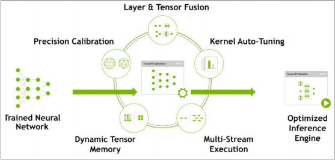

(1) Adopting horizontal or vertical layer fusion, TensorRT greatly decrease the amount of layers so as to reduce kernel launches and memory reading.

In horizontal layer fusion, convolution, bias, and ReLU layers are fused to form a single layer which is called CBR structure. After fusion, this layer only occupies one CUDA core. Vertical layer fusion is to combine layers in the same structure but with different weights into a wider layer which also use one CUDA core.

In addition, although multiple branches are fused, TensorRT can directly connect to the required place without special concat operation, so this layer can also be canceled. After layer fusion, the computation graph has less layers and occupies less CUDA cores resulting in smaller, faster, and more effective model structure.

(2\) The Tensor in the network of most deep learning frameworks when training the neural network is 32-bit floating-point precision (FP32). Once the network is trained, backpropagation is no longer required in deployment inference, so the data precision can be reduced. Lower data precision will minimize the storage occupation and latency, and make the model size smaller.

The dynamic ranges of different precision are listed below.

| Precision | Dynamic Range                                  |
| --------- | ---------------------------------------------- |
| FP32      | −3.4 × 1038 +3.4 × 1038−3.4 × 1038 +3.4 × 1038 |
| FP16      | −65504 +65504−65504 +65504                     |
| INT8      | −128 +127−128 +127                             |


INT8 has only 256 different values. Using INT8 to represent values with FP32 precision will definitely omit information and engender performance degradation. However, TensorRT can provide a fully automated calibration that can reduce FP32 precision to INT8 precision with the best matching

performance to minimize performance loss.

Kernel Auto-Tuning：Network model recalls CUDA core of GPU to infer and compute. According to different algorithms, network models and GPU platform, TensorRT can implement kernel-level optimization to enable the model to compute on the specific platform with best performance.

Dynamic Tensor Memory：When using the tensor, TensorRT will designate its memory to avoid repetitive application, reduce storage occupation and improve the reuse efficiency.

Multi-Stream Execution：TensorRT employs stream technology of CUDA to perform parallel operation on multiple branches with the same input, and can optimize based on different batchsize.

## 8.10 Accelerate Custom YOLOv5 Model with TensorRT

After extensive training, we obtained a new model. Proceed with converting the new model into a version with TensorRT acceleration to improve its performance.

### 8.10.1 Format Conversion

The input command should be case sensitive, and “Tab” key can be used to complement the key words.

If you use the system image we provide, you can find the corresponding program in the folder “**[3. Basic Operation Course -> 3.2 Introduction to System Desktop]()** .”

Additionally, if all the required environments are already installed in the image, you can skip this step.

1. Power on Jetson Orin Nano, and connect it to NoMachine.

2. Drag the file “**tensorrtx-yolov5-v7.0.zip**” to the remote system desktop:

   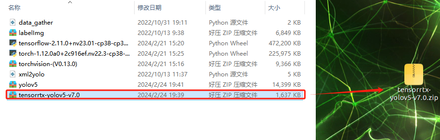

3. Right click on a blank area of the system desktop to select “Open in Terminal” to open a command-line terminal.

   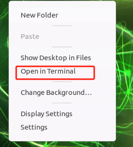

4. Enter the command to extract the file and wait for this process to complete.

   ```py
   unzip tensorrtx-yolov5-v7.0.zip
   ```

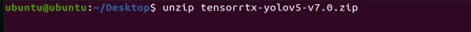

5. Based on the location of the yolov5 folder (according to the previous tutorial, it is stored in the ~/Desktop folder), enter the command here. You can modify it according to the actual location of your folder.

   ```py
   cd Desktop/yolov5/
   ```

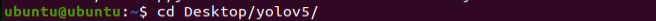

6. Enter the command to copy the yolov5/gen_wts.py file from the tensorrtx folder to the current YOLOv5 folder.

   ```py
   cp ~/Desktop/tensorrtx-yolov5-v7.0/yolov5/gen_wts.py .
   ```

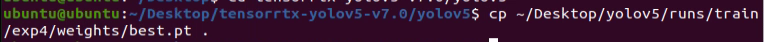

7. Enter the command and press Enter to convert the pt file to a wts file.

   ```py
   python3 gen_wts.py -w runs/train/exp4/weights/best.pt -o best.wts
   ```

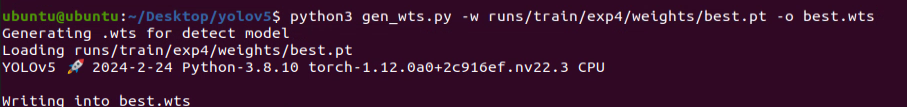

> [!NOTE]
>
> **Here, we use the official yolov5n model as an example. If you need to use a different model, simply replace yolov5n.pt in the command with the name of your model file.**

8. Then enter the command to navigate to the tensorrtx/yolov folder

   ```py
   cd ~/Desktop/tensorrtx-yolov5-v7.0/yolov5/
   ```

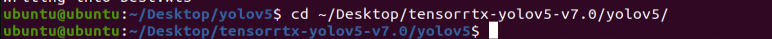

9. Enter the command and press Enter to open yololayer.h file and edit it.

   ```py
   gedit src/config.h
   ```

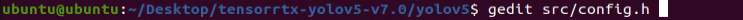

10) Locate the code highlighted in the below red box. This parameter refers to the numbers of categories for object detection. Modify the value according to your specific needs.

> [!NOTE]
>
> **The value you need to enter here is the number of categories you want to detect. You should modify it based on your specific situation. For example, if you set 1 category when collecting data, you should enter 1 here.**

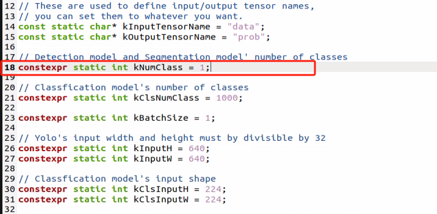

11. After the modification completes, press the shortcut key “Ctrl+S” or click “Save” to save and exit the file.

12. Enter the command to create the “build” folder.

    ```py
    mkdir build
    ```

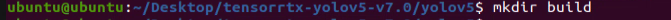

13. Enter the command and press Enter to navigate to the “build” folder.

    ```py
    cd build/
    ```

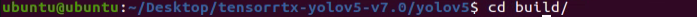

14. Enter the command and press “Enter” to compile the “build” folder.

    ```py
    cmake ..
    ```

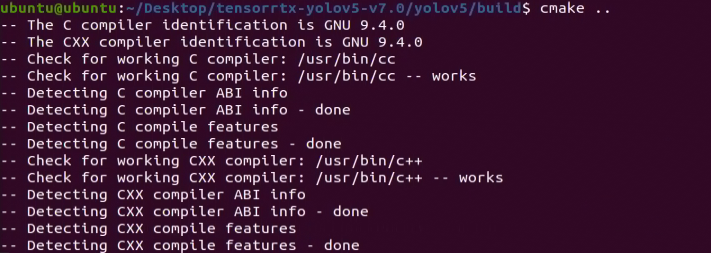

15. Enter the command and press “Enter” to compile the contents of the “build” folder.

    ```py
    make
    ```

16. Enter the command to copy the previously generated “.wts” file from YOLOv5 to the current directory “build”:

    ```py
    cp ~/Desktop/yolov5/best.wts .
    ```

    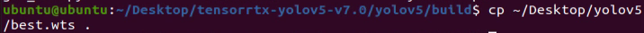

17. Enter the command and press Enter to generate TensorRT model file “yolov5n.engine”. Then wait for the model conversion to complete.

    ```py
    sudo ./yolov5_det -s best.wts best.engine s
    ```

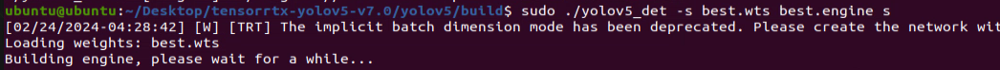

In the command, best.wts refers to the path where the best.wts file is located. Since you are currently in the directory where the .wts file is located, you can simply enter the .wts file name here. best.engine is the name of the TensorRT model file. The last parameter, ‘s’, indicates the type of model used for training. If the model is yolov5n, you can use ‘n’ as the suffix.

18) If the command line terminal displays the following text, it indicates that the engine file has been successfully converted.


### 8.10.2 Invoke TensorRT Model for Testing

Before start the detection, adjust and modify the configuration file as follow:

1. Access the remote desktop

2. Drag and drop the decompressed file “testimages.zip” to the remote desktop.

   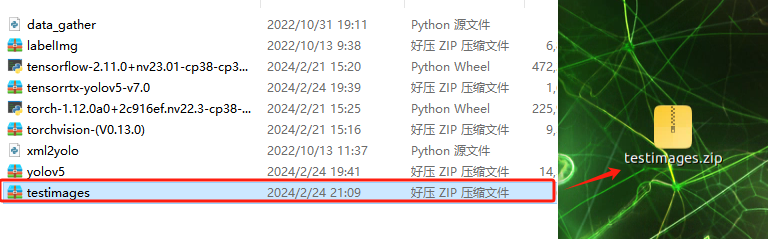

3. Double click 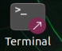to open a command-line terminal. Enter the command to navigate to the “**tensorrtx/yolov5**” file. The path should be based on the location of your Jetson Orin Nano. Here, we refer to the previous path.

   ```py
   cd ~/Desktop/tensorrtx-yolov5-v7.0/yolov5
   ```

   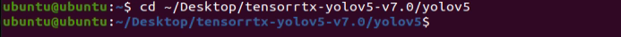

4. Enter the command to edit the parameters in the “**yolov5_det_trt.py**” file.

   ```py
   gedit yolov5_det_trt.py
   ```

   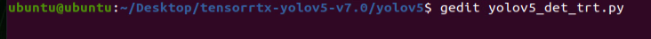

- In the script file, pay attention to the three parameters highlighted in the red box below:

  **PLUGIN_LIBRARY** (Dynamic library for executing detection)

  **engine_file_path** (Path to the generated engine model)

  **image_dir** (Path to the folder containing test images. Note that the path should only include the image format.)

  

  Among the three parameters in the image above, fill them in according to their actual locations. For example, in the previous tutorial, the dynamic library and model engine file were both stored in the build folder within the current directory. You can define and provide the test files as needed and make changes according to your specific situation.

- Modification of Detection Classes:

  

  Based on the previous label categories, use left as the category in the script, as specified in the tutorial. Ensure that it matches the labels used during the annotation process.

- **Modify the detection confidence:** Find the parameter content highlighted in the red box in the image below, and make the necessary modifications and adjustments:

  

  Similarly, adjust the parameter at this location based on the performance of the trained model. For example, adjust the CONF_THRESH parameter, which ranges from 0 to 1. Values within this range will be compared against actual detection results; if the detection result exceeds this value, it will be recognized as an object in the model.

  After confirming the above parameters, save and exit the file, and you can proceed with detection and recognition.

1. Enter the command to install pycuda.

   ```py
   pip3 install pycuda -i https://mirrors.aliyun.com/pypi/simple/
   ```

   

2. Enter the command, ensuring that the path in the current command line terminal is correct.

   ```py
   python3 yolov5_det_trt.py
   ```

   

3. Check the output result in the terminal:

   

   As shown in the image above, the result files for the detection are stored in the output folder. Open it using the file explorer:

   

4. View the detection results by double-clicking and opening the images in the output folder generated in the previous step to review the detection performance:

   

   When the recognition results are unsatisfactory, adjust the detection parameters such as CONF_THRESH. If the results are still not ideal after adjusting the parameters, you may need to re-collect data and retrain the model.