# 9. ROS1 Basic Lesson

## 9.1 ROS Introduction

### 9.1.1 An introduction to Robot Operating System (ROS)

Before learning ROS, the definition of the operating system needs to be understanded first. What is the operating system? It provides some of software and hardware interfaces for direct use. Therefore, for different platforms and functions, different operating systems are needed to complete the underlying operating.

Ros is an open source operating system for robots. It provides OS-like services including hardware abstraction, low-level device control, implementation of commonly used functionality, message-passing between processes, and package management. Some tools and libraries are also provided for acquiring, compiling, writing, and executing programs for multi-machine fusion.

In addition, ROS has process-to-process communication, which is the biggest difference between it and other operating systems. In the traditional operating systems, communication between processes needs to be called by the system, which consumes a lot of system resources so that it is not suitable for robot operating system.

A robot may contain multiple sensors to collabrate through communication between modules to accomplish a given task through modules. Therefore, an effective and rapid communication beween processes is essential for a robot, and ROS provides such function.


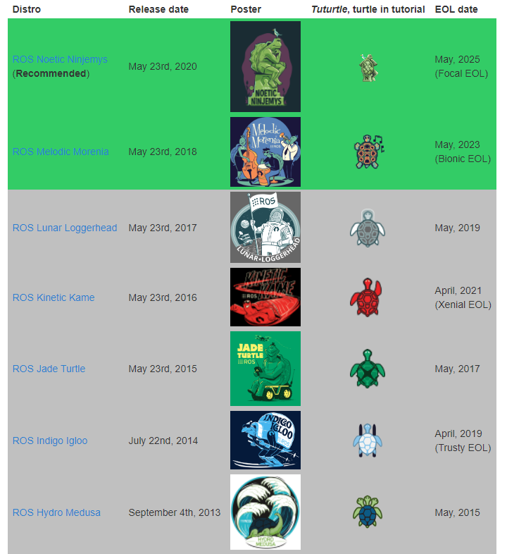

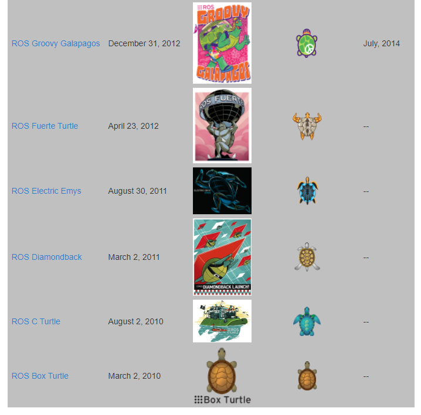

### 9.1.2 ROS Features

1)  Node to node design and independ functions.

2)  Simple stureture and high integration.

3)  Pentiful tool packages and supporting multiple programming languages. Each of packages adopts different programming language.

4)  Free and open source

5)  Abundant communities

Official website: https://wiki.ros.org

## 9.2 ROS Installation and Settings

This lesson is applicable for building a ROS environment from scratch on Jetson Nano official image. Here, we provide two methods for ROS installation. Method one is a one-click installation, where you only need to execute a single command to automatically install the entire ROS system. Method two requires to set up download sources and configure environment variables.

If you are new to ROS, it is recommended to choose “one-click installation” for a quick and easy installation.

### 9.2.1 Method 1: One-click Installation (Recommended)

Click on to open the command line terminal. Enter command “**wget http://fishros.com/install -O fishros && . fishros**” and press Enter, then enter the password.


Enter “1” to select the one-click ROS installation method.


During the initial installation, you need to change the source and clean up third-party sources. Enter “1” to choose to replace the system source before installing.


Enter “2” to choose to replace the system source and clear up the third-party sources.


Enter “1” to choose to install melodic (ROS1) version.


Enter “1” to choose to install melodic (ROS1) desktop version and wait for the installation to complete.


### 9.2.2 Method 2: Step-by-step Installation (Routine Method)

* **Version Selection**

Different versions of Ubuntu have different corresponding versions of ROS . The corresponding ROS version of Ubuntu 18.04 is Melodic.


* **Check Ubuntu Software and Update Source**

1. Find “Software and update” in system.

   

2. Ensure the following options are checked and change the download source which can be used in your country.

   

### 9.2.3 Set the Download Source for ROS

**1. Set the Download Source**

Open a new command line terminal. Enter command “**sudo sh -c '. /etc/lsb-release && echo "deb http://mirrors.ustc.edu.cn/ros/ubuntu/ `lsb_release -cs\` main" > /etc/apt/sources.list.d/ros-latest.list'**” and press **Enter**. Then enter the password of the virtual machine “**ubuntu**”. (The password can be changed, and it uses “ubuntu” here as example.)


**2. Set Public Key**

Enter command “**sudo apt-key adv --keyserver 'hkp://keyserver.ubuntu.com:80' --recv-key C1CF6E31E6BADE8868B172B4F42ED6FBAB17C654**” and press **Enter**.


**3. Update Software Package** 

Enter command “**sudo apt update**”.


### 9.2.4 Install ROS

Open a command line terminal. Enter command “**sudo apt install ros-melodic-desktop-full**” to install ROS. The installation process generally needs to take around 10 min, depending on the network status.


### 9.2.5 Set the Environment Variables

Open a command line terminal. Enter command “**echo "source /opt/ros/melodic/setup.bash" \>\> ~/.bashrc**” and “**echo "source /opt/ros/melodic/setup.bash" \>\> ~/.bashrc**” in sequence to complete the configuration for environment variables.


### 9.2.6 Install rosdep

Enter command “**sudo apt-get install python3-rosdep**” and press Enter to install rosdep. When the installation confirmation prompt occurs, enter “**Y**”.


### 9.2.7 Initialization

Enter command “**cd /etc/ros/rosdep/sources.list.d**” and press Enter to enter the “**cd /etc/ros/rosdep/sources.list.d**” folder.


1. Enter command “**sudo gedit 20-default.list**” and press Enter to edit this file.

   

2. Replace the content in the original file with the below content. (Do not manually enter the content. Please directly copy and paste, and do not need)

   \# os-specific li# os-specific listings first yaml https://gitee.com/wybros/rosdistro/raw/master/rosdep/osx-homebrew.yaml osx \# generic yaml https://gitee.com/wybros/rosdistro/raw/master/rosdep/base.yaml yaml https://gitee.com/wybros/rosdistro/raw/master/rosdep/python.yaml yaml https://gitee.com/wybros/rosdistro/raw/master/rosdep/ruby.yaml gbpdistro https://gitee.com/wybros/rosdistro/raw/master/releases/fuerte.yaml fuerte \# newer distributions (Groovy, Hydro, ...) must not be listed anymore, they are being fetched from the rosdistro index.yaml instead

   During the modification, a warning will appear in terminal. It is a normal phenomena that can be ignored.

   

3. After the replacement is done, click “Save” to save the file, then close.

   

4. Enter command “**cd /usr/lib/python2.7/dist-packages/rosdep2/**” and press Enter to get access to the “**rosdep2**” directory.

   

5. Enter command “**sudo gedit gbpdistro_support.py**” and press Enter. You might be prompted to enter the password of the virtual machine. Then press Enter to open the “**gbpdistro_support.py**” file and locate the “**FUERTE_GBPDISTRO_URL**” code.

   

   

6. Change “https://raw.githubusercontent.com/ros/rosdistro/” to “https://gitee.com/wybros/rosdistro/raw/”. (Only the content shown in following red box requires to modify) Then click “Save” and close the file.

   

7. Enter command “**sudo gedit rep3.py**” and press Enter to open the “**rep3.py**” file and locate the “REP3_TARGETS_URL” code.

   

   

8. Change “**https://raw.githubusercontent.com/ros/rosdistro/”** to “**https://gitee.com/wybros/rosdistro/raw/**” (Only the content shown in following red box requires to modify) Then click “Save” and close the file.

   

9. Enter command “**sudo gedit sources_list.py**” and press Enter to open the “**sources_list.py**” file and locate the “**DEFAULT_SOURCES_LIST_URL**” code.

   

   

10. Change “**https://raw.githubusercontent.com/ros/rosdistro/**” to “**https://gitee.com/wybros/rosdistro/raw/**”. (Only the content shown in following red box requires to modify) Then click “Save” and close the file.

    

11. Enter command “**cd /usr/lib/python2.7/dist-packages/rosdistro/**” and press Enter to get access to the “**rosdistro**” directory.

    

12. Enter command “**sudo gedit \_\_init\_\_.py**” and press Enter to get access to “**\_\_init\_\_.py**” file, and locate the “DEFAULT_INDEX_URL” code.

    

    

13. Change “**https://raw.githubusercontent.com/ros/rosdistro/**” to “**https://gitee.com/wybros/rosdistro/raw/**”. (Only the content shown in following red box requires to modify) Then click “Save” and close the file.

    

### 9.2.8 Update 

Open a new command line terminal and enter command “**rosdep update**”.


The below information represents the update is successfully complete.


If you encounter a timeout error as shown in the figure, it may be due to network issues. In this case, you can try entering "**rosdep update**" multiple times to attempt updating. If it still fails to update, you should check the contents of "**[9.2.7 Initialization]()**" to ensure that the modifications made are correct. After verifying the changes, the user can try running "**rosdep update**" again to perform the update.


## 9.3 ROS Documents and Terms Instruction

### 9.3.1 The Composition of ROS File System

ROS file consists of Packages and Manifests (package.xml).

Packages: The function packages, the most basic unit of the Ros software, contains node source code, configuration files, data definition, etc.

Manifest (package xml): The description file of function package is used to define dependencies between the meta information ralated to the function packge, including version, maintainer, license agreement, etc.

### 9.3.2 Understand the Basic Terms of ROS

The following table provides explanation on some of ROS basic terms.

|   **Terms**    |                       **Instruction**                        |
| :------------: | :----------------------------------------------------------: |
|   ROS Master   |   The connection and message communication between nodes.    |
|      Node      | The smallest processing unit running in Ros is usually an executable file. Each node can use topic or service to communicate with other nodes. |
|    Message     |  The variables of int, float, boolean and other data types.  |
|     Topic      | A one-way asynchronous communication mechanism. The data can be transmitted between nodes through publishing message to topics or subscribing topics. The type of topics are determined by that of corresponding message. |
|    Publish     | Send data with the message type corresponding to the topic content. |
|   Publisher    | To execute pulishing, the publisher nodes register their topics and other various information on the master node, and send messages to subsriber nodes that wish to subsribe. |
|    Subscrib    | Receive data with the massage type corresponding to the topic content. |
|   Subscriber   | To execute subscribing, the subscriber node registers its own topic and other various informations on the master node and receives the inforamtion from the master node about all publisher nodes that have published the topic to which this node needs to subscribe. |
|    Service     | A two-way synchronous communication mechanism. The service client requests the service corresponding to the specific purpose task and the service server replys to the service. |
| Service Server |     The node with request as input and respond as output     |
| Service Client |     The node with respond as input and request as output     |

### 9.3.3 Learn about ROS Common Files

|   **Terms**    |                       **Instruction**                        |
| :------------: | :----------------------------------------------------------: |
|   urdf file    | It is a model file describing all elemnts of robot including link, joint, axis, dynamics, visual and collision. |
|    Srv file    | It is stored in srv folder for ROS service message definition and contains two parts, request and reply. The symbol “--” is used to separate the request from the reply. |
|    Msg file    | It is stored in msg folder and used for ROS topics message definitions. |
|  package.xml   | Describe the property of function package including its name, version, author, etc. |
| CmakeLists.txt |         Compile configuration files by using Cmake.          |
|  Launch file   | Launch file. It contains the node and services needed to systematically boot up the robot. |

### 9.3.4 Learn About Common Commands

ROS commands can be divided into five types: ROS shell commands, ROS excution commands, ROS inforamation commands, ROS catkin commands, ROS function package commands. The followings are some of commonlu used basic commands:

- **ROS shell commands**

| **Command** |      **Explanation**      |                **Instruction**                |
| :---------: | :-----------------------: | :-------------------------------------------: |
|    roscd    | ros+cd(changes directory) | Come to the specified ROS package directory.  |
|    rosls    |    ros+ls(lists files)    | Display the file and directory of ROS package |
|    rosed    |      ros+ed(editor)       |         Edit the files of ROS package         |
|    roscp    |   ros+cp(copies files)    |         Copy the files of ROS package         |
|    rospd    |         ros+pushd         |     Add directory to ROS directory index      |
|    rosd     |       ros+directory       | Display the directory in ROS directory index. |

- **ROS Executing Command**

| **Command** | **Explanation** |         **Instruction**         |
| :---------: | :-------------: | :-----------------------------: |
|   roscore   |    ros+core     | Boot ROS master node management |
|   rosrun    |     ros+run     |          Run ROS node           |
|  roslaunch  |   ros+launch    |        Start launch file        |
|  rosclean   |    rosclean     |  Check or delete ROS log file   |

- **ROS Information command**

| **Command** |   **Explanation**    |               **Instruction**                |
| :---------: | :------------------: | :------------------------------------------: |
|  rostopic   |      ros+topic       |        Confim ROS topics information         |
| rosservice  |     ros+service      |       Confirm ROS service information        |
|   rosnode   |       ros+node       |         Confirm Ros node information         |
|  rosparam   | ros+param(parameter) | Confirm and modify ROS parameter information |
|   rosbag    |       ros+bag        |        Record and replay ROS meassage        |
|   rosmsg    |       ros+msg        |           Display ROS message type           |
|   rossrv    |       ros+srv        |           Display ROS service type           |
| rosversion  |     ros+version      | Dispalay ROS package and version information |
|   roswtf    |       ros+wtf        |               Check ROS system               |

- **ROS catkin Command**

|        **Command**        |                       **Instruction**                        |
| :-----------------------: | :----------------------------------------------------------: |
|     catkin_create_pkg     |           Automatically generate function package            |
|        catkin_make        | Build all function packages in diectory on the basis of catkin build system. |
|      catkin_eclipse       | Modify the package generated with the catkin build system to work in Eclipse environment. |
|  catkin_prepare_release   | Update CHANGELOG.rst file generated by “catkin_generate_changelog” |
| catkin_generate_changelog |    Generate or upadate CHANGELOG.rst file when publishing    |
|   catkin_init_workspace   | Initialize the workspace directory of the catkin build system |
|        catkin_find        |            Find all warkspace directories in use             |

- **ROS Package Command**

|  **Command**  |  **Explanation**   |                       **Instruction**                        |
| :-----------: | :----------------: | :----------------------------------------------------------: |
|    rospack    |   ros+pack(age)    |      View information related to ROS funcation package       |
|  rosinstall   |    ros+install     |                Install the ROS add-on package                |
|    rosdep     | ros+dep(endencies) | Install the dependency files for the specified function package |
|   roslocate   |     ros+locate     |   Display the information related to ROS function package    |
| roscreate-pkg |   ros+create-pkg   | Automatically generate ROS function package (Use for old rosbuild system) |
|    rosmake    |      ros+make      |  Build ROS function package (used for old rosbuild system)   |

## 9.4 Create Workspace and Package

The creation of messages and services, the writing of publishers and subscribers, the writing of servers and clients all operate on the basis of ROS function packages, so it is necessary to create workspace and function packages before performing the operations above.

###  9.4.1 Create Workspace

1. Open the terminal.

2. Input “**mkdir -p ~/catkin_ws/src**” command and press “Enter” to create a workspace named catkin_ws under the specified directory.

   ```py
   mkdir -p ~/catkin_ws/src
   ```

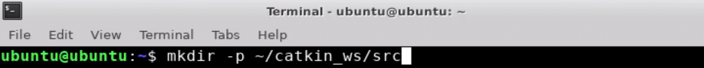

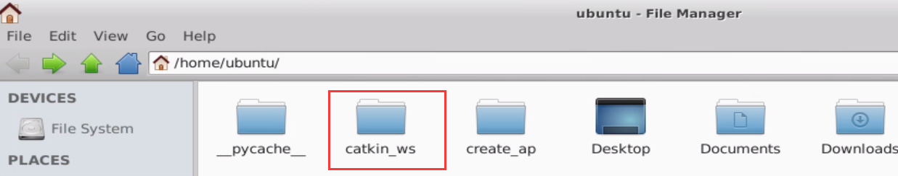

###  9.4.2 Create ROS Package

1. Input “**cd ~/catkin_ws/src**” command, and then press “Enter” to come to the source file space (src) directory of catkin_ws.

   ```py
   cd ~/catkin_ws/src
   ```

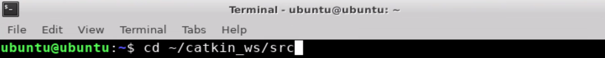

2. Input “**catkin_create_pkg beginner_hiwonder std_msgs rospy roscpp**” command, and then press “Enter” to create function package named “beginner_hiwonder” and add dependencies (msgs, rospy, roscpp).

   ```py
   catkin_create_pkg beginner_hiwonder std_msgs rospy roscpp
   ```

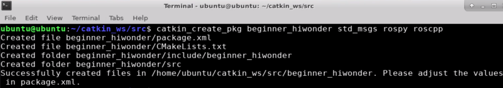

3. Input “**cd ~/catkin_ws**” command and press “Enter” to back to workspace.

   ```py
   cd ~/catkin_ws
   ```

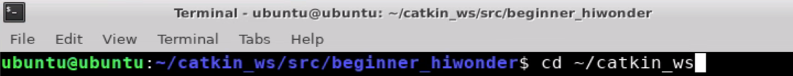

4. Input “**catkin_make**” command and press “Enter” to complete the creation of function package in catkin workspace.

   ```py
   catkin_make
   ```

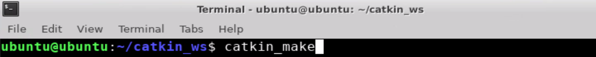

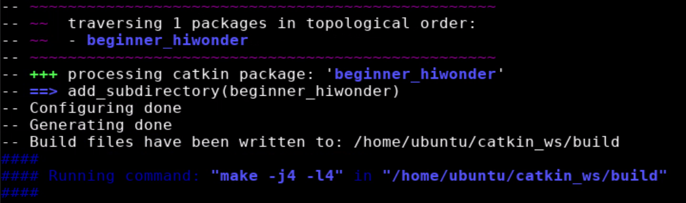

5. Input “echo "**source ~/catkin_ws/devel/setup.bash" \>\> ~/.bashrc**” command to add catkin_ws workspace to ROS enviroment, which the creation of function package is completed.

   ```py
   source ~/catkin_ws/devel/setup.bash" >> ~/.bashrc
   ```

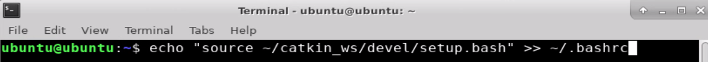

6. Input “**source ~/.bashrc**” command and press “Enter” to add the path.

   ```py
   source ~/.bashrc
   ```

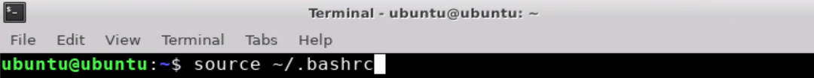

7. Input “**roscd beginner_hiwonder**” command to enter the directory of funtion package and press “Enter” to verify whether the function package is created.

   ```py
   roscd beginner_hiwonder
   ```


## 9.5 Write A Simple Publisher

This section takes the creation of a velocity_publisher.py publisher node as an example to explain.

1)  Input “**roscd beginner_hiwonder**” command and press “Enter” to enter beginner_hiwonder software package.


2. Input “**mkdir scripts**” command and press “Enter” to create a new scripts directory to store Python scripts.

   

3. Input “**cd scripts/**” command and press “Enter”.

   

4. Input “**vi velocity_publisher.py**” command to edit program, and then copy the following program. If need to modify, you can press “i” again. After modifying, press “Esc” and input “:wq” to save and exit the file.

   

```py
#!/usr/bin/env python
# -*- coding: utf-8 -*-
#Publish this routine to the topic turtle1/cmd_vel，the type of message geometry_msgs::Twist

import rospy
from geometry_msgs.msg import Twist

def velocity_publisher():
	# Initialize ROS node
	rospy.init_node('velocity_publisher', anonymous=True)
	# Create a Publishr and pubish a topic named /turtle1/cmd_vel. The type of message is geometry_msgs::Twist and the [queue](javascript:;) [size](javascript:;) is 10.
	turtle_vel_pub = rospy.Publisher('/turtle1/cmd_vel', Twist, queue_size=10)
	#set the loop rate
	rate = rospy.Rate(10)
    
	while not rospy.is_shutdown():
		# Initialize the message of geometry_msgs::Twist type
		vel_msg = Twist()
		vel_msg.linear.x = 0.5
		vel_msg.angular.z = 0.2
        
		# Publish message
		turtle_vel_pub.publish(vel_msg)
		rospy.loginfo("Publsh turtle velocity command\[%0.2f m/s, %0.2f rad/s\]",
			vel_msg.linear.x, vel_msg.angular.z)
		# Delay on the basis of loop rate
		rate.sleep()
if __name__ == '__main__':
	try:
		velocity_publisher()
	except rospy.ROSInterruptException:
		pass
```


5)  Input command **“chmod +x velocity_publisher.py**” to give executable permissions to the saved velocity_publisher.py.


6)  The publisher editing is complete.

## 9.6 Write A Simple Subscriber

The creation of subscriber is based on the edited publisher. The subscription are only possible as long as the message is published. If you have not edited the publisher, you can view the content in “**[9.6 Write A Simple Subscriber](#anchor_9_6)**” and follow the steps to edit it.

### 9.6.1 Write Subscriber Node

This section takes the creation of a pose_subscriber.py node as an example to explain.

1)  Input “**cd catkin_ws/src/beginner_hiwonder/scripts/**” command and press “Enter”.


2. Enter “**vi pose_subscriber.py**” command to edit the program, and then copy the following program. If need to modify, press “i”. After modifying, press “Esc” and input “:wq” to save and exit.

   

```py
#!/usr/bin/env python
# -*- coding: utf-8 -*-
import rospy
from turtlesim.msg import Pose

def poseCallback(msg):
	rospy.loginfo("Turtle pose: x:%0.6f, y:%0.6f", msg.x, msg.y)

def pose_subscriber():
	# Initialize ROS node
	rospy.init_node('pose_subscriber', anonymous=True)

	# Create a subsriber, subscribe to the topic named
	# /turtle1/pose and register callback function poseCallback rospy.Subscriber("/turtle1/pose", Pose, poseCallback)

	# Loop and wait callback function
	rospy.spin()

if __name__ == '__main__':
	pose_subscriber()
```


3)  Input “**chmod +x pose_subscriber.py**” command and press “Enter” to give the executable permission to saved pose_subscriber.py.


### 9.6.2 Test Publisher and Subscriber

1)  Input “roscore” command to start the node manager.


After starting, the following prompt will appear:


Input “**rosrun turtlesim turtlesim_node**” command and then press “Enter” to start TurtleSim.


Open a new terminal and enter “**rosrun beginner_hiwonder velocity_publisher.py**” command to run the publisher of velocity_publisher.py. Then press “Ctrl+C” to stop running the publisher node.


Open a new terminal and input “**rosrun beginner_hiwonder pose_subscriber.py**” command to run the subscriber of pose_subscriber.py Then press “Ctrl+C” to stop running the subscribe node.

1.  The publisher node needs to be started first, and then the subscriber node can subscribe message.

2.  If need to receive the publisher messages completely, you can start the subscriber node first and then the publisher node.

## 9.7 The Definition and Use Of Topics Message

### 9.7.1 Customize Topic Message

> [!NOTE]
>
> **Before customizing the topic message, the workspace and package need to be created first. The specific operation steps can be viewed in “[9. ROS1 Basic Lesson/9.4 Create Workspace and Package]()".**

The specific operation steps for customizing topic massages are as following:

1)  Open the terminal.

2)  Enter “**roscd beginner_hiwonder**” command to locate to the package directory and press “Enter”.


> [!NOTE]
>
> If there is a prompt “**No such package/stack ‘beginner_hiwonder**” appears, it means that the package does not exist in the environment variable ROS_PACKAGE_PATH. The specific solution can be viewed in “**[9. ROS1 Basic Lesson/9.4 Create Workspace and Package]()**”. After the problem is solved, please repeat the current step.

3)  Enter “**mkdir msg**” command and press “Enter”. Then create a new folder “msg” for storing text files.


4)  Enter “**cd msg**” command and press “Enter”.


5. Enter “**vi Person.msg**” command to edit program and copy the following program. If want to modify, you can press “i” key. After modifying, press “Esc” and enter “:wq” to save and exit.

   

```py
string name
uint8 age
uint8 sex

uint8 unknown = 0
uint8 male = 1
uint8 female = 2
```


6. Enter “**vi package.xml**” command. Then copy the following program and add the package dependencies in the position shown in the figure below. If want to modify, you can press “i” again. After modifying, press “Esc” and enter “:wq” to save and exit.

   

7. Add the package dependencies in the position shown in the below figure:

```py
<build_depend>message_generation</build_depend>
<exec_depend>message_runtime</exec_depend>
```


8)  Enter “**vi CMakeLists.txt**” and press “i” to modify “CMakeLists.txt” file.


9)  Add the required compiation option “**message_generation**” in the position shown in the figure below.


10) Locate the code shown in the figure below. Then uncomment the framed code and add the required compilation option “**Person.msg**”.


11) Find the code shown in the figure below. Then uncomment the code in red box and ensure that the required compilation options take effect.


12) Find the code shown in the figure below. Then uncomment the code in red box and add the required compilation option “**message_runtime**”.


13) After modifying, press “Esc” and enter “:wq” to save and exit.


14) Enter the command “**rosmsg show beginner_hiwonder/Person**” and press “Enter” to check whether the message written can be recognized by system. When the words shown in red box appear, it means that they are recognized successfully.


### 9.7.2 The Use of Topic Message

* **Create Publisher and Subscriber Code**

1)  Open the terminal.

2)  Enter “**roscd beginner_hiwonder**” command to locate to the package directory and press “Enter”.


3)  Enter “**cd scripts**” command and press “Enter” to come to the folder “scripts” where Python scripts are stored.


4. Enter “**vi person_publisher.py**” command to edit progam, and then copy the following program. If want to modify, you can press “i”. After modifying, press “Esc” and enter “:wq” to save and exit.

   

```py
#!/usr/bin/env python
# -*- coding: utf-8 -*-
#This routine will pulish /person_info topic and customize message type beginner_hiwonder::Person.
import rospy
from beginner_hiwonder.msg import Person

def velocity_publisher():

	# Initialize ROS node
	rospy.init_node('person_publisher', anonymous=True)
	# Create a publisher and publish a topic named /person_info. The message type is beginner_hiwonder::Person and the queue length is 10.
	person_info_pub = rospy.Publisher('/person_info', Person, queue_size=10)

	#set the loop rate
	rate = rospy.Rate(10)

	while not rospy.is_shutdown():

		# Initialize the message of beginner_hiwonder::Person type
		person_msg = Person()
		person_msg.name = "Tom";
		person_msg.age = 18;
		person_msg.sex = Person.male;

		# publish message
		person_info_pub.publish(person_msg)
		rospy.loginfo("Publsh person message[%s, %d, %d]",
			person_msg.name, person_msg.age, person_msg.sex)

		# Delay on basis of the loop rate
		rate.sleep()

if __name__ == '__main__':
	try:
		velocity_publisher()
	except rospy.ROSInterruptException:
		pass
```


5. Enter “**vi person_subscriber.py**” to edit program, and copy the following program. If want to modify, you can press “i”. After modifying, press “Esc” and enter “:wq” to save and exit.

   

```py
#!/usr/bin/env python
# -*- coding: utf-8 -*-
# This routine will subscribe to the /person_info topic and customize the message type beginner_hiwonder::Person
import rospy
from beginner_hiwonder.msg import Person

def personInfoCallback(msg):
	rospy.loginfo("Subcribe Person Info: name:%s age:%d sex:%d",
		msg.name, msg.age, msg.sex)

def person_subscriber():
	# Initialize ROS node
	rospy.init_node('person_subscriber', anonymous=True)

	# Create a subscriber, subsribe the topic named /person_info and register the callback funcation personInfoCallback
	rospy.Subscriber("/person_info", Person, personInfoCallback)

	# loop and wait the callback function
	rospy.spin()

if __name__ == '__main__':
	person_subscriber()
```


6)  Enter “**chmod +x person_publisher.py**” command and press “Enter” to give the executable permission to the saved person_publisher.py.


* **Run Publisher And Subscriber Nodes**

1)  Enter “**cd ~/catkin_ws**” command and press “Enter” to enter to catkin workspace.


2)  Enter “**catkin_make**” command and press “Enter” to build all the packages in directory.


3)  Enter “**source ./devel/setup.bash**” command and press “Enter” to refresh the workspace environment.


4)  Enter “**roscore**” command to start node manager.


After starting, the prompt below will appear:


5)  Enter “**rosrun beginner_hiwonder person_publisher.py**” command and press “Enter” to run publisher node. If want to stop running node, you can press “Ctrl+C”.


6)  Open a new terminal. Enter “**rosrun beginner_hiwonder person_subscriber.py**” command and press “Enter” to run the subscriber node. If want to stop running node, you can press “Ctrl+C”.


1.  The publisher node needs to be started first, and then the subscriber node can subscribe message.

2.  If need to receive the publisher messages completely, you can start the subscriber node first and then the publisher node.

## 9.8 Write A Simple Client

This section takes the creation of a simple service (Client) node turtle_spawn.py as an example to explain and this node publishes a request for the client to spawn a new turtle by means of a program.

### 9.8.1 Configure Client Code Compilation Rule

1. Enter “**cd catkin_ws/src/beginner_hiwonder/scripts/**” command and press “Enter”.

   

2. Enter “**vi turtle_spawn.py**” command to edit program and copy the following program. If want to program, you can press “i”, and then press “Esc” to enter “:wq” to exit and save.

   

```py
#!/usr/bin/env python
# -\*- coding: utf-8 -\*-
# This routine will request /spawn service and the service data type is turtlesim::Spawn
import sys
import rospy
from turtlesim.srv import Spawn

def turtle_spawn():
	# Initialize ROS node
	rospy.init_node('turtle_spawn')
	# After finding the /spawn service, create a service client, and then connect the service named /spawn.
	rospy.wait_for_service('/spawn')
	try:
		add_turtle = rospy.ServiceProxy('/spawn', Spawn)
		# Request service call and input request data
		response = add_turtle(2.0, 2.0, 0.0, "turtle2")
		return response.name
	except rospy.ServiceException, e:
		print "Service call failed: %s"%e

if __name__ == "__main__":
	#The service calls and displays the result of call.
	print "Spwan turtle successfully \[name:%s\]" %(turtle_spawn())
```


3. Enter “**chmod +x turtle_spawn.py**” command and press “Enter” to give the executable permission to the saved turtle_spawn.py.

   

### 9.8.2 Run Client

1)  Enter “**roscore**” command to start node manager.


2. Enter “**rosrun turtlesim turtlesim_node**” command and press “enter” to run turtlesim.

   

   At this time, the interface will pop up the turtlesim window, as the figure shown below:


3)  Open a new terminal. Enter “**rosrun beginner_hiwonder turtle_spawn.py**” command and press “Enter” to run the client.


At this time, client will send the request to server and respond to start another turtle.


## 9.9 Write A Simple Server

###  9.9.1 Create Service Code

> [!NOTE]
>
> **Before creating service code, you need to create workspace and package first. The specific operation steps can be viewed in file “[9. ROS1 Basic Lesson->9.4 Create Workspace and Package]()”.**

1)  Enter “**cd catkin_ws/src/beginner_hiwonder/scripts/**” command and press “Enter”.


2. Enter “**vi turtle_command_server.py**” command to edit program and copy the following program. If want to modify, you can press “i”. After modifying, press “Esc” and enter “:wq” to save and exit.

   

```py
#!/usr/bin/env python
# -\*- coding: utf-8 -\*-
import rospy
import thread,time
from geometry_msgs.msg import Twist
from std_srvs.srv import Trigger, TriggerResponse
pubCommand = False;
turtle_vel_pub = rospy.Publisher('/turtle1/cmd_vel', Twist, queue_size=10)

def command_thread():
	while True:
		if pubCommand:
			vel_msg = Twist()
			vel_msg.linear.x = 0.5
			vel_msg.angular.z = 0.2
			turtle_vel_pub.publish(vel_msg)

	time.sleep(0.1)

def commandCallback(req):
	global pubCommand
	pubCommand = bool(1-pubCommand)
	rospy.loginfo("Publish turtle velocity command\![%d\]", pubCommand)
	return TriggerResponse(1, "Change turtle command state!")

def turtle_command_server():
	rospy.init_node('turtle_command_server')
	s = rospy.Service('/turtle_command', Trigger, commandCallback)
	print "Ready to receive turtle command."
	thread.start_new_thread(command_thread, ())
	rospy.spin()

if __name__ == "__main__":
	turtle_command_server()
```


3)  Enter “**chmod +x turtle_command_server.py**” command and press “Enter” to give the executable permission to the saved turtle_command_server.py.


###  9.9.2 Run Server Node

1)  Enter “**roscore**” command to start node manager.


2)  Enter “**rosrun turtlesim turtlesim_node**” command and press “Enter” to start turtlesim simulator window.


3)  Open a new terminal. Then enter “**rosrun beginner_hiwonder turtle_command_server.py**” and press “Enter” to run service node. If need to stop running the node, you can press “Ctrl+C”.


4)  Open a new terminal again. Enter “**rosservice call /turtle_command "{}"**” command and press “Enter” to move the turtle along the circular path.


## 9.10 The Definition and Use of Service Data

###  9.10.1Customize Service Data

> [!NOTE]
>
> **Before customizing service data, the workspace and package need to be created first. The specific operation steps can be viewed in file “[9. ROS1 Basic Lesson/9.4 Create Workspace and Package]()”.**

The specific operation steps to customize service data are as follow:

1)  Open the terminal.

2)  Enter “**roscd beginner_hiwonder**” command to go to the package directory and press “Enter”.


> [!NOTE]
>
> If there is a prompt “**No such package/stack ‘beginner_hiwonder**” appears, it means that the package does not exist in the environment variable ROS_PACKAGE_PATH. The specific solution can be viewed in “**[9. ROS1 Basic Lesson/9.4 Create Workspace and Package]()**”. After the problem is solved, please repeat the current step.

3)  Enter “**mkdir srv**” command and press “**Enter**”. Then create a new folder “**srv**” for storing text files.


4. Enter “**vi Person.srv**” command to edit program, and then copy the following program. If want to modify, you can press “i”. After modifying, press “**Esc**” and enter “**:wq**” to save and exit.

   

```py
string name
int8 age
int8 sex

int8 unknown = 0
int8 male = 1
int8 female = 2

---
string result
```


5. Enter “**cd ~/catkin_ws/src/beginner_hiwonder/**” command, and then press “Enter”.

   

6. Enter “**vi package.xml**” command. Then copy the following program and add the package dependencies in the position shown in the figure below. If want to modify, you can press “i” again. After modifying, press “**Esc**” and enter “**:wq**” to save and exit.

   

```py
<build_depend>message_generation</build_depend>
<exec_depend>message_runtime</exec_depend>
```


7)  Enter “**vi CMakeLists.txt**” and press “i” to modify “CMakeLists.txt” file.


8)  Add the required compilation option “**message_generation**” in the position shown in the figure below.


9)  Find the code shown in the figure below. Then uncomment the framed code and add the required compilation option “**Person.srv**”.


10) Find the code shown in the figure below. Then uncomment the code in red box and ensure that the required compilation options take effect.


11) Find the code shown in the figure below. Then uncomment the code in red box and add the required compilation option “**message_runtime**”.


12) After modifying, press “**Esc**” and enter “**:wq**” to save and exit.


13) Enter the command “**rosmsg show beginner_hiwonder/Person**” and press “**Enter**” to check whether the massage written can be recognized by system. When the words shown in red box appear, it means that they are recognized successfully.


###  9.10.2 The Use of Service Data

* **Create Server and Client Data**

1. Open the terminal.

2. Enter “**cd catkin_ws/src/beginner_hiwonder/scripts/**” command and press “Enter” to come to the folder “**scripts**” where Python scripts are stored.

   

3. Enter “**vi person_server.py**” command to edit program, and then copy the following program. If want to modify, you can press “i”. After modifying, press “**Esc**” and enter “**:wq**” to save and exit.

   

```py
#!/usr/bin/env python
# -*- coding: utf-8 -*-
# This routine will execute the /show_perso service with service data type beginner_hiwonder::Person
import rospy
from beginner_hiwonder.srv import Person, PersonResponse

def personCallback(req):
	# Display request message
	rospy.loginfo("Person: name:%s age:%d sex:%d", req.name, req.age, req.sex)

	# Data feedback
	return PersonResponse("OK")

def person_server():
	# Initialize ROS node
	rospy.init_node('person_server')

	# Create a server named /show_person and register personCallback function
	s = rospy.Service('/show_person', Person, personCallback)

	# loop and wait callback function
	print "Ready to show person informtion."
	rospy.spin()

if __name__ == "__main__":
	person_server()
```


4. Enter “**vi person_subscriber.py**” to edit program, and copy the following program. If want to modify, you can press “i”. After modifying, press “Esc” and enter “:wq” to save and exit.

   

```py
#!/usr/bin/env python
# -\*- coding: utf-8 -\*-
# This routine will request /show_person service with the service data type beginner_hiwonder::Person

import sys
import rospy
from beginner_hiwonder.srv import Person, PersonRequest

def person_client():
	# Initialize ROS node
	rospy.init_node('person_client')

		# After finding the /spawn service, create a service client, and then connect service name /spawn
	rospy.wait_for_service('/show_person')
	try:
		person_client = rospy.ServiceProxy('/show_person', Person)

	# Request service call, input request data
	response = person_client("Tom", 20, PersonRequest.male)
	return response.result
except rospy.ServiceException, e:
	print "Service call failed: %s"%e

if __name__ == "__main__":
	#Service call and display the call result
	print "Show person result : %s" %(person_client())
```


5)  Enter “**chmod +x person_server.py**” and “**chmod +x person_client.py**” command, and then press “Enter” to give the executable permission to the saved person_publisher.py.


### 9.10.3 Run Server and Client Nodes

1)  Enter “**cd ~/catkin_ws**” command and press “Enter” to enter to catkin workspace.


2)  Enter “**catkin_make**” command and press “Enter” to build all the packages in directory.


3)  Enter “**source ./devel/setup.bash**” command and press “Enter” to refresh the workspace environment.


4)  Enter “**roscore**” command to start node manager.


5)  Enter “**rosrun beginner_hiwonder person_publisher.py**” command and press “Enter” to run publisher node. If want to stop running node, you can press “Ctrl+C”.


6)  Open a new terminal. Enter “**rosrun beginner_hiwonder person_client.py**” command and press “Enter” to run the client node.


7)  After running the client node, the terminal window for starting server node will print the content shown in the red box in the figure below.


## 9.11 Parameters Usage and Programming Method

### 9.11.1 Service Model

There is a parameter server in ROS master, which is a global dictionary to store configuration parameters among nodes. For example, parameter server for saving our name, radius and height can be globally accessible by each node.

If I access the robot name in Node A, I will get a value of “my_rot”. It only needs to send a query request to our ROS master, and then return the result of “my_rot”. The same goes for Node B, Node C, and Node D.

The parameter server model is shown in the following figure:

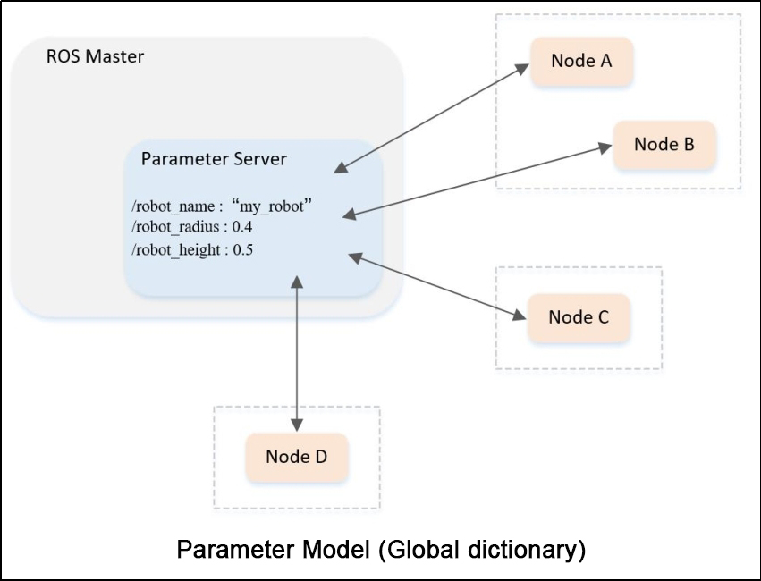

### 9.11.2 rosparam Parameter

* **rosparam Detailed Parameter** 

Let’s get to know rosparam first and the detailed parameters are as follow:

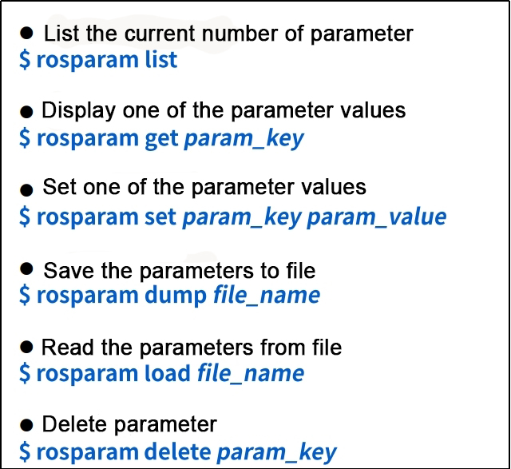

* **Run Turtlesim Routine**

Taking turtlesim project as an example, run the turtlesim routine first. The specific operation steps are as follows:

1)  Enter “**roscore**” command and press “Enter”.

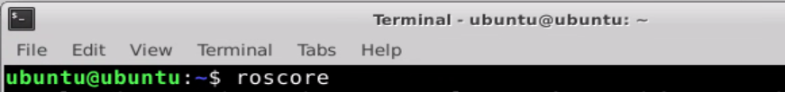

> [!NOTE]
>
> If the prompt “**roscore cannot run as another roscore/master is already running**” appears, which means node manager has been started before and this step can be skipped.

2)  Enter the command “**rosrun turtlesim turtlesim_node**”, and then press “Enter” to open the turtle simulator.

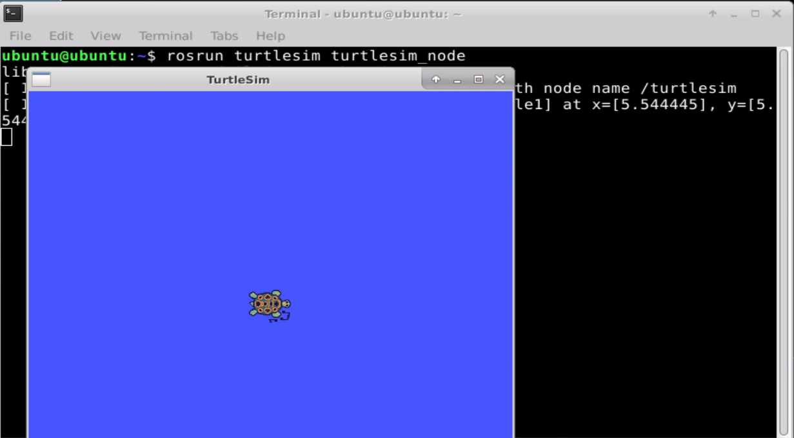

* **The Use of rosparam**

The operation steps for the use of rosparam are as follow:

1)  Open a new terminal.

2)  Enter “**rosparam**” command and press “**Enter**”.

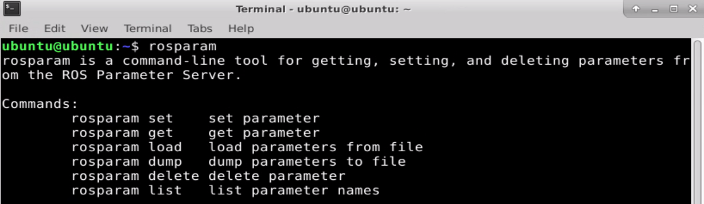

3. Enter the command "**rosparam list**" and press “**Enter**” to query the number of turtle parameters.

   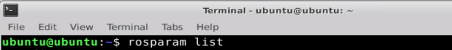

4. Enter “**rosparam get /turtlesim/background_b**” command and press “**Enter**” to get the value of“**background_b**”. The same method goes for getting other values.

   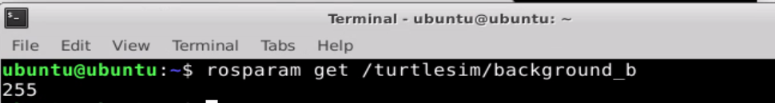

5. Enter “**rosparam set /turtlesim/background_b 100**” command and press “Enter” to set “**background_b**” value. The same method goes for setting other values.

   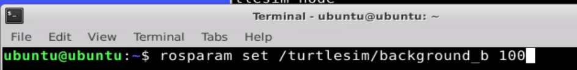

6. Enter “**rosparam get /turtlesim/background_b**” command and press “Enter”. Then you can find that the value has been modified to 100.

   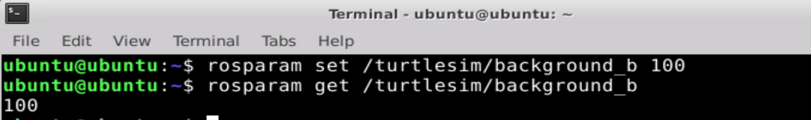

7. Enter “**rosservice call clear "{}"** ” command and press “Enter” to send the request to change color.

   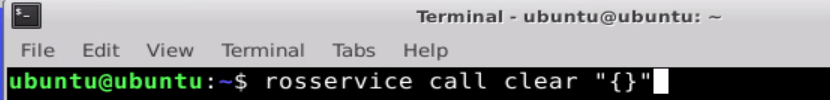

   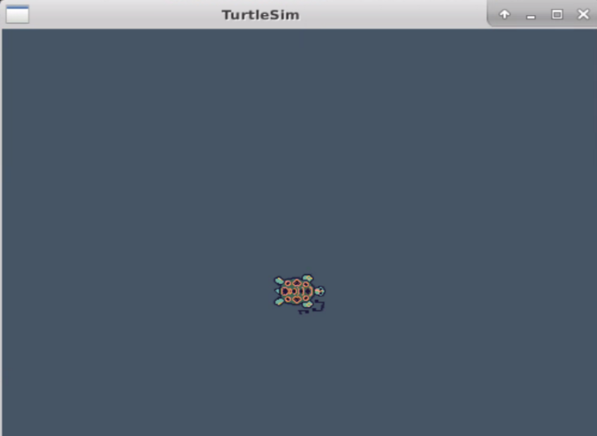

8. Enter “**rosparam dump param.yaml**” command and press “Enter” to save file.

   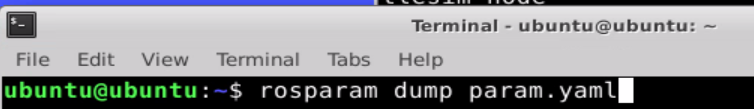

9. The created file is saved in the following path and open it directly.

   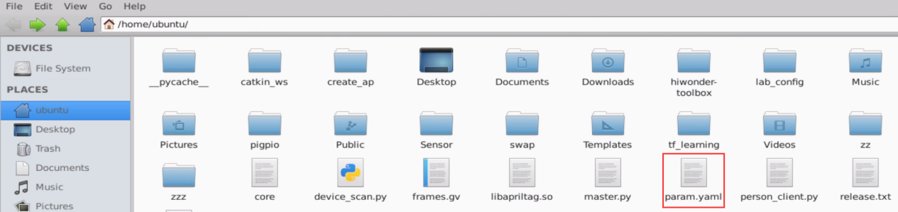

10. Enter “**vi param.yaml**” command and press “Enter”. Then press “i” to modify “param.yaml”.

    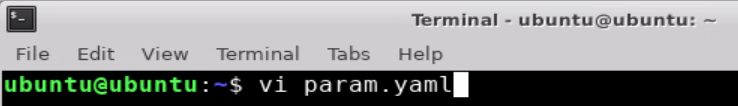

    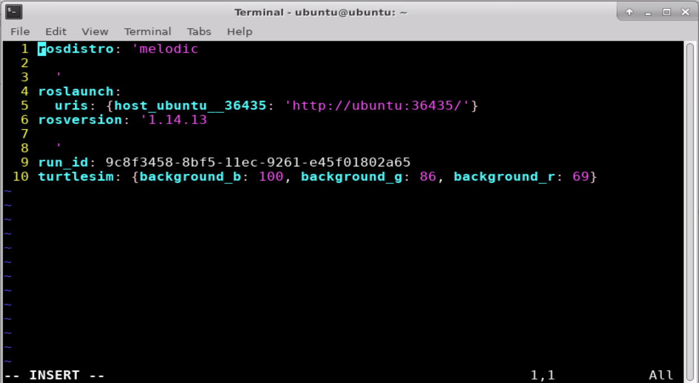

11. The color can be modified to 0 which is black. After modifying, press “Esc” and enter “:wq” to save and exit.

    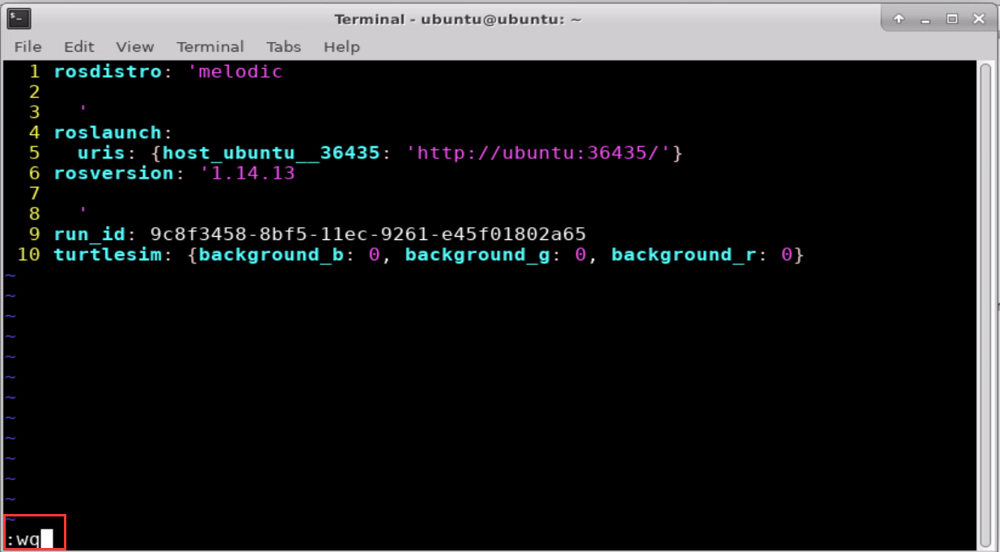

12. Enter “**rosparam load param.yaml**” command and press “Enter” to load the file.

    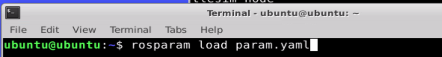

13. Enter “**rosparam get /turtlesim/background_b**” command and press “Enter” to check the loading effect.

    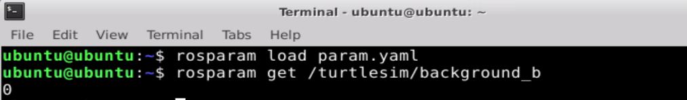

14. Enter “**rosservice call clear "{}"** ” command and press “Enter” to send a request that changes the background scolor to black.

    

    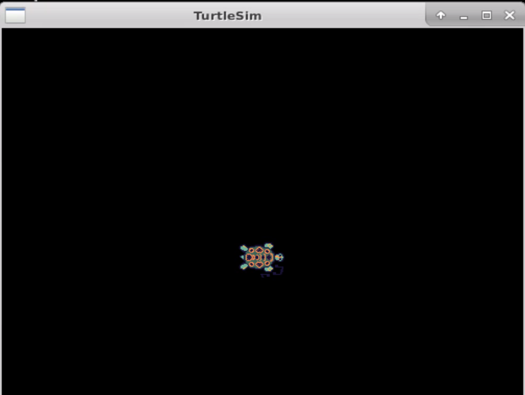

15. Enter “**rosparam delete /turtlesim/background_g**” command and press “**Enter**” to delete the color of g.

    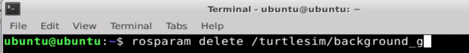

16. Enter “**rosparam list**” command and press “**Enter**” to check effect.

    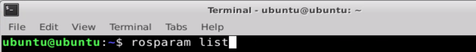

17. Enter “**rosservice call clear "{}"** ” command and press “Enter” to refesh the blackground color to check effect.

    

    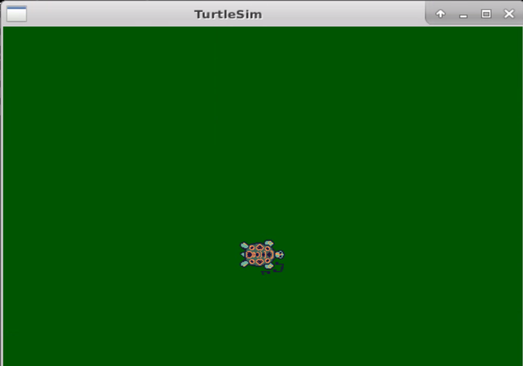

###  9.11.3 Programming Method 

The operation steps for creating package is as follow:

1)  Enter “**cd catkin_ws/src/**” command and press “**Enter**” to come to workspace.

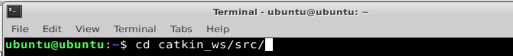

2)  Enter “**catkin_create_pkg parameter_hiwonder rospy std_msgs**” command and press “**Enter**” to create package.

* **Write Control Program**

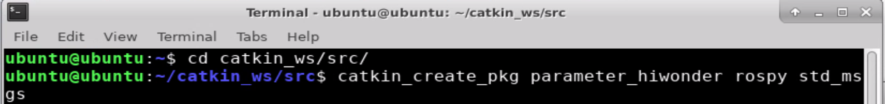

1)  Open the terminial.

2)  Enter “**roscd parameter_hiwonder**” command and press “**Enter**” to come to the package directory.

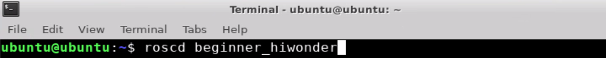

3)  Enter “**mkdir scripts**” command and press “Enter” to create a new folder “scripts” where Python scripts are stored.

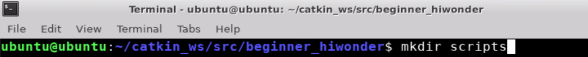

4. Enter “**cd scripts/**” command and press “Enter” to come to the “scripts” folder.

   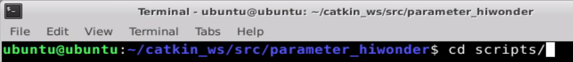

5. Enter the command “**vi parameter_config.py**” to edit the program, and then copy the following program. If want to modify, you can press “i”. After modifying, press “Esc” and enter “:wq” to save and exit.

   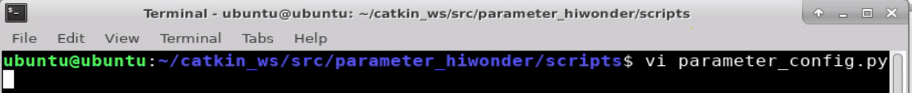

```py
#!/usr/bin/env python
# -\*- coding: utf-8 -\*-
# This routine set and read the parameter in turtle routine
import sys
import rospy
from std_srvs.srv import Empty

def parameter_config():
	# Initialize ROS node
	rospy.init_node('parameter_config', anonymous=True)

	# read the parameter of blackground color
	red = rospy.get_param('/turtlesim/background_r')
	green = rospy.get_param('/turtlesim/background_g')
	blue = rospy.get_param('/turtlesim/background_b')

	rospy.loginfo("Get Backgroud Color\[%d, %d, %d\]", red, green, blue)

	# set the parameter of blackground color
	rospy.set_param("/turtlesim/background_r", 255);
	rospy.set_param("/turtlesim/background_g", 255);
	rospy.set_param("/turtlesim/background_b", 255);
	rospy.loginfo("Set Backgroud Color\[255, 255, 255\]");

	# read the parameter of blackground color
	red = rospy.get_param('/turtlesim/background_r')
	green = rospy.get_param('/turtlesim/background_g')
	blue = rospy.get_param('/turtlesim/background_b')
	
    rospy.loginfo("Get Backgroud Color\[%d, %d, %d\]", red, green, blue)
	# After finding /spawn, create a service client, and then connect service named /spawn.

	rospy.wait_for_service('/clear')
	try:
		clear_background = rospy.ServiceProxy('/clear', Empty)
		# Request service call, enter request data
		response = clear_background()
		return response
	except rospy.ServiceException, e:
		print "Service call failed: %s"%e

if __name__ == "__main__":
	parameter_config()
```

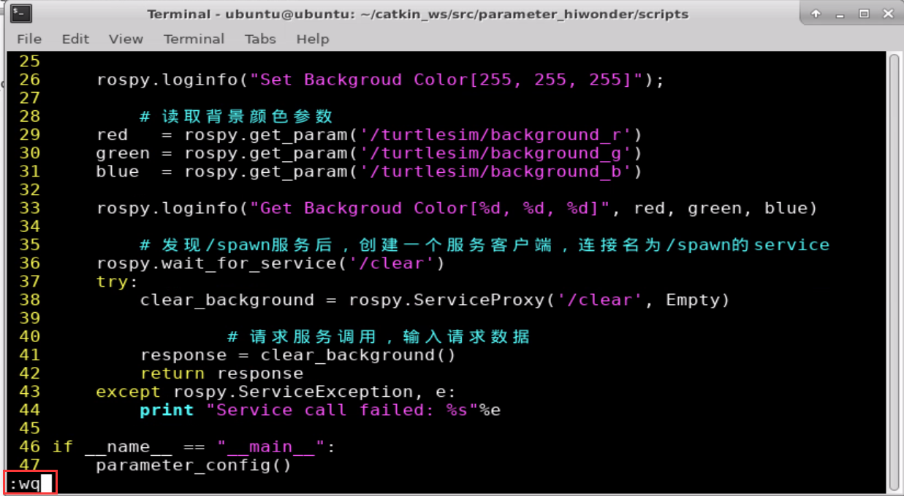

6)  Enter “**chmod +x parameter_config.py**” command and press “Enter” to give the executable permission to the saved parameter_config.py.

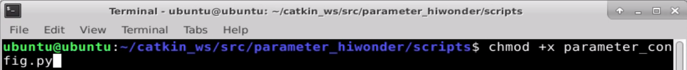

* **Run Program** 

1)  Enter “**roscore**” command and press “**Enter**” to start node manager.

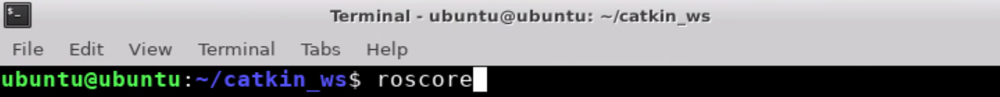

> [!NOTE]
>
> **If the prompt “roscore cannot run as another roscore/master is already running” appears, it means node manager has been started up so this step can be skipped directly.**

2. Enter “**rosrun turtlesim turtlesim_node**” command and press “Enter” to open the turtle simulator.

   

3. Enter “**rosrun parameter_hiwonder parameter_config.py**” command and press “Enter” to run the program, which changes the background color of turtle to white, as the figure shown below:

   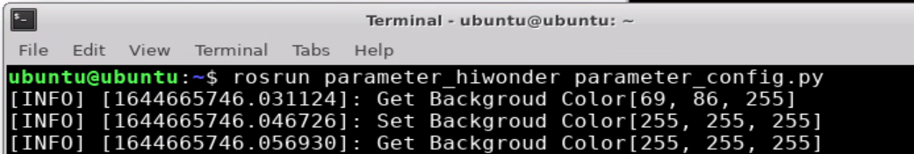

   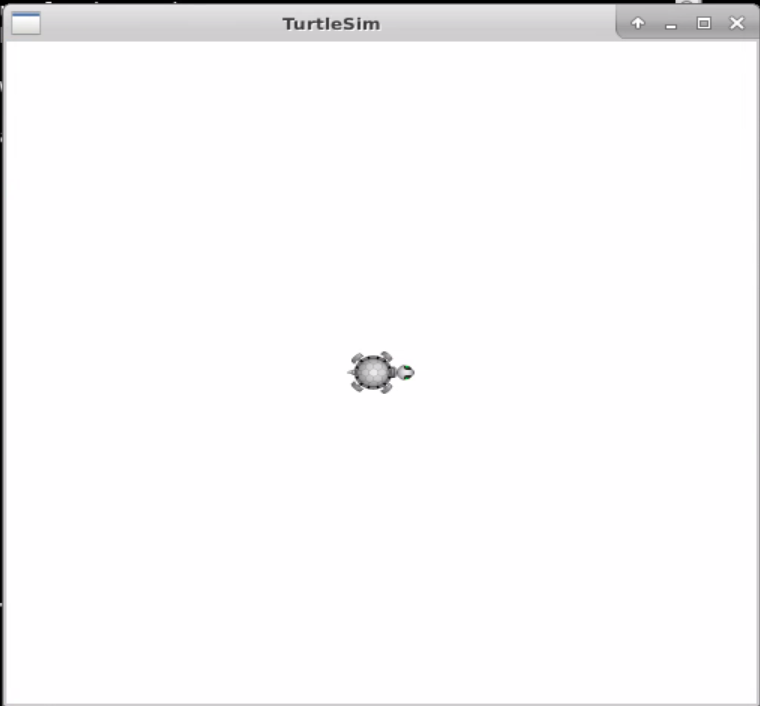

4. If want to stop running program, you can press “**Ctrl+C**”.

## 9.12 The Use of Launch File

### 9.12.1 Preface 

In the previous lessons, common line is tried to run a new node. However, as the more complex robotic systems are created, it becomes increasingly cumbersome to open multiple terminals and re-enter settings.

Therefore, through creating a launch file, we can start up and configure multiple ROS nodes to be executed as the same time, as well as start more functions. In addition, ROS Master can be started automatically.

### 9.12.2 Basic Grammar of Launch File

* **Tag Instruction**

Launch file: the configuration and startup of multiple nodes through XML file.

```py
<launch>
<node pkg=”turtlesim” name=”sim1” type=”turtlesim_node”/>
<node pkg=”turtlesim” name=”sim2” type=”turtlesim_node”/>
</launch>
```

The above is an example of the simplest Lanuch file. The root element in the Launch file is defined by the \<Lanuch\> tag.

The node tag is one of the most commonly used tags in Launch files.

```py
<node pkg=”package-name”type=”executable-name”name=”node-name”/>
```

1. `<node>`：The starting node.

2. `pkg`：The name of package in which the node is located.

3. `type`：The name of the node executable file. If it is written in python, the suffix “.py” needs to be added. If it is written in C++, the name of the executable file can be written directly without the suffix “.cpp”.

4. The name of the node when it runs. Each node needs its own unique name. If want to start up two identical files, you can write two different names, for example, start two turtles.

   More parameters in \<node\> can be set in addition to pkg、type、name, as follow:

```py
<launch>
	<node
		pkg=""
		type=""
		name=""
		respawn="true"
		required="true"
		launch-prefix="xterm -e"
		output="screen"
		ns="some_namespace"
		args=""
	/>
</launch>
```

| **Parameter** |                         **Function**                         |
| :-----------: | :----------------------------------------------------------: |
|    output     | By default, information about launching node is stored in the following log file （/.ros/log/run_id/node_name-number-stdout.log）by which set the parameters, which can be set here to make the information appear on the screen. For example, output = “screen”. |
|   required    |     Whether all the nodes started by node are shut down      |
|    respawn    | Whether to automatically restart the node if it shuts down unexpectedly |
|      ns       | The node is classified into a different namespace, that is, the prefix given by ns is added in front of the node name |

* **Parameter Settings**

\<param\>/：Set the parameters running in ROS and store them in parameter server.

```py
<param name=”output_frame”value=”odom”/>
```

1. `name`：parameter name

2. `value`：parameter value

<rosparam\>：load multiple paramters in a parameter file

```py
<rosparam file=”params.yaml”command=”load”ns=”params” />
```

\<arg\>：the [local](javascript:;) [variable](javascript:;) in launch file. It is restricted to Launch file.

```py
<arg name=”arg-name” default=”arg-value” />
```

1)  `name`：parameter name

2)  `value`：parameter value

* **Remap nesting**

\<remap\>：remap the name of ROS computation graph resource

```py
<remap from=”/turtlebot/cmd_vel”to=”/cmd_vel”/”>
```

1. `from`：the original name

2. `to`：the name after mapping

<include\>：Include other launch files which is similar to header in C programming language.

```py
<include file="$(dirname)/other.launch”>
```

`file`：The path to the other Launch files included.

### 9.12.3 Operation Steps

Take the startup of turtle sporting program with a launch file as an exmple, and the steps are as follow:

Step 1: Open the terminal, and then enter “**cd catkin_ws/src/beginner_hiwonder**” command.

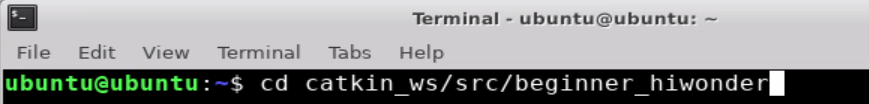

Step 2: enter “**mkdir lanuch**” command to create a launch folder.

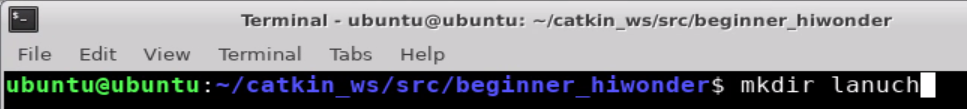

Step 3: Enter “**cd lanuch**” command to enter the launch folder.

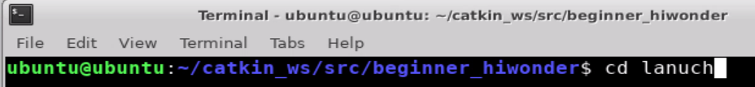

Step 4: Enter “**vi turtlesim_launch_test.lanuch**” command to open the file created in step 1 through vi eiditor.

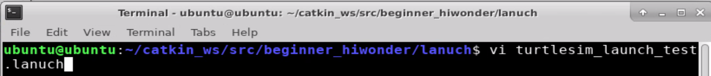

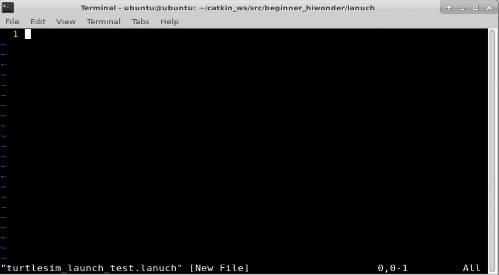

Step 5: Copy the following content into the folder.

```py
	<launch>
	<node pkg="turtlesim" type="turtlesim_node" name="turtlesim" />
	<node pkg="turtlesim" type="turtle_teleop_key" name="turtle_teleop_key" output="screen" />
</launch>
```

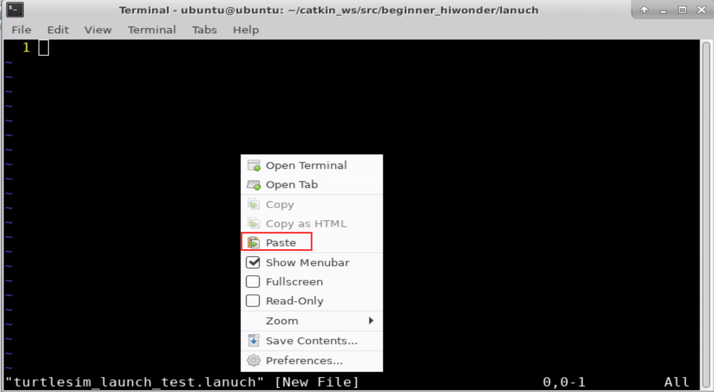

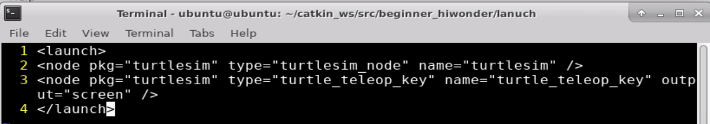

Step 6: Press “**Esc**” and enter “**:wq**” to save and exit.

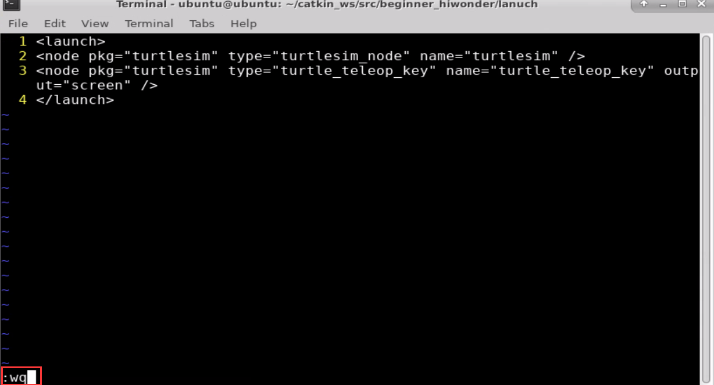

Step 7: Enter “**roslaunch beginner_hiwonder turtlesim_launch_test.lanuch**” command to start TurtleSim.

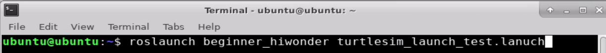


## 9.13 The Programming Realization of TF Coordinates Broadcasting and Listening

### 9.13.1 Coordinates Transformation

Before programming, the coordinates transformation of robot needs to be learned about first. Here takes running TurtleSim project as an example and the operation steps are as follow:

1. Enter “**sudo apt-get install ros-melodic-turtle-tf**” command to install the package.

   

Among them, “**melodic**” corresponds to ROS version.

2. Enter “**roslaunch turtle_tf turtle_tf_demo.launch**” command to run launch file.

   

   

3. Enter “**rosrun turtlesim turtle_teleop_key**” command to run turtle keyboard control node.

   

   

4. Enter “**rosrun tf view_frames**” command to view the frame.

   

5. Find the file “**frames.pdf**” under the main directory as the figure shown below:

   

6. Open the file “**frames.pdf**”, and then the position relationship between TF coordinates in current system can be viewed, as the figure shown below:

   

### 9.13.2 Create Package

The following operation are going to create the package:

1)  Enter “**cd catkin_ws/src/**” command and press “Eenter” to come to the workspace.


2)  Enter “**catkin_create_pkg tf_hiwonder rospy std_msgs**” command and press “Enter” to create package.


### 9.13.3 Programming Method

* **Write Broadcasting and Listening Programs**

1)  Open the terminal.

2)  Enter “**roscd tf_hiwonder**” command to enter the package directory and press “Enter”.


3)  Enter “**mkdir scripts**” command and press “Enter” to create a new folder “scripts” where Python scripts are stored.


4. Enter “**cd scripts/**” command and press “Enter” to enter the folder “scripts” where Python scripts are stored.

   

5. Enter “**vi turtle_tf_broadcaster.py**” command to edit program and copy the following program. If want to modify, you can press “i”. After modifying, press “Esc” and enter “:wq” to save and exit.

   

```py
#!/usr/bin/env python
# -*- coding: utf-8 -*-
# This routine will request /show_person service and the service data type is learning_service::Person
import tf
import rospy
import turtlesim.msg

def handle_turtle_pose(msg, turtlename):
	br = tf.TransformBroadcaster()
	br.sendTransform((msg.x, msg.y, 0),
		tf.transformations.quaternion_from_euler(0, 0, msg.theta),
		rospy.Time.now(),
		turtlename,
		"world")

if __name__ == '__main__':
	rospy.init_node('turtle_tf_broadcaster')
	turtlename = rospy.get_param('~turtle')
	rospy.Subscriber('/%s/pose' % turtlename,
		turtlesim.msg.Pose,
		handle_turtle_pose,
		turtlename)
	rospy.spin()
```


7. Enter “**vi turtle_tf_listener.py**” command to edit program and copy the following program. If need to modify, you can press “i”. After modifying, press “i” and enter “:wq” to save and exit.

   

```py
#!/usr/bin/env python
# -*- coding: utf-8 -*-
# This routine will request /show_person service and the service data type is learning_service::Person
import roslib
import rospy
import math
import tf
import geometry_msgs.msg
import turtlesim.srv

if __name__ == '__main__':
	rospy.init_node('turtle_tf_listener')

	listener = tf.TransformListener()

	rospy.wait_for_service('spawn')
	spawner = rospy.ServiceProxy('spawn', turtlesim.srv.Spawn)
	spawner(4, 2, 0, 'turtle2')

	turtle_vel = rospy.Publisher('turtle2/cmd_vel', geometry_msgs.msg.Twist,queue_size=1)

	rate = rospy.Rate(10.0)
	while not rospy.is_shutdown():
		try:
			(trans,rot) = listener.lookupTransform('/turtle2', '/turtle1', rospy.Time(0))
		except (tf.LookupException, tf.ConnectivityException, tf.ExtrapolationException):
			continue

		angular = 4 * math.atan2(trans[1], trans[0])
		linear = 0.5 * math.sqrt(trans[0] ** 2 + trans[1] ** 2)
		cmd = geometry_msgs.msg.Twist()
		cmd.linear.x = linear
		cmd.angular.z = angular
		turtle_vel.publish(cmd)

		rate.sleep()
```


8)  Enter “**chmod +x turtle_tf_broadcaster.py**” and “**chmod +x turtle_tf_listener.py**” command, and then press “Enter” to give the executable permission to the files.


9. Enter “**cd ..**” and “**mkdir launch**” command to create a new folder “launch” where the launch scripts are stored.

   

   

10. Enter “**cd launch/**” command and press “**Enter**” to enter the folder “**launch**” where Python scripts are stored.

    

11. Enter “**vi start_tf_demo_py.launch**” command to edit program, and then copy the following program. If want to modify, you can press “i”. After modifying, press “Esc” and enter “:wq” to save and exit.

    

```py
<launch>
	<!-- Turtlesim Node-->
	<node pkg="turtlesim" type="turtlesim_node" name="sim"/>
	<node pkg="turtlesim" type="turtle_teleop_key" name="teleop" output="screen"/>

	<node name="turtle1_tf_broadcaster" pkg="tf_hiwonder" type="turtle_tf_broadcaster.py" respawn="false" output="screen" >
	<param name="turtle" type="string" value="turtle1" />

	</node>

	<node name="turtle2_tf_broadcaster" pkg="tf_hiwonder" type="turtle_tf_broadcaster.py" respawn="false" output="screen" >
	<param name="turtle" type="string" value="turtle2" />
	</node>

	<node pkg="tf_hiwonder" type="turtle_tf_listener.py" name="listener" />

</launch>
```


* **Run Program**

1. Enter “**source ./devel/setup.bash**” command and press “**Enter**” to set the working environment.

   

2. Enter “**roslaunch tf_hiwonder start_tf_demo_py.launch**” and press “**Enter**” to run launch program.

   

   A turtle automatically moves to the position of another turtle, as the figure shown below.

   

3. If want to stop program, you can press “**Ctrl+C**”.

## 9.14 Common Visualization Tools

###  9.14.1 A Introduction to RQT Tool

* **Overview**

RQT is a graphical user interface framework that implements various tools and interfaces in the form of plugins.

One can run all the existing GUI tools as dockable windows within RQT. When in use, RQT tools and plugins can be ran with command “rqt”. This GUI allows you to choose any available plugins on your system. In addition, you can also run plugins in standalone window.

* **RQT Component Structure**

RQT consists of three metapackages：

1)  Rqt: core infrastucture modules

2)  rqt_common_plugins: back-end tool for building

3)  rqt_robot_plugins: tool for interacting with robots

* **Advantage of RQt framework**

Compared to building your own GUIs from scratch:

1. Standardized common procedures for GUI (start-shutdown hook, restore previous states).

2. Multiple widgets can be docked in a single window.

3. Easily turn your existing Qt widgets into RQt plugins.

4. Expect support at ROS Answers (ROS community website for the questions).

   From system architecture’s perspective:

1)  Support multi-platformand multi-language (Python, C++).

2)  Manageable lifecycle: RQt plugins using common API makes maintainance and reuse easier.

###  9.14.2 RQT Running

> [!NOTE]
>
> **After ROS is installed successfully, it comes with RQT tool, no need to reinstall.**

1)  Open the terminal, and then enter “**rosrun rqt_**” and press “Tab” key to unlist the following command:

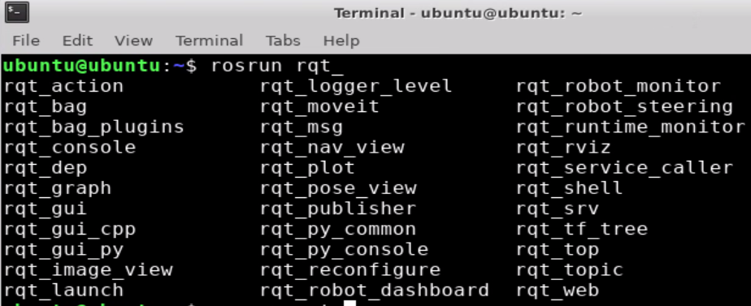

rqt_image_view is used to display the returned image.

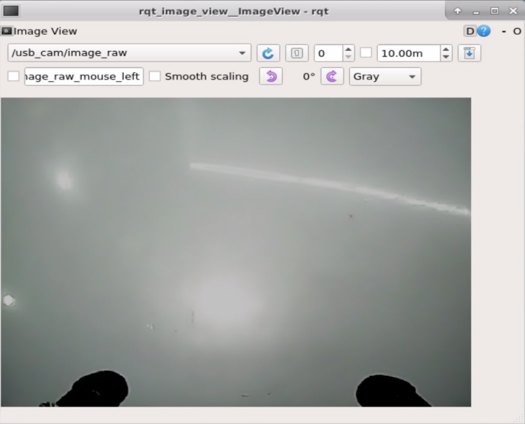

Several tools are introduced for you:

1. rqt_console：Log output tool

   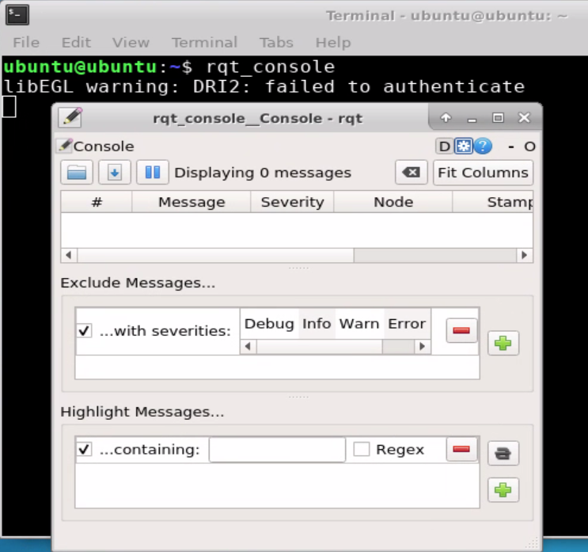

2. graph visualization tool

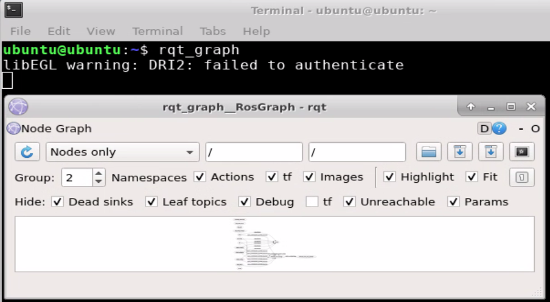

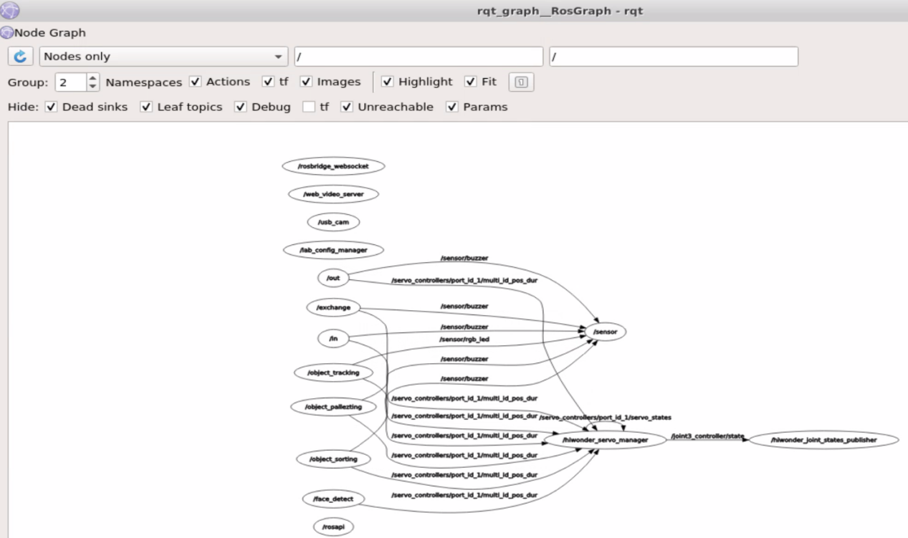

3)  rqt_plot： graph visualization tool

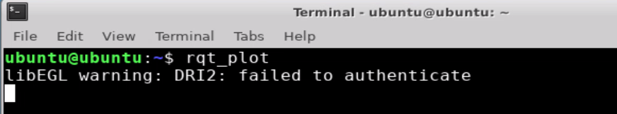

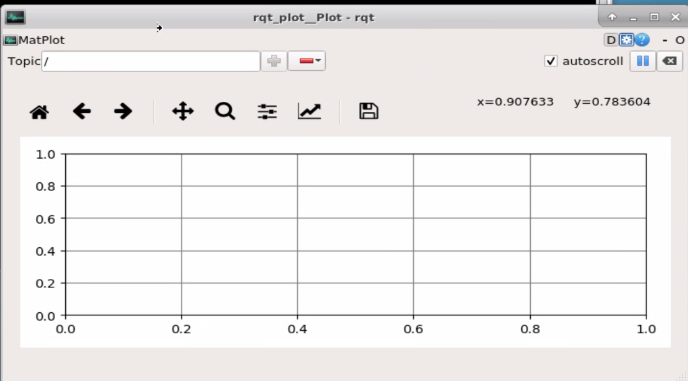

###  9.14.3 Plugins Function Introduction

Some useful plugins are enumerated in the following table:

|       Plugins       |                     Function Instruction                     |
| :-----------------: | :----------------------------------------------------------: |
|   topics monitor    | Moitor the current transmisson data of a topic, bandwidth consumption, topic frequency, etc, which is equivalent to the original rostopic echo msg_name |
|  message publisher  | Publish a topic with a custom name as well as specfiy the message type, publishing data and publishing frequency of the topic |
| message type brower | View all currently defined message types including own defined msg, which is basically equivalent to the function of rosmsg show msg_name |
|   robot steering    | Publish a topic cmd_vel to publish Twist topic message, which can visually modify the speed, angle variables. It is convenient for testing some control commands conviniently |
|         bag         | Record a bag and arbitrarily choose and specify which topic to record. It can also open a bag, in which you can easily control the play or pause of the bag play, and specify the previous and next frames to be played. |

The plugins in bag are shown in the following table:

|     Plugins     |                     Function Instruction                     |
| :-------------: | :----------------------------------------------------------: |
|   node_graph    |          View all the nodes running in current node          |
| process monitor |  View all current nodes and PID, CPU and RAM usage of node   |
|     launch      | Easily choose package and launch files in visualization interface, run and stop a node of lauch file |
|   image view    | Easily view the image messages delivered in ROS topic, which is convenient for us to observe the images that the robot is looking at. |
|      plot       | The data of a topic (all or part of the data) can be displayed on a graph, so that we can see the changes of the topic messages more visually, which is convenient for us to debug |
|     tf tree     |           Display the stucture of current tf tree            |
|      rviz       | rivz is also integrated in rqt, which is convenient for us to open rviz tool in here |